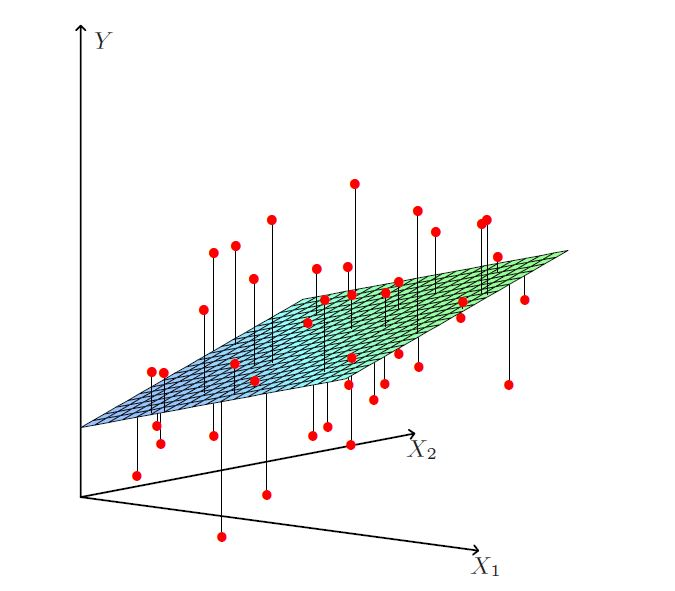
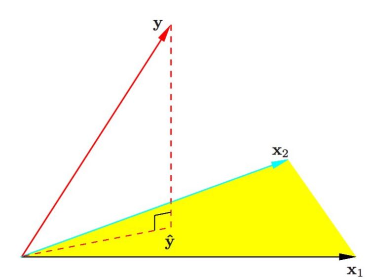
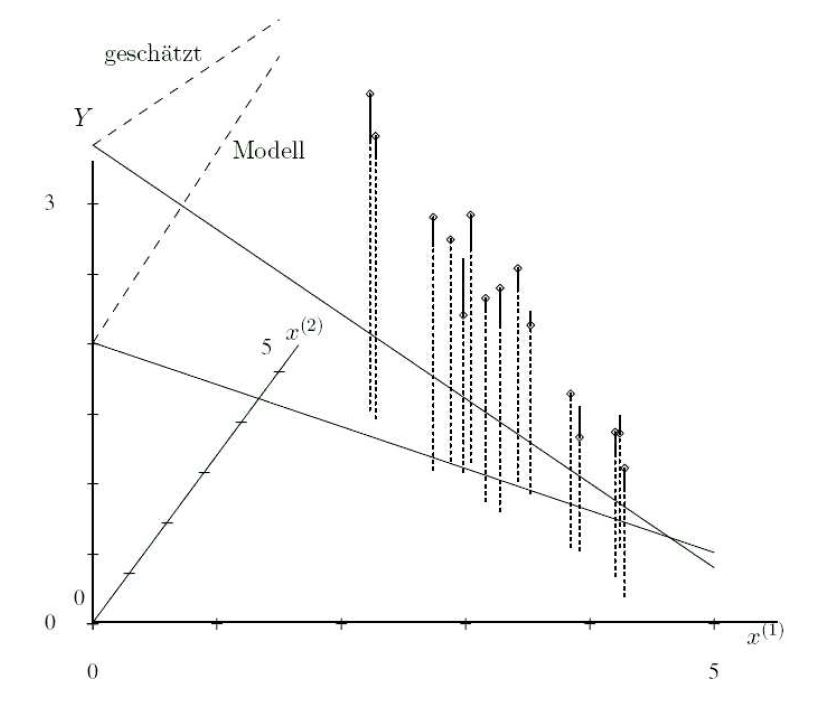

# Multivariate regression and challenges in high-dimensions

```{r include=FALSE}
library(gridExtra)
library(knitr)
library(tidyverse)
```

In this chapter we will review multivariate regression and in particular the *Ordinary Least Squares* (OLS) estimator. We will further illustrate challenges in high dimensions.

## Ordinary least squares

Given a vector of inputs $X=(X_1,X_2,\ldots,X_p)$, in multivariate regression we predict the output $Y$ via the linear model:

\[ \hat{Y}=\sum_{j=1}^{p}X_j\hat\beta_j.\]

The term $\beta_0$ is the intercept. If we include the constant variable 1 in $X$, include $\hat\beta_0$ in the vector of coefficients $\hat\beta$, then we can write 

\[\hat{Y}=X^T\hat\beta.\]

How do we fit the linear model to a set of training data (i.e. how do we obtain the estimator $\hat \beta$)? We typically use *ordinary least squares* (OLS) where we pick the coefficient $\beta$ to minimize the residual sum of squares

\begin{align*}
\rm{RSS}(\beta)&=\sum_{i=1}^{N}(y_i-x_i^T\beta)^2\\
&=(\bf y - \bf X \beta)^T (\bf y - \bf X \beta)\\
&=\|\bf y - \bf X \beta\|^2.
\end{align*}

If the matrix $\bf X^T \bf X$ is nonsingular, then the solution is given by 

\[\hat\beta=(\bf X^T \bf X)^{-1}\bf X^T \bf y.\]

Thus, the learning rule at the new input point $X_{\rm new}$ is

\begin{align*}
\hat{Y}&=\hat{f}(X_{\rm new})\\
&=X_{\rm new}^T\hat\beta\\
&=X_{\rm new}^T(\bf X^T \bf X)^{-1}\bf X^T \bf y.\\
\end{align*}

Figures \@ref(fig:olsgeom2) and \@ref(fig:olsgeom1) show two geometric representations of the OLS estimator. In Figure \@ref(fig:olsgeom2) the $N$ data points $(y_i,x_{i2},\ldots,x_{ip})$ randomly spread around a $(p-1)$-dimensional hyperplane in a $p$-dimensional space; the random spread only occurs parallel to the y-axis. Figure \@ref(fig:olsgeom1) shows a different representation where the vector $\bf y$ is a single point in the $N$-dimensional space ${\bf R}^N$; the fitted values $\hat {\bf y}$ are the orthogonal projection onto the $p$-dimensional subspace of ${\bf R}^N$ spanned by the vectors ${\bf x}_1,\ldots,{\bf x}_p$.


```{r olsgeom2,echo=FALSE,out.width="80%",fig.cap="N data points spreading around the (p-1)-dimensional OLS hyperplane."}

```


```{r olsgeom1,echo=FALSE,out.width="80%",fig.cap="OLS fit as the orthogonal projection **y** onto subspace spanned by covariates."}

```


## High-dimensionality

The field of high-dimensional statistics deals with inference in situations where the model complexity is large compared to the number of independent observations. In the multivariate regression setup this is often paraphrased as $p>>n$, referring to the situation where we have more covariates than observations. The challenge with high-dimensions is manifested in *overfitting* and *collinearity*. 

### Overfitting 

Overfitting refers to the phenomenon of modelling the noise rather than the signal. In case the true model is parsimonious (few covariates driving the response $Y$) and data on many covariates are available, it is likely that a linear combination of all covariates yields a higher likelihood than a combination of the few that are actually related to the response. As only the few covariates related to the response contain the signal, the model involving all covariates then cannot
but explain more than the signal alone: it also models the error. Hence, it overfits the data. 

In high-dimensional settings overfitting is a real threat! In the situation where $p>n$ it is possible to form a linear combination of the covariates that perfectly explains the response, including the noise. In general, large estimates of regression coefficients are often an indication of overfitting. We illustrate overfitting in the next example.
We simulate $n=10$ training data points. We take $p=9$ and $X_{i1},\ldots,X_{ip}$ i.i.d $N(0,1)$. The response depends only on the first covariate, i.e.  $Y_i=\beta_1 X_{i1}+\epsilon_i$, where $\beta_1=2$ and $\epsilon_i$ i.i.d $N(0,0.5)$. 

```{r}
set.seed(1)
n <- 10
p <- 9
beta <- c(2,rep(0,p-1))

# simulate covariates
xtrain <- matrix(rnorm(n*p),n,p)
ytrain <- xtrain%*%beta+rnorm(n,sd=0.5)
dtrain <- data.frame(xtrain)
dtrain$y <- ytrain
```

We fit a linear regression model.
```{r}
# fit linear regression (all 9 covariates, intercept excluded for this illustration)
fit <- lm(y~-1+.,data=dtrain)
```

We obtain the estimated regression coefficients.

```{r}
coef(fit)
```

We note that many regression coefficient are clearly *over-estimated* (the true coefficients are $\beta = (1, 0, \ldots, 0)$). Next, we plot the fitted values against the values of the first covariate and we add the reference line $x = y$ representing the "true" relationship. The fitted values (red triangles) perfectly match the data (black dots). This means the fitted model also captures the deviations from the truth (blue line).

```{r, echo=FALSE}
t.d <-data.frame(x=xtrain[,1],y=ytrain,yhat=predict(fit)) 
t.d%>%
  ggplot(.,aes(x=x))+
  geom_point(aes(y=y),size=2)+
  geom_line(aes(y=yhat),col="red")+
  geom_point(aes(y=yhat),col="red",pch=2,size=3)+
  geom_abline(intercept=0,slope=1,col="blue",lty=2)+
  xlab("X1")+ylab("Y")
```

In this example the model clearly overfits the data. In other words, the *residual degrees of freedom* which remains to estimate the error is $n-p$ =`r n-p`. A common rule of thumb to avoid overfitting is that the residual degrees of freedom should be at least $5$ (be aware that this is not a general applicable rule!).

### Collinearity

Recall that *collinearity* in regression analysis refers to the event of two (or multiple) covariates being strongly linearly related. The case of two (or multiple) covariates being perfectly linearly dependent is referred to as *super-collinearity*.

For illustration we generate some data.
```{r }
set.seed(1315)
n <- 20
x1 <- rnorm(n)
x2 <- rnorm(n)
x3 <- x1+rnorm(n,sd=0.25)
x4 <- x1
dat <- data.frame(x1,x2,x3,x4)
dat$y <- 2*dat$x1+rnorm(n)
```

The figures show pairs of covariates with no-, high- and super-collinearity.

```{r echo=FALSE, fig.height=4, fig.width=12}
gp1 <- dat%>%
  ggplot(.,aes(x=x1,y=x2))+
  geom_point()+
  ggtitle("no collinearity")

gp2 <- dat%>%
  ggplot(.,aes(x=x1,y=x3))+
  geom_point()+
  ggtitle("collinearity")

gp3 <- dat%>%
  ggplot(.,aes(x=x1,y=x4))+
  geom_point()+
  ggtitle("super collinearity")

grid.arrange(gp1,gp2,gp3,ncol=3)
```

In the presence of collinearity, the estimate of one variable's impact on the dependent variable $Y$ while controlling for the others tends to be less precise than if covariates were uncorrelated with one another. Intuitively this can be explained based on Figure \@ref(fig:collinearity) which shows the response Y and two highly correlated covariates x1 and x2. The depicted hyperplains for the true ("modell") and estimated ("geschätzt") coefficients are deviating from each other. Further we see that the exact position of the estimated hyperplain is stable alongside of the "hedge" of data points (but unstable in the orthogonal direction).

```{r collinearity,echo=FALSE,out.width="80%",fig.cap="This Figure illustrates OLS regression in the context of covariates with high collinearity."}

```

We will now illustrate this numerically by fitting the following two models.

```{r}
modela <- lm(y~x1+x2,data=dat)
modelb <- lm(y~x1+x3,data=dat)
```

We obtain the variances of the estimated regression coefficients. The variances are larger for model b where x1 and x3 are
correlated.

```{r}
# variance of model a
diag(vcov(modela))

#variance of model b
diag(vcov(modelb))
```

If we would also include x4 into the model (scenario of *super-collinearity*), then the OLS estimate would not be well defined (rank of the design matrix is 0 and therefore the matrix ${\bf X}^T {\bf X}$ is singular). 

```{r}
x <- as.matrix(dat[,-5])
det(t(x)%*%x)
```

High-dimensional problems with $p>n$ always suffer from super-collinearity: the rank of the design matrix cannot exceed $n$ which implies that the columns of $\bf X$ are linearly dependent. Therefore the OLS estimator cannot be calculated in this situation.


