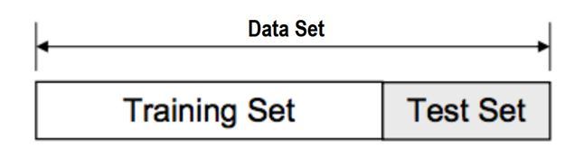

# Multiple Linear Regression

```{r include=FALSE}
library(gridExtra)
library(knitr)
library(tidyverse)
library(caret)
library(MASS)
```

In this chapter we review multiple linear regression and in particular the Ordinary Least Squares (OLS) estimator. We investigate the challenges which arise in the high-dimensional setting where the number of covariates is large compared to the number of observations, i.e. $p>>n$. We discuss model selection and introduce subset- and stepwise-regression.

## Notation

We will typically denote the covariates by the symbol $X$. If $X$ is a vector, its components can be accessed
by subscripts $X_j$. The response variable will be denoted by $Y$. We use uppercase letters such as $X$, $Y$ when referring to the generic aspects of a variable. Observed values are written in lowercase; hence the $i$th observed value of $X$ is written as $x_i$ (where $x_i$ is again a scalar or vector). Matrices are represented by bold uppercase letters; for example, a set of $n$ input p-vectors $x_i$, $i=1,\ldots,n$ would be represented by the $n\times p$ matrix $\bf{X}$. All vectors are assumed to be column vectors, the $i$th row of $\bf{X}$ is $x_i^T$.

## Ordinary least squares

Given a vector of inputs $X=(X_1,X_2,\ldots,X_p)$, in multiple regression we predict the output $Y$ via the linear model:

\[ \hat{Y}=\hat\beta_0+\sum_{j=1}^{p}X_j\hat\beta_j.\]

The term $\beta_0$ is the intercept. If we include the constant variable 1 in $X$, include $\hat\beta_0$ in the vector of coefficients $\hat\beta$, then we can write 

\[\hat{Y}=X^T\hat\beta.\]

How do we fit the linear model to a set of training data (i.e. how do we obtain the estimator $\hat \beta$)? We typically use *ordinary least squares* (OLS) where we pick the coefficient $\beta$ to minimize the residual sum of squares

\begin{eqnarray*}
\textrm{RSS}(\beta)&=&\sum_{i=1}^{n}(y_i-x_i^T\beta)^2\\
&=&(\textbf{y} - \textbf{X} \beta)^T (\textbf{y} - \textbf{X} \beta)\\
&=&\|\textbf{y} - \textbf{X} \beta\|^2_2.
\end{eqnarray*}

If the matrix $\bf X^T \bf X$ is nonsingular, then the solution is given by 

\[\hat\beta=(\bf X^T \bf X)^{-1}\bf X^T \bf y.\]

Thus, the prediction at the new input point $X_{\rm new}$ is

\begin{align*}
\hat{Y}&=\hat{f}(X_{\rm new})\\
&=X_{\rm new}^T\hat\beta\\
&=X_{\rm new}^T(\textbf{X}^T \textbf{X})^{-1}\textbf{X}^T \textbf{y}.
\end{align*}

Figures \@ref(fig:olsgeom2) and \@ref(fig:olsgeom1) show two geometric representations of the OLS estimator. In Figure \@ref(fig:olsgeom2) the $n$ data points $(y_i,x_{i1},\ldots,x_{ip})$ randomly spread around a $p$-dimensional hyperplane in a $p+1$-dimensional space; the random spread only occurs parallel to the y-axis and the hyperplane is defined via $\hat \beta$. Figure \@ref(fig:olsgeom1) shows a different representation where the vector $\bf y$ is a single point in the $n$-dimensional space ${\bf R}^n$; the fitted $\hat {\bf y}$ is the orthogonal projection onto the $p$-dimensional subspace of ${\bf R}^n$ spanned by the vectors ${\bf x}_1,\ldots,{\bf x}_p$.


```{r olsgeom2,echo=FALSE,out.width="80%",fig.cap="Data points spreading around the p-dimensional OLS hyperplane."}
knitr::include_graphics("ols_geom2.JPG")
```


```{r olsgeom1,echo=FALSE,out.width="80%",fig.cap="OLS fit $\\hat{\\textbf{y}}$ as the orthogonal projection of $\\textbf{y}$ onto subspace spanned by covariates."}
knitr::include_graphics("ols_geom1.JPG")
```

## Overfitting 

Overfitting refers to the phenomenon of modelling the noise rather than the signal. In case the true model is parsimonious (few covariates driving the response $Y$) and data on many covariates are available, it is likely that a linear combination of all covariates yields a higher likelihood than a combination of the few that are actually related to the response. As only the few covariates related to the response contain the signal, the model involving all covariates then cannot
but explain more than the signal alone: it also models the error. Hence, it overfits the data. 

We illustrate overfitting by generating artificial data.
We simulate $n=10$ training data points, take $p=15$ and $X_{i1},\ldots,X_{ip}$ i.i.d. $N(0,1)$. We assume that the response depends only on the first covariate, i.e.  $Y_i=\beta_1 X_{i1}+\epsilon_i$, where $\beta_1=2$ and $\epsilon_i$ i.i.d. $N(0,0.5^2)$. 

```{r}
set.seed(1)
n <- 10
p <- 15
beta <- c(2,rep(0,p-1))

# simulate covariates
xtrain <- matrix(rnorm(n*p),n,p)
ytrain <- xtrain%*%beta+rnorm(n,sd=0.5)
dtrain <- data.frame(xtrain)
dtrain$y <- ytrain
```


We fit a univariate linear regression model with X1 as covariate and print the `summary`.

```{r}
fit1 <- lm(y~X1,data=dtrain)
summary(fit1)
```

The coefficient for X1 is close to the true value. The R squared value $R^2=$ `r round(summary(fit1)$r.squared,2)` indicates that the model fits the data well. In order to explore what happens if we add noise covariates, we re-fit the model with an increasing number of covariates, i.e. $p=4$, $8$ and $15$.

```{r}
fit4 <- lm(y~X1+X2+X3+X4,data=dtrain)
fit8 <- lm(y~X1+X2+X3+X4+X5+X6+X7+X8,data=dtrain)
fit15 <- lm(y~.,data=dtrain) #all 15 covariates
```

The next plot shows the data points (black circles) together with the fitted values (red crosses).

```{r, echo=FALSE, fig.cap="Observed and fitted values for models with increasing $p$."}
library(ggpubr)
t.d <-data.frame(x=xtrain[,1],y=ytrain)
t.d$yhat1 <- predict(fit1)
t.d$yhat4 <- predict(fit4)
t.d$yhat8 <- predict(fit8)
t.d$yhat15 <- predict(fit15)
p0 <- t.d%>%
  ggplot(.,aes(x=x))+
  geom_point(aes(y=y),size=3)+
  geom_abline(intercept=coef(fit1)[1],slope=coef(fit1)[2],col="blue",lty=2,lwd=1)+
  xlab("X1")+ylab("Y")+
  theme_bw()
p1 <- p0+
  geom_point(aes(y=yhat1),col="red",pch=3,size=2,stroke=1.5)
p4 <- p0+
  geom_point(aes(y=yhat4),col="red",pch=3,size=2,stroke=1.5)
p8 <- p0+
  geom_point(aes(y=yhat8),col="red",pch=3,size=2,stroke=1.5)
p15 <- p0+
  geom_point(aes(y=yhat15),col="red",pch=3,size=2,stroke=1.5)
ggarrange(p1,p4,p8,p15,labels = c("p=1", "p=4", "p=8","p=15"),hjust=-2)
```

With increasing $p$ the fitted values start to deviate from the true model (blue line) and they move closer towards the observed data points. Finally, with $p=15$, the fitted values match perfectly the data, i.e. the model captures the noise and overfits the data. In line with these plots we note that the R squared values increase with $p$.

```{r echo=FALSE}
t.d <- data.frame(
  model=c("p=1","p=4","p=8","p=15"),
  R2=c(summary(fit1)$r.squared,summary(fit4)$r.squared,summary(fit8)$r.squared,summary(fit15)$r.squared)
)
kable(t.d,digits = 2,booktabs=TRUE,caption="R2 for models with increasing p.")
```

The following figure shows the regression coefficients for the different models. The larger the $p$, the bigger the discrepancy to the true coefficients.

```{r echo=FALSE, fig.cap="Regression coefficients for models with increasing $p$."}
t.d <- data.frame(matrix(NA,nrow=16,ncol=4))
t.d[1:2,1] <- coef(fit1)
t.d[1:5,2] <- coef(fit4)
t.d[1:9,3] <- coef(fit8)
t.d[1:16,4] <- coef(fit15)
colnames(t.d) <- paste0("p=",c(1,4,8,15))
rownames(t.d) <- names(coef(fit15))
t.d$true <- c(0,2,rep(0,14))

# t.d2 <- round(t.d,2)
# t.d2[is.na(t.d2)] <- "-"
# kable(t.d2,digits = 2)

t.d.l <- pivot_longer(t.d%>%
                        rownames_to_column(var="beta"),cols=-beta)%>%
  dplyr::mutate(beta=factor(beta,levels=unique(beta)),
                model=factor(name,levels=c("true","p=1","p=4","p=8","p=15")))
t.d.l$value[is.na(t.d.l$value)] <- 0
t.d.l%>%
  ggplot(.,aes(x=beta,y=value,fill=model,color=model))+
  geom_bar(width=0.5,position = position_dodge(width = 0.8),stat="identity")+
  theme_bw()+
  theme(text =element_text(size=15),axis.text.x = element_text(angle = 45, hjust = 1),
        legend.position = "top")+
  scale_fill_grey(aesthetics = c("fill","color"))+
  xlab("")+ylab("beta")
```

This becomes even more evident when calculating the mean squared error between the estimated and true coefficients.

```{r echo=FALSE}
ave.deviation <- apply(t.d[,-5],2,FUN=function(x)
{
  beta.true <- c(0,2,rep(0,14))
  mean((x-beta.true)^2,na.rm=TRUE)
}
)
kable(ave.deviation,col.names="mse",digits=2,booktabs=TRUE,caption="MSE between estimated and true coefficients.")
```

The `summary` of the full model with $p=15$ indicates that something went wrong. 

```{r}
summary(fit15)
```

There is a note saying "no residual degrees of freedom". Furthermore, many entries in the table of coefficients are not available and a note says that coefficients cannot be calculated because of *singularities*. What has happened? In fact, the OLS estimator as introduced above is not well defined.  The design matrix $\bf X$ is rank deficient (${\rm rank}({\bf X})=n< p$) and therefore the matrix ${\bf X}^T {\bf X}$ is singular (not invertible). We can check this by calculating the determinant.

```{r}
x <- model.matrix(fit15)
det(t(x)%*%x)
```

In this simulation exercise we illustrated the problem of overfitting. We have seen that the models with large $p$ fit the data very well, but the estimated coefficients are far off from the truth. In practice we do not know the truth. How do we know when a model is overfitting and how do we decide what a "good" model is? Shortly we will introduce the [Generalization Error] which will shed light on this question.

<!-- In particular, if $p>n$ then it is possible to form a linear combination of the covariates that perfectly explains the response, including the noise. Further, we noted that large estimates of regression coefficients are an indication of overfitting.  -->

We end this section with the helpful **_10:1 rule:_** 

> In order to avoid overfitting the number of predictors (or covariates) **p should be less than n/10**. This rule can be extended to binary and time-to-event endpoints. For binary endpoints we replace $n$ with $\min\{n_0,n_1\}$ and for time-to-event with $n_{\rm events}$.

## Generalization error

The ultimative goal of a good model is to make good predictions for the future. That is we need to assess how the fitted model generalizes beyond the "observed" data. Conceptually, given new input data $x_{\rm new}$, the model provides a prediction $\hat{Y}=\hat{f}(x_{\rm new})$. The *Generalization Error* is the expected discrepancy between the prediction $\hat{Y}=\hat{f}(x_{\rm new})$ and the actual outcome $Y_{\rm new}$

$${\rm Err}(x_{\rm new})=E[(Y_{\rm new}-\hat{f}(x_{\rm new}))^2].$$
One can show that this error can be decomposed into three terms

\begin{eqnarray}
{\rm Err}(x_{\rm new})&=&\sigma_{\epsilon}^2+{\rm Bias}^2(\hat{f}(x_{\rm new})) + {\rm Var}(\hat{f}(x_{\rm new})),
\end{eqnarray}

where the first term is the irreducible error (or "noise"), the second term describes the systematic bias from the truth and the third term is the variance of the predictive model. For linear regression the expected variance can be approximated by $\sigma^2_{\epsilon} \frac{p}{N}$. Complex models (with large number of covariates) have typically a small bias but a large variance. Therefore the equation above is referred to as the bias-variance dilemma as it describes the conflict in trying simultaneously minimize both sources of error, bias and variance.  
<!-- the =(E[\hat{f}(x_{\rm new})]-f(x_{\rm new})\right)$ and ${\bf Var}(\hat{f}(x_{\rm new}))=E\left[(E[\hat{f}(x_{\rm new})]-\hat{f}(x_{\rm new}))^2\right]$. The first term represent the *irreducible error* (or noise), the second term is the  -->

How do we calculate the Generalization Error in practice? The most simple approach is to separate the data into a training and testing set (see Figure \@ref(fig:traintest)). The model is fitted (or "trained") on the training data and the Generalization Error is calculated on the test data and quantified using the root-mean-square error (RMSE)

$$ {\rm RMSE}= \sqrt{\frac{\sum_{i=1}^{n_{\rm test}}(y_{\rm test,i}-\hat y_{i})^2}{n_{\rm test}}}.$$  

```{r traintest,echo=FALSE,out.width="80%",fig.cap="Splitting the data into training set and test sets."}

```

We illustrate this based on the dummy data. First we simulate test data.

```{r include=FALSE}
set.seed(2)
```

```{r}
# simulate test data
xtest <- matrix(rnorm(n*p),n,p)
ytest <- xtest%*%beta+rnorm(n,sd=0.5)
dtest <- data.frame(xtest)
dtest$y <- ytest
```

Next, we take the fitted models and make predictions on the test data

```{r warning=FALSE}
# prediction
pred1 <- predict(fit1,newdata = dtest)
pred4 <- predict(fit4,newdata = dtest)
pred8 <- predict(fit8,newdata = dtest)
pred15 <- predict(fit15,newdata = dtest)
```

<!-- The following plot shows the test data points (in black) together with the predictions obtained from models `fit4` (in orange) and `fit8` (in green). -->

<!-- ```{r, echo=FALSE} -->
<!-- dtest$pred4 <- pred4 -->
<!-- dtest$pred8 <- pred8 -->
<!-- dtest%>% -->
<!--   ggplot(.,aes(x=X1))+ -->
<!--   geom_point(aes(y=y),size=3,col="black")+ -->
<!--   geom_point(aes(y=pred4),col="orange",pch=3,size=2,stroke=1.5)+ -->
<!--   geom_point(aes(y=pred8),col="green",pch=4,size=2,stroke=1.5)+ -->
<!--   geom_abline(intercept=0,slope=2,col="blue",lty=2)+ -->
<!--   xlab("X1")+ylab("Y")+ -->
<!--   theme_bw() -->
<!-- ``` -->

<!-- The predictions from `fit8` (model with 8 covariates) lie way off from the truth!  -->
<!-- We quantify the prediction error with the root-mean-square error (RMSE). -->

<!-- $$ {\bf RMSE}= \sqrt{\frac{\sum_{i=1}^N(y_i-\hat y_i)^2}{N}}$$ -->

<!-- The RMSE measures how far off we should expect the prediction of our model to be. -->
<!-- In our dummy data example we can calculate the prediction error using the function `RMSE`. -->

<!-- ```{r} -->
<!-- RMSE(pred4,ytest) -->
<!-- RMSE(pred8,ytest) -->
<!-- ``` -->

and we calculate the RMSE.

```{r}
# rmse
rmse <- data.frame(
  RMSE(pred1,ytest),RMSE(pred4,ytest),
  RMSE(pred8,ytest),RMSE(pred15,ytest)
)
colnames(rmse) <- paste0("p=",c(1,4,8,15))
rownames(rmse) <- "RMSE"
kable(rmse,digits=2,booktabs=TRUE,
      caption="RMSE for models with increasing p.")
```

The models with $p=1$ and $4$ achieve a good error close to the "irreducible" $\sigma_{\epsilon}$. On the other hand the predictions obtained with $p=8$ and $15$ are very poor (RMSEs are 6 to 8-fold larger).

## Model selection

We will shortly see that the approaches which we introduce do not only fit one single model but they explore a whole series of models (indexed as $m=1,\ldots,M$). Model selection refers to the choice of an optimal model achieving a low generalization error. A plausible approach would be to fit the different models to  the training data and then select the model with smallest error on the test data. However, this is an illegitimate approach as the test data has to be kept untouched for the final evaluation of the selected model. Therefore we guide model selection by approximating the generalization error using training data only. We review now two such approximations, namely, cross-validation and the Akaike information criterion (AIC). 

K-fold cross-validation approximates the prediction error by splitting the training data into K chunks as illustrated below (here $K=5$).

```{r crossvalidation,echo=FALSE,out.width="80%"}
knitr::include_graphics("crossvalidation.JPG")
```

Each chunk is then used as "hold-out" validation data to estimate the error of $m$th model trained on the other $K-1$ data chunks. In that way we obtain $K$ error estimates and we typically take the average as the cross-validation error of model $m$ (denoted by ${\rm CV}_m$). The next plot shows a typical cross-validation error plot. This curve attains its minimum at a model with  $p_m=4$ ($p_m$ is the number of included predictors in model $m$).

```{r message=FALSE,warning=FALSE,echo=FALSE}
set.seed(1)
library(glmnet)
library(caret)
x <-  matrix(rnorm(20 * 20), 20, 15)
y <- x[,1:4]%*%c(2,-2,2,-2)+rnorm(20)
data <- data.frame(x,y)
train.control <- trainControl(method = "cv", number = 5)
step.model <- train(y ~., data = data,
                    method = "leapForward", 
                    tuneGrid = data.frame(nvmax = 1:15),
                    trControl = train.control
                    )
ggplot(step.model)+
  theme_bw()+
  theme(text =element_text(size=15))+
  ylab("CV")+xlab("Number of Predictors")
```

The AIC approach is founded in information theory and selects the model with smallest AIC

$$
{\rm AIC}_m=-2\;{\rm loglik}+2\;p_{m}.
$$
Thus, AIC rewards goodness of fit (as assessed by the likelihood function *loglik*) and penalizes model complexity (by the term $2 p_m$). The figure below shows for the same example the AIC curve. Also the AIC approaches suggests to use a model with $p_m=4$ predictors.

```{r message=FALSE,warning=FALSE,echo=FALSE}
models <- leaps::regsubsets(y~., data = data, 
                            nvmax = 15,
                            method = "forward")

smodels <-  summary(models)
nvar <- apply(smodels$which,1,sum)-1
k <- nvar+2
n <- nrow(data)
aic <- smodels$bic-log(n)*k+k*(2+(2*k+2)/(n-k-1))
plot(nvar, aic, xlab = "Number of Predictors", ylab = "AIC",type="b")
```


## Subset- and stepwise regression

We have seen that multiple regression falls short in the high-dimensional context. It leads to overfitting and as a result in large estimates of regression coefficients. Augmentation of the least-squares optimization with constraints on the regression coefficients can decrease the risk of overfitting. In the following we will discuss methods which minimize the residual sum of squares, $\rm{RSS}(\beta)$, under some constraints on the parameter $\beta$.

The most common approach to impose constraints is subset selection. In this approach we retain only a subset of the variables, and eliminate the rest from the model. OLS is used to estimate the coefficients of the inputs that are retained. More formally, given a subset $S\subset\{1,\ldots,p\}$ we solve the optimization problem


\[
\hat{\beta}_{S}=\text{arg}\!\!\!\!\!\min\limits_{\beta_j=0\;\forall j\notin S}\!\!\!\textrm{RSS}(\beta).
\]

It is easy to show that this is equivalent to OLS regression based on subset $S$ covariates, i.e.

\[
\hat{\beta}_{S}=(\textbf{X}_S^T \textbf{X}_S)^{-1}\textbf{X}_S^T \textbf{y}.
\]

In practice we need to explore a sequence of subsets $S_1,\ldots,S_M$ and choose an optimal subset by either a re-sampling approach or by using an information criterion (see Section \@ref(model-selection)). There are a number of different strategies available. *Best subsets regression* consists of looking at all possible combinations of covariates. Rather than search though all possible subsets, we can seek a good path through them. Two popular approaches are *backward stepwise* regression which starts with the full model and sequentially deletes covariates, whereas *forward stepwise* regression starts with the intercept, and then sequentially adds into the model the covariate that most improves the fit. 

In `R` we can use `regsubsets` from the `leaps` package or `stepAIC` from the `MASS` package to perform subset- and stepwise regression. For example to perform forward stepwise regression based on AIC we proceed as follows.

```{r include=FALSE}
set.seed(1)
n <- 10
p <- 9
beta <- c(2,rep(0,p-1))

# simulate covariates
xtrain <- matrix(rnorm(n*p),n,p)
ytrain <- as.numeric(xtrain%*%beta+rnorm(n,sd=0.5))
dtrain <- data.frame(xtrain)
dtrain$y <- ytrain
```

```{r}
# Forward regression
fit0 <- lm(y~1,data=dtrain)
up.model <- paste("~", paste(colnames(dtrain[,-(p+1)]), collapse=" + "))
fit.fw <- stepAIC(fit0,
                  direction="forward",
                  scope=
                    list(lower=fit0,
                         upper=up.model)
                    ,
                  trace = FALSE
)
```

We can summarize the stepwise process.

```{r}
kable(as.data.frame(fit.fw$anova),digits=3,booktabs=TRUE
      ,caption="Inclusion of covariates in forward stepwise regression.")
```

Finally we can retrieve the regression coefficients of the optimal model.

```{r}
kable(broom::tidy(fit.fw),digits=3,booktabs=TRUE,
      caption="Regression coefficients of the optimal model.")
```

