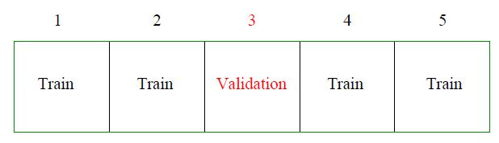
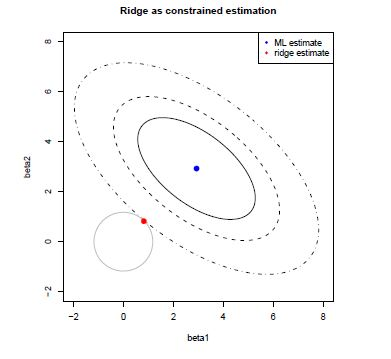
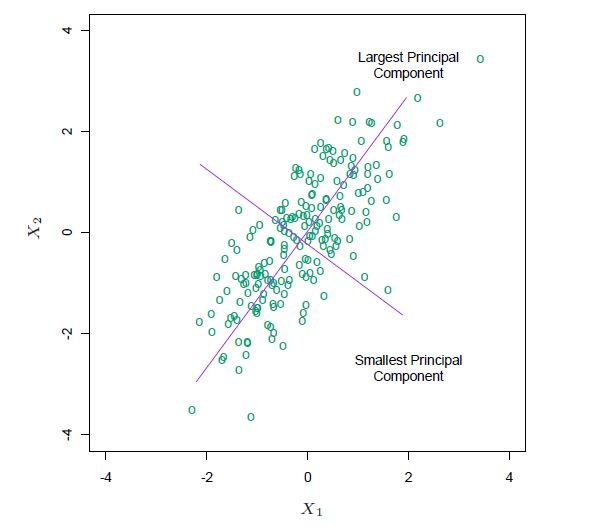
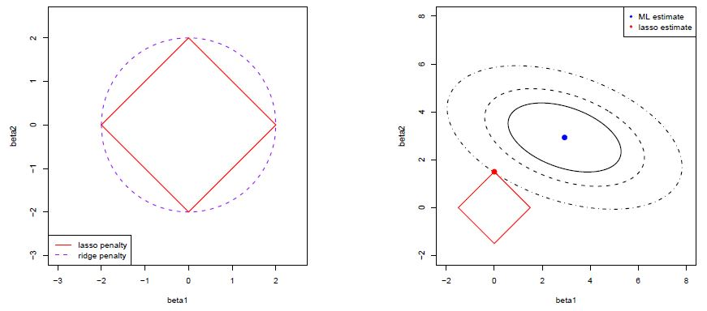

# Regularization

```{r, include=FALSE}
library(knitr)
library(caret)
library(glmnet)
library(tidyverse)
library(MASS)
library(lars)
library(gridExtra)
library(stats)
library(splines)
```

We have seen that multiple regression falls short in the high-dimensional context. It leads to overfitting and as a result in large estimates of regression coefficients. Augmentation of the estimation
procedure with a constraint on the regression coefficients is a simple remedy to large parameter estimates. As a consequence it decreases the probability of overfitting. In the following we will discuss methods which minimize the residual sum of squares, $\rm{RSS}(\beta)$, under some constraints on the parameter $\beta$.


## Model Selection

We will shortly see that the approaches which we introduce do not only fit one single model but they explore a whole series of models. These models are indexed by a tuning parameter which defines the "amount" of constraints to be imposed on the regression coefficients. Model selection refers to the choice of an optimal tuning parameter achieving a low generalization error. Importantly model selection is part of the training step. We review cross-validation and the Akaike information criterion (AIC). K-fold cross-validation approximates the prediction error by splitting the training data into K chunks as illustrated below (here $K=5$).

```{r crossvalidation,echo=FALSE,out.width="70%"}

```

Each chunk is then used as "hold-out" validation data to calculate the error of $\alpha$th model trained on the other $K-1$ data chunks. In that way we obtain $K$ error estimates and we typically take the average as the cross-validation error (denoted by ${\rm CV}(\alpha)$). The next plot shows a typical cross-validation error plot. This curve attains its minimum at a model with  $\alpha=4$ (here $\alpha$ represents the number of included predictors).

```{r message=FALSE,warning=FALSE,echo=FALSE}
set.seed(1)
library(glmnet)
library(caret)
x <-  matrix(rnorm(20 * 20), 20, 15)
y <- x[,1:4]%*%c(2,-2,2,-2)+rnorm(20)
data <- data.frame(x,y)
train.control <- trainControl(method = "cv", number = 5)
step.model <- train(y ~., data = data,
                    method = "leapForward", 
                    tuneGrid = data.frame(nvmax = 1:15),
                    trControl = train.control
                    )
ggplot(step.model)+
  theme_bw()+
  ylab("CV")+xlab("Alpha [Number of Predictors]")
```

The AIC approach is founded in information theory and selects the model with smallest AIC

$$
{\rm AIC}(\alpha)=-2\;{\rm loglik}+2\;d_{\alpha}.
$$
Thus, AIC rewards goodness of fit (as assessed by the likelihood function *loglik*), but it also includes a penalty that is an increasing function of the number of estimated parameters $d_{\alpha}$. The figure below shows for the same example the AIC curve. Also the AIC approaches suggests to use a model with $\alpha=4$ predictors.

```{r message=FALSE,warning=FALSE,echo=FALSE}
models <- leaps::regsubsets(y~., data = data, 
                            nvmax = 15,
                            method = "forward")

smodels <-  summary(models)
nvar <- apply(smodels$which,1,sum)-1
k <- nvar+2
n <- nrow(data)
aic <- smodels$bic-log(n)*k+k*(2+(2*k+2)/(n-k-1))
plot(nvar, aic, xlab = "Alpha [Number of Predictors]", ylab = "AIC",type="b")
```


## Subset- and Stepwise Regression

The most common approach to impose constraints is subset selection. In this approach we retain only a subset of the variables, and eliminate the rest from the model. OLS is used to estimate the coefficients of the inputs that are retained. More formally, given a subset $S\subset\{1,\ldots,p\}$ we solve the optimization problem


\begin{align*}
\hat{\beta}_{S}&=\text{arg}\!\!\!\!\!\!\min\limits_{\beta_j=0\;\forall j\notin S}\!\!\!\rm{RSS}(\beta).
\end{align*}

It is easy to show that this is equivalent to OLS regression based on subset $S$ covariates, i.e.

\[
\hat{\beta}_{S}=({\bf X}_S^T {\bf X}_S)^{-1}{\bf X}_S^T {\bf y}.
\]

In practice we need to explore a sequence of subsets $S_1,\ldots,S_K$ and choose an optimal subset by either a re-sampling approach or by using an information criteria (see Section \@ref(model-selection)). There are a number of different strategies available. *Best subsets regression* consists of looking at all possible combinations of covariates. Rather than search though all possible subsets, we can seek a good path through them. Two popular approaches are *backward stepwise* regression which starts with the full model and sequentially deletes covariates, whereas *forward stepwise* regression starts with the intercept, and then sequentially adds into the model the covariate that most improves the fit. 

In `R` we can use `regsubsets` from the `leaps` package or `stepAIC` from the `MASS` package to perform subset- and stepwise regression. For example to perform forward stepwise regression based on AIC we proceed as follows.

```{r include=FALSE}
set.seed(1)
n <- 10
p <- 9
beta <- c(2,rep(0,p-1))

# simulate covariates
xtrain <- matrix(rnorm(n*p),n,p)
ytrain <- xtrain%*%beta+rnorm(n,sd=0.5)
dtrain <- data.frame(xtrain)
dtrain$y <- ytrain
```

```{r}
# Forward regression
fit0 <- lm(y~1,data=dtrain)
fit.fw <- stepAIC(fit0,
                  direction="forward",
                  scope=
                    list(lower=fit0,
                         upper=paste("~", paste(colnames(dtrain[,-10]), 
                                                collapse=" + "))
                    ),
                  trace = FALSE
)
```

We can summarize the stepwise process.

```{r}
kable(as.data.frame(fit.fw$anova),digits=3)
```

Finally we can retrieve the regression coefficients of the optimal model.

```{r}
kable(broom::tidy(fit.fw),digits=3)
```

## Ridge Regression

Subset selection as outlined above works by either including or
excluding covariates, i.e. contrain specific regression coefficients to be zero.

An alternative is *Ridge Regression*, which constrains (or regularizes) the optimization problem by shrinking regression coefficients towards zero. This discourages complex models because
models that overfit tend to have larger coefficients. Ridge regression can be formulated as a constrained optimization problem

\begin{align*}
\hat{\beta}^{\rm Ridge}_{c}&=\text{arg}\min\limits_{\|\beta\|_2^2\leq c}\rm{RSS}(\beta).
\end{align*}

The geometry of the optimization problem is illustrated in Figure \@ref(fig:ridgegeom). It shows the levels sets of ${\rm RSS}(\beta)$, ellipsoids centered around the OLS estimate, and the circular ridge
parameter constraint, centered around zero with radius $c > 0$. The Ridge estimator
is the point where the smallest level set hits the constraint. Exactly at that point the $\rm{RSS}(\beta)$ is
minimized over those $\beta$’s that "live" inside the constraint.

```{r ridgegeom,echo=FALSE,out.width="70%",fig.cap="Geometry of Ridge regression."}

```

Alternatively, ridge regression can be cast as the optimization of the penalised residual sum of squares with a *penalty* on the magnitude of the coefficients, i.e. 

\begin{align*}
\hat{\beta}^{\rm Ridge}_{\lambda}&=\text{arg}\min\limits_{\beta}\rm{RSS}(\beta)+\lambda\|\beta\|^2_2.
\end{align*}

Both formulations are equivalent in the sense that there is a one-to-one relationship between the tuning parameters $c$ and $\lambda$. We will use more often the latter "penalisation" formulation. The parameter $\lambda$ is the amount of penalisation. Note that with no penalization, $\lambda=0$, ridge regression coincides with OLS. Increasing $\lambda$ has the effect of shrinking the regression coefficients to zero. 

The Ridge optimization problem has the closed form solution (see exercises)

\begin{align*}
\hat{\beta}^{\rm Ridge}_{\lambda}&=(\bf X^T \bf X+\lambda \bf I)^{-1}\bf X^T \bf y.
\end{align*}

Note that for $\lambda>0$ the matrix ${\bf X}^T {\bf X}+\lambda \bf I$ has always full rank and therefore Ridge regression is well defined even in the high-dimensional context (in contrast to OLS).

Ridge regression is implemented in the package `glmnet`. We can call 

```{r}
fit.ridge.glmnet <-glmnet(x=xtrain,y=ytrain,alpha=0) 
plot(fit.ridge.glmnet,xvar="lambda",label=TRUE)
```


### Choice of penalty parameter

In subset- and stepwise regression we had to identify an optimal subset. Similarly, for Ridge regression we need to select the tuning parameter $\lambda$. We proceed by choosing a grid values $0<\lambda_1<\lambda_2<\ldots<\lambda_K<\infty$ and proceed as explained in Section \@ref(model-selection), that is we choose the optimal $\lambda_{\rm opt}$ by either re-sampling or information criteria. In `glmnet` we use cross-validation using the command `cv.glmnet`.

```{r warning=FALSE}
cv.ridge.glmnet <-cv.glmnet(x=xtrain,y=ytrain,alpha=0) 
plot(cv.ridge.glmnet)
```

The tuning parameter with the smallest cross-validation error is stored in the argument `lambda.min`.
```{r}
cv.ridge.glmnet$lambda.min
```

Another choice is `lambda.1se` which denotes the largest $\lambda$ within 1 standard error of the smallest cross-validation error.

```{r}
cv.ridge.glmnet$lambda.1se
```

### Effective degrees of freedom

Although Ridge regression involves all $p$ covariates the *effective degrees of freedom* is smaller than $p$ as we have imposed constraints through the penalty. In the book @elements it is shown that the effective degrees of freedom for Ridge regression, $\nu^{\rm ridge}_{\lambda}$, is given by

\[\nu^{\rm ridge}_{\lambda}=\sum_{j=1}^{p}\frac{d_j^2}{d_j^2+\lambda},\]
where $d_1,\ldots,d_p$ are the singular values of $\bf X$.

```{r}
# get singular values
fit.svd <- svd(xtrain) #fit.svd$d

# ridge degree of freedom for lambdaopt
df_lambdaopt <- sum(fit.svd$d^2/(fit.svd$d^2+cv.ridge.glmnet$lambda.1se))
df_lambdaopt
```

Thus, the residual degrees of freedom in our example is $n-\nu^{\rm ridge}_{\lambda}$=`r round(nrow(xtrain)-df_lambdaopt,2)`. Note that this is inline with the "rule of thumb" from Section \@ref(overfitting).

### Shrinkage property

In Section \@ref(collinearity) we have seen that in presence of collinearity the OLS estimator becomes unstable (high variance) and that this poses a challenge especially in high-dimensions. A nice property of Ridge regression is that it counteracts this by shrinking low-variance components more than high-variance components. 

For OLS the vector of fitted values ${\bf \hat y}^{\rm OLS}$ is the orthogonal projection of ${\bf y}$ onto the column space of $\bf X$. In terms of normalized principle components we have

\[{\bf\hat y}^{\rm OLS}=\sum_{j=1}^{p}{\bf u}_j {\bf u}_j^T {\bf y}.\]

Similarly, we can represent the Ridge projection as

\[{\bf\hat y}^{\rm Ridge}=\sum_{j=1}^{p}{\bf u}_j \frac{d_j^2}{d_j^2+\lambda}{\bf u}_j^T {\bf y}.\]

This shows that the level of shrinkage $\frac{d_j^2}{d_j^2+\lambda}$ is largest in the direction of the last principle component, which in return is the direction in the column space of $\bf X$ with largest variance (see Figure \@ref(fig:principlecomponent)).

```{r principlecomponent,echo=FALSE,out.width="80%",fig.cap="Principle components of 2-dimensional input data."}

```

### Bayesian interpretation

Ridge regression has a nice interpretation as the maximum a posteriori (MAP) estimate of a hierarchical bayesian model where the data follows a multivariate regression model
\[Y_i|X_i,\beta\sim N(X_i^T\beta,\sigma^2),\; i=1,\ldots,n\]
and the regression coefficients are equipped with prior
\[\beta_j \sim N(0,\tau^2),\; j=1,\ldots,p.\]

We will elaborate on this connection in the exercises.

### Towards non-parametric regression

Ridge regression and high-dimensionality play a role in many subfields of statistics. We illustrate this with the example of smoothing splines for univariate non-parametric regression.

Sometimes it is extremely unlikely that the true function $f(X)$ is actually linear in $X$. Consider the following example.

```{r, echo=FALSE}
# define a non-linear function
n <- 101
x <- seq(0, 1, length.out = n)
fx <- sin(2 * pi * x)

# generate noisy data
set.seed(1)
y <- fx + rnorm(n, sd = 0.5)

plot(x, y)# plot of the data
```

How can we approximate the relationship between Y and X?
The most simple approximation is a straight horizontal line (note: the true sinusoidal function is depicted in black). 

```{r echo=FALSE}
const <- mean(y)
plot(x, y)
abline(h=const, lty = 2, col = "blue",lwd=3)
lines(x, fx, lwd = 2)
legend("topright", legend = "f(x)", lty = 1, lwd = 2, bty = "n")
```


Clearly this approximation is too rigid. Next, we try it with a piecewise constant approximation with two inner "knots".

```{r echo=FALSE}
# see https://bobby.gramacy.com/surrogates/splines.html
xi <- c(1/3,2/3)
hc1 <- function(x) { as.numeric(x < xi[1]) }
hc2 <- function(x) { as.numeric(x >= xi[1] & x < xi[2]) }
hc3 <- function(x) { as.numeric(x >= xi[2]) }
Hc <- data.frame(cbind(hc1(x), hc2(x), hc3(x)))
names(Hc) <- paste("hc", 1:3, sep="")
fit.pwc <- lm(y~.,data=Hc)
plot(x, y)
lines(x, fx, lwd = 2)
lines(x, predict(fit.pwc), lty = 2, col = "blue",lwd=3)
#abline(v=1/3,col="white",lwd=6);abline(v=2/3,col="white",lwd=6)
```

We also try it a piecewise linear function. 

```{r echo=FALSE}
Hl <- cbind(Hc, hc1(x)*x, hc2(x)*x, hc3(x)*x)
names(Hl)[4:6] <- paste("hl", 1:3, sep="")
fit.pwl <- lm(y~., data=Hl)
plot(x, y)
lines(x, fx, lwd = 2)
lines(x, predict(fit.pwl), lty = 2, col = "blue",lwd=3)
```


The approximation improves. Nevertheless it would be nice if the different line segments would line up better. What we need are piecewise polynomials which are "smooth" at the knots. Such functions are called "splines". We assume that $f$ can be expressed by a set of basis functions 

$$ f(X)=\sum_{m=1}^{p}\beta_m B_m(X).$$
For example for a cubic spline with $K$ fixed knots and fixed polynomial degree $d=3$ ("cubic") we have $p=K+d+1$ and the $B_m(x)$'s form a B-spline basis (one could also use the truncated-power basis). The coefficients $\beta_m$ are estimated using OLS. Although we have only one single variable $X$ the design matrix consists of $p=K+d+1$ features and quickly run into issues due to overfitting. In `R` we obtain a B-spline basis with `bs` and we can plot the basis functions $B_m(x)$ as follows.

```{r}
spl <- bs(x,df=10) # cubic spline with p=10 degrees of freedom
plot(spl[,1]~x, ylim=c(0,max(spl)), type='l', lwd=2, col=1, 
     xlab="Cubic B-spline basis", ylab="")
for (j in 2:ncol(spl)) lines(spl[,j]~x, lwd=2, col=j)
```

The estimated coefficients $\hat \beta_m$ are obtain using `lm`.
```{r}
fit.csp <- lm(y~spl)
#fit.csp <- lm(y~bs(x,df=10))
coef(fit.csp)
```
The cubic spline with $p=10$ degrees of freedom fits the data well as shown in the next plot (in violet). 

```{r}
plot(x, y)
lines(x, fx, lwd = 2)
lines(x, predict(fit.csp), lty = 2, col = "violet",lwd=3)
```

An alternative approach are so-called *smoothing splines*, where we take $p=n$ and the $B_m(x)$'s are an n-dimensional set of basis functions representing the family of natural cubic splines with knots at the unique values of $x_i$, $i=1,\ldots,n$. The coefficients $\beta_m$ cannot be estimated using OLS as the number $p$ of basis function (columns of the design matrix) equals the number of observations $n$. Smoothing splines overcome this hurdle by imposing a generalized ridge penalty on the spline coefficients $\beta_j$, i.e.

\[\hat{\beta}_{\lambda}=\text{arg}\min\limits_{\beta}\;\|\bf y- \bf B \beta\|^2+\lambda \beta^T\Omega\beta,\]

where $\bf B$ is the design matrix with $jth$ column $(B_j(x_1),\ldots,B_j(x_n))^T$. In practice we can fit 
smoothing spline using the function `smooth.spline`. The penalty term is specified by setting the effective degrees of freedom ($\nu$) or by selecting $\lambda$ using cross-validation (see Section \@ref(choice-of-penalty-parameter)).


```{r, eval=FALSE,include=FALSE}
#https://www.hse.ru/data/2018/03/15/1164357459/5._Splines.html
#https://cswr.nrhstat.org/3-5-splines.html
# https://lbelzile.github.io/lineaRmodels/splines.html
#https://bobby.gramacy.com/surrogates/splines.html


my.knots <- sort(unique(x))[-c(1,101)]
bs_mat <- ns(x,knots=my.knots)
bmat2 <- splineDesign(knots=my.knots,x=x,outer.ok = TRUE)
fit.smsp <- smooth.spline(x, y, all.knots = TRUE,keep.stuff = TRUE)
fit.smsp$auxM

x <- seq(0, 1, by=0.001)
spl <- ns(x,df=6)
plot(spl[,1]~x, ylim=c(min(spl),max(spl)), type='l', lwd=2, col=1, 
     xlab="Cubic B-spline basis", ylab="")
for (j in 2:ncol(spl)) lines(spl[,j]~x, lwd=2, col=j)
```

We fit a smoothing splines to our simulation example.

```{r}
fit.smsp.df10 <- smooth.spline(x, y, df = 10) # smoothing spline with 10 effective degrees of freedom
fit.smsp.df30 <- smooth.spline(x, y, df = 30) # smoothing spline with 30 effective degrees of freedom
fit.smsp.cv <- smooth.spline(x, y) # smoothing spline with effective degrees of freedom estimated by cv
plot(x, y)
lines(x, fx, lwd = 2)
lines(x, fit.smsp.df10$y, lty = 2, col = "blue",lwd=3)
lines(x, fit.smsp.df30$y, lty = 2, col = "green",lwd=3)
lines(x, fit.smsp.cv$y, lty = 2, col="red",lwd=3)
```

The smoothing spline with $\nu=30$ (in green) leads to overfitting. The smoothing splines obtained by cross-validation (in red) or by fixing $\nu=10$ (in blue) are both good approximation of the truth. The corresponding effective degrees of freedom of the cross-validation solution can be retrieved from the model fit.

```{r}
fit.smsp.cv$df
```

## Lasso Regression

We have seen that ridge regression works in the high-dimensional context and we have also discussed some nice properties. However, a disadvantage of ridge regression is that it does not perform variable selection and therefore the interpretation of the model is more challenging. 

In ridge regression we minimize $\rm RSS(\beta)$ given constraints on the so-called *L2-norm* of the regression coefficients

\[\|\beta\|^2_2=\sum_{j=1}^p \beta^2_j \leq c.\] 

Another very popular approach in high-dimensional statistics is *Lasso Regression*. The Lasso works very similarly. The only difference is that constraints are imposed on the *L1-norm* of the coefficients

\[\|\beta\|_1=\sum_{j=1}^p |\beta_j| \leq c.\]

Therefore the Lasso is referred to as L1 regularization (penalization). The change in the form of the constraints (L2 vs L1) has important implications. Figure \@ref(fig:lassogeom) illustrates the geometry of the Lasso optimization. Geometrically the Lasso constraint is a diamond with "corners" (the Ridge constraint is a circle). If the sum of squares "hits" one of these corners then the coefficient corresponding to the axis is shrunk to zero. As $p$ increases, the multidimensional diamond has an increasing number of corners, and so it is highly likely that some coefficients will be set to zero. Hence, the Lasso performs not only shrinkage but it also sets some coefficients to zero, in other words the Lasso simultaneously performs variable selection. A disadvantage of the "diamond" geometry is that in general there is no closed form solution for the Lasso (the Lasso optimisation problem is not differentiable at the corners of the diamond).

```{r lassogeom,echo=FALSE,out.width="80%",fig.cap="Lasso regression geometry."}

```

Similar to ridge regression the Lasso can be formulated as a penalisation problem

\begin{align*}
\hat{\beta}^{\rm Lasso}_{\lambda}&=\text{arg}\min\limits_{\beta}\;\rm{RSS}(\beta)+\lambda\|\beta\|_1.
\end{align*}

To fit the Lasso we use `glmnet`.

```{r}
fit.lasso.glmnet <-glmnet(x=xtrain,y=ytrain,alpha=1) 
```

The following Figure shows the Lasso solution for a grid of $\lambda$ values. We note that the Lasso shrinks some coefficients to exactly zero.

```{r}
plot(fit.lasso.glmnet,xvar="lambda",label=TRUE)
```

We again choose the optimal tuning parameter $\lambda_{\rm opt}$ by cross-validation.

```{r warning=FALSE}
cv.lasso.glmnet <-cv.glmnet(x=xtrain,y=ytrain,alpha=1) 
plot(cv.lasso.glmnet)
cv.lasso.glmnet$lambda.min
```

The coefficient for the optimal model can be extracted using the `coef` function.

```{r}
beta.lasso <- coef(fit.lasso.glmnet, s = cv.lasso.glmnet$lambda.min)
names(beta.lasso) <- colnames(xtrain)
beta.lasso
```

We now discuss some properties of the Lasso.

### Numerical optimization and soft thresholding

We mentioned in the beginning that in general the Lasso optimization problem has not a closed from solution. The reason is that the absolute value function is not differential at zero.

In the case of orthonormal design matrix $\bf X$, ie. $\bf X^T\bf X=\bf I$, we have

\begin{align*}
\rm{RSS}(\beta)&=({\bf y}-{\bf X}\beta)^T({\bf y}-{\bf X}\beta)\\
&={\bf y}{\bf y}-2\beta^T\hat\beta^{\rm OLS}+\beta^T\hat\beta
\end{align*}

and therefore the Lasso optimization reduces to $j=1,\ldots,p$ univariate problems

\[\rm{minimize}\; -\hat\beta_j^{\rm OLS}\beta_j+0.5\beta_j^2+0.5\lambda |\beta_j|.\]

In the exercises we will show that the solution is

\begin{align*}
\hat \beta_{\lambda,j}^{\rm Lasso}&=\rm{sign}(\hat\beta_j^{\rm OLS})\left(|\hat\beta_j^{\rm OLS}|-0.5\lambda\right)_{+}\\
&=\left\{\begin{array}{ll}
      \hat\beta^{\rm OLS}_j-0.5\lambda & {\rm if}\;\hat\beta^{\rm OLS}_j>0.5\lambda\\
      0 & {\rm if}\;|\hat\beta^{\rm OLS}_j|\leq 0.5\lambda\\
 \hat\beta^{\rm OLS}_j+0.5\lambda & {\rm if}\;\hat\beta^{\rm OLS}_j<-0.5\lambda
    \end{array}
  \right.
\end{align*}


That is, in the orthonormal case, the Lasso is a function of the OLS estimator. This function, depicted in the next figure, is referred to as *soft-thresholding*.

```{r, echo=FALSE}
softthreshold <- function(x,lambda=1){
  sign(x)*pmax(abs(x)-0.5*lambda,0)
}
curve(softthreshold,xlim=c(-2,2),xlab="beta ols",ylab="beta lasso")
```

In general there is no closed-form solution for the Lasso. The optimization has to be performed numerically. An efficient algorithm is implemented in `glmnet` and is referred to as "Pathwise Coordinate Optimization". The algorithm updates one regression coefficient at a time using the soft-thresholding function. This is done iteratively until some convergence criteria is met.

### Variable selection

The Lasso does not only shrink coefficients to zero but also performs variable selection and therefore 
leads to more interpretabel models. For the Lasso we can define the set of selected variables

$$\hat S^{\rm Lasso}_{\lambda}=\{j\in (1,\ldots,p); \hat\beta^{\rm Lasso}_{\lambda,j}\neq 0\}$$

In our example this set can be obtained as follows.

```{r}
Shat <- rownames(beta.lasso)[which(beta.lasso != 0)]
Shat
```

An interesting question is whether the Lasso does a good job in variable selection. That is, does $\hat S^{\rm Lasso}_{\lambda}$ tend to agree with the true set of active variables $S_0$? Or, does the Lasso typically under - or over select covariates? These questions are an active field of mathematical statistical research. 

### Elastic Net

We have encountered the L1 and L2 penalty. The Lasso penalty
has the nice property that it leads to sparse solutions, i.e. it simultaneously performs variable selection. A disadvantage is that the Lasso penalty is somewhat indifferent to the choice among a set of strong but correlated variables. The Ridge penalty, on the other hand, tends
to shrink the coefficients of correlated variables toward each other. An attempt to take the best of both worlds is the *Elastic Net* penalty which has the form 

\[\lambda \Big(\alpha \|\beta\|_1+(1-\alpha)\|\beta\|_2^2\Big).\]

The second term encourages highly correlated features to be averaged, while
the first term encourages a sparse solution in the coefficients of these averaged features.

In `glmnet` the Elastic Net penalty is implemented using the mixing parameter $\alpha$. The default is $\alpha=1$, i.e. the Lasso.

## Diabetes example

We now review what we have learned with an example.The data which we consider consist of
observations on 442 patients, with the response of interest being a quantitative
measure of disease progression one year after baseline. There are ten baseline
variables — age, sex, body-mass index, average blood pressure, and six blood
serum measurements — plus quadratic terms, giving a total of $p=64$ features. The task for a statistician is to construct a model that predicts response $Y$ from the covariates. The two hopes are, that the model would produce accurate baseline
predictions of response for future patients, and also that the form of the model would suggest
which covariates were important factors in disease progression.

We start by splitting the data into training and test data.

```{r}
library(lars) # lars package contains the diabetes data
data("diabetes")
data <- as.data.frame(cbind(y=diabetes$y,diabetes$x2))
colnames(data) <- gsub(":",".",colnames(data))
train_ind <- sample(seq(nrow(data)),size=nrow(data)/2)
data_train <- data[train_ind,]
xtrain <- as.matrix(data_train[,-1])
ytrain <- data_train[,1]
data_test <- data[-train_ind,]
xtest <- as.matrix(data_test[,-1])
ytest <- data_test[,1]
```

We perform subset selection using forward regression.

```{r}
# Forward regression
fit0 <- lm(y~1,data=data_train)
fit.fw <- stepAIC(fit0,direction="forward",
                  scope=list(lower=fit0,
                             upper=paste("~", 
                                         paste(
                                           colnames(data_train[,-1]), 
                                           collapse=" + ")
                             )
                  ),
                  trace = FALSE
)
#summary(fit.fw)
```

The selection process is depicted in the following table.

```{r}
kable(as.data.frame(fit.fw$anova),digits=2)
```

The regression coefficients and corresponding statistics of the model selected by forward regression are shown next.

```{r}
kable(broom::tidy(fit.fw),digits=2)
```

We continue by fitting ridge regression. We show the trace plot and the cross-validation plot.

```{r}
# Ridge
set.seed(1515)
fit.ridge <- glmnet(xtrain,ytrain,alpha=0)
fit.ridge.cv <- cv.glmnet(xtrain,ytrain,alpha=0)
plot(fit.ridge,xvar="lambda")
plot(fit.ridge.cv)
```

Finally, we run the Lasso approach and show trace and cross-validation plots.

```{r}
# Lasso
set.seed(1515)
fit.lasso <- glmnet(xtrain,ytrain,alpha=1)
fit.lasso.cv <- cv.glmnet(xtrain,ytrain,alpha=1)
plot(fit.lasso,xvar="lambda")
plot(fit.lasso.cv)#fit.lasso.cv$lambda.1se
```

We calculate the root-mean-square errors (RMSE) on the test data and compare the generalization error with the full model.

```{r}
# Full model
fit.full <- lm(y~.,data=data_train)
# RMSE
pred.full <- predict(fit.full,newdata=data_test)
pred.fw <- predict(fit.fw,newdata=data_test)
pred.ridge <- as.vector(predict(fit.ridge,newx=xtest,s=fit.ridge.cv$lambda.1se))
pred.lasso <- as.vector(predict(fit.lasso,newx=xtest,s=fit.lasso.cv$lambda.1se))
res.rmse <- data.frame(
  method=c("full","forward","ridge","lasso"),
  rmse=c(RMSE(pred.full,ytest),RMSE(pred.fw,ytest),RMSE(pred.ridge,ytest),RMSE(pred.lasso,ytest)))
kable(res.rmse,digits = 2)
```

The Lasso has the lowest RMSE on test data. We plot the regression coefficients for all 3 methods.

```{r, echo=FALSE}
beta.fw <- coef(fit.fw)
beta.ridge <- coef(fit.ridge,s=fit.ridge.cv$lambda.1se)
beta.lasso <- coef(fit.lasso,s=fit.lasso.cv$lambda.1se)
res.coef <- data.frame(forward=0,ridge=as.numeric(beta.ridge),lasso=as.numeric(beta.lasso))
rownames(res.coef) <- rownames(beta.ridge)
res.coef[names(beta.fw),"forward"] <- beta.fw
res.coef$coef <- rownames(res.coef)
res.coef.l <- pivot_longer(res.coef,cols=c("forward","ridge","lasso"),names_to="method")

res.coef.l%>%
  dplyr::mutate(coef=factor(coef,levels = unique(coef)))%>%
  ggplot(.,aes(x=coef,y=value,fill=method))+
  geom_bar(stat="identity",position = position_dodge(width = .7),width=0.8)+
  theme(legend.position = "top",axis.text.x = element_text(angle = 90,vjust = 0.5, hjust=1))+
  xlab("")+ylab("beta")
```


```{r, eval=FALSE,echo=FALSE}
data("diabetes")
x <- diabetes$x #mean=0, L2 norm=1
xs <- scale(diabetes$x) #mean=0, var=1
x2 <- diabetes$x2
x2s <- scale(x2)
y <- diabetes$y-mean(diabetes$y)
ys <- scale(y)

# Lasso
fit <- glmnet(xs,ys,alpha=1,standardize = FALSE,intercept=FALSE)
plot(fit,xvar="norm",label=TRUE) # Fig 6.2 in SLS
fit.cv <- cv.glmnet(xs,ys,alpha=1,standardize = FALSE,intercept=FALSE)
plot(fit.cv) # Fig 6.5

```

```{r, eval=FALSE,echo=FALSE}
data("diabetes")
dat <- read.csv("data/diabetes_raw.csv")
colnames(dat) <- c("age","sex","bmi","map","tc","ldl","hdl","tch","ltg","glu","y")
# x <- apply(dat[,-11],2,FUN=function(x){
#   x <- x-mean(x)
#   x/sqrt(sum(x^2))
# })
x <- scale(dat[,-11])/(sqrt(nrow(dat)-1))
head(x[,"age"])
head(diabetes$x2[,"age"])
head(diabetes$x2[,"age^2"])
age2 <- dat$age^2
age2c <- age2-mean(age2)
age2sc <- age2c/sqrt(sum(age2c^2))
xage2 <- (x[,"age"])^2
xage2c <- xage2-mean(xage2)
xage2sc <- xage2c/sqrt(sum(xage2c^2))
head(xage2sc)

x2 <- scale(x^2)/sqrt((nrow(x)-1))
colnames(x2) <- paste0(colnames(x2),"^2")
xint <- scale(model.matrix(~0+.^2,data=data.frame(x)))/sqrt((nrow(x)-1))
head(xint[,"age:sex"])
head(diabetes$x2[,"age:sex"])

xfull <- cbind(x,x2,xint)[,colnames(diabetes$x2)]
```

```{r, eval=FALSE,echo=FALSE}
library(lars)
data("diabetes")
x2s <- scale(diabetes$x2)
colnames(x2s) <- gsub(":",".",colnames(x2s))
y <- diabetes$y-mean(diabetes$y)
dat <- as.data.frame(cbind(y,x2s))

# Forward regression
fit0 <- lm(y~1,data=dat)
fit.fw <- stepAIC(fit0,direction="forward",
                  scope=list(lower=fit0,upper=paste("~", paste(colnames(x2s), collapse=" + "))
                             ),
                  trace = FALSE
                  )
kable(as.data.frame(fit.fw$anova),digits=2)

#summary(fit.fw)
beta.fw <- coef(fit.fw)
kable(broom::tidy(fit.fw),digits=2)

# Ridge
set.seed(1515)
fit.ridge <- glmnet(x2s,y,alpha=0,intercept = FALSE,standardize = FALSE)
fit.ridge.cv <- cv.glmnet(x2s,y,alpha=0,intercept = FALSE,standardize = FALSE)
plot(fit.ridge.cv)
fit.ridge.cv$lambda.1se
beta.ridge <- coef(fit.ridge,s=fit.ridge.cv$lambda.1se)

# Lasso
set.seed(1515)
fit.lasso <- glmnet(x2s,y,alpha=1,intercept = FALSE,standardize = FALSE)
fit.lasso.cv <- cv.glmnet(x2s,y,alpha=1,intercept = FALSE,standardize = FALSE)
plot(fit.lasso.cv)
fit.lasso.cv$lambda.1se
beta.lasso <- coef(fit.lasso,s=fit.lasso.cv$lambda.1se)


res.coef.l%>%
  dplyr::filter(coef!="(Intercept)")%>%
  dplyr::mutate(coef=factor(coef,levels = unique(coef)))%>%
  ggplot(.,aes(x=coef,y=value,fill=method))+
  geom_bar(stat="identity",position = position_dodge(width = .7),width=0.8)+
  theme(legend.position = "top",axis.text.x = element_text(angle = 90,vjust = 0.5, hjust=1))+
  xlab("")+ylab("beta")
```

We point out that the same analysis can be conducted with the `caret` package. The code to do so is provided next.

```{r eval=FALSE}
tc <- trainControl(method = "cv", number = 10)

## Ridge
lambda.grid <- fit.ridge.cv$lambda
fit.ridge.caret<-train(x=xtrain,
                       y=ytrain, 
                       method = "glmnet",
                       tuneGrid = expand.grid(alpha = 0,lambda=lambda.grid),
                       trControl = tc
) 

# CV curve
plot(fit.ridge.caret)
# Best lambda
fit.ridge.caret$bestTune$lambda
# Model coefficients
coef(fit.ridge.caret$finalModel,fit.ridge.cv$lambda.1se)%>%head
# Make predictions
fit.ridge.caret %>% predict(xtest,s=fit.ridge.cv$lambda.1se)%>%head

## Lasso
lambda.grid <- fit.lasso.cv$lambda
fit.lasso.caret<-train(x=xtrain,
                       y=ytrain, 
                       method = "glmnet",
                       tuneGrid = expand.grid(alpha = 1,lambda=lambda.grid),
                       trControl = tc
) 

# CV curve
plot(fit.lasso.caret)
# Best lambda
fit.lasso.caret$bestTune$lambda
# Model coefficients
coef(fit.lasso.caret$finalModel,fit.lasso.caret$bestTune$lambda)%>%head
# Make predictions
fit.lasso.caret %>% predict(xtest,s=fit.ridge.cv$lambda.1se)%>%head

## Compare Ridge and Lasso
models <- list(ridge= fit.ridge.caret,ridge = fit.lasso.caret)
resamples(models) %>% summary( metric = "RMSE")
```

