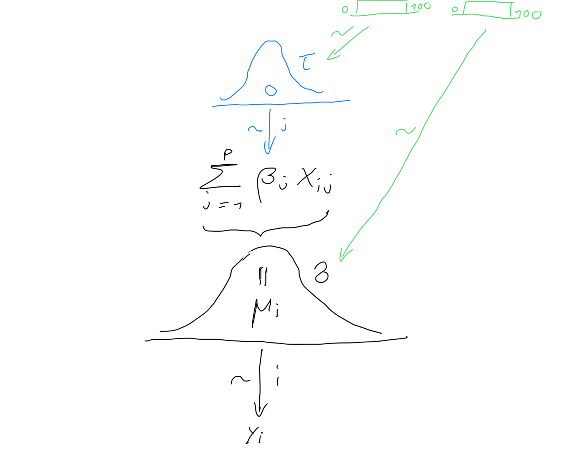

# Ridge Regression and Shrinkage

```{r, include=FALSE}
library(knitr)
library(caret)
library(glmnet)
library(tidyverse)
library(MASS)
library(lars)
library(gridExtra)
library(stats)
library(splines)
library(rjags)
library(ggmcmc)
library(MCMCvis)
```


Subset selection as outlined above works by either including or
excluding covariates, i.e. constrain specific regression coefficients to be zero.

An alternative is *Ridge regression*, which regularizes the optimization problem by shrinking regression coefficients towards zero. This discourages complex models because
models that overfit tend to have larger coefficients. Ridge regression can be formulated as a constrained optimization problem

\[
\hat{\beta}^{\rm Ridge}_{c}=\text{arg}\min\limits_{\|\beta\|_2^2\leq c}\textrm{RSS}(\beta).
\]

The geometry of the optimization problem is illustrated in Figure \@ref(fig:ridgegeom). It shows the levels sets of ${\rm RSS}(\beta)$, ellipsoids centered around the OLS estimate, and the circular ridge
parameter constraint, centered around zero with radius $c > 0$. The Ridge estimator
is the point where the smallest level set hits the constraint. Exactly at that point the $\rm{RSS}(\beta)$ is
minimized over those $\beta$’s that "live" inside the constraint.

```{r ridgegeom,echo=FALSE,out.width="70%",fig.cap="Geometry of Ridge regression."}
knitr::include_graphics("ridge_geometry.JPG")
```

Alternatively, Ridge regression can be cast as the optimization of the penalised residual sum of squares with a *penalty* on the magnitude of the coefficients, i.e. 

\[\hat{\beta}^{\rm Ridge}_{\lambda}=\textrm{arg}\min\limits_{\beta}\textrm{RSS}(\beta)+\lambda\|\beta\|^2_2.\]

Both formulations are equivalent in the sense that there is a one-to-one relationship between the tuning parameters $c$ and $\lambda$. We will use more often the latter "penalisation" formulation. The parameter $\lambda$ is the amount of penalisation. Note that with no penalization, $\lambda=0$, Ridge regression coincides with OLS. Increasing $\lambda$ has the effect of shrinking the regression coefficients to zero. 

The Ridge optimization problem has the closed form solution (see exercises)

\begin{align*}
\hat{\beta}^{\rm Ridge}_{\lambda}&=(\textbf{X}^T \textbf{X}+\lambda \textbf{I})^{-1}\textbf{X}^T \textbf{y}.
\end{align*}

Note that for $\lambda>0$ the matrix $\textbf{X}^T \textbf{X}+\lambda \textbf{I}$ has always full rank and therefore Ridge regression is well defined even in the high-dimensional context (in contrast to OLS).

Ridge regression is implemented in the package `glmnet`. We use `alpha=0` and can call 

```{r include=FALSE}
set.seed(1)
n <- 10
p <- 9
beta <- c(2,rep(0,p-1))

# simulate covariates
xtrain <- matrix(rnorm(n*p),n,p)
ytrain <- as.numeric(xtrain%*%beta+rnorm(n,sd=0.5))
dtrain <- data.frame(xtrain)
dtrain$y <- ytrain
```

```{r}
fit.ridge.glmnet <-glmnet(x=xtrain,y=ytrain,alpha=0) 
plot(fit.ridge.glmnet,xvar="lambda",label=TRUE)
```


## Choice of penalty parameter

In subset- and stepwise regression we had to identify the optimal subset. Similarly, for Ridge regression model selection consists of selecting the tuning parameter $\lambda$. We take a grid of values $0<\lambda_1<\lambda_2<\ldots<\lambda_M<\infty$ and proceed as explained in Section \@ref(model-selection), that is we choose the optimal $\lambda_{\rm opt}$ by either re-sampling or information criteria. In `glmnet` we use cross-validation using the command `cv.glmnet`.

```{r warning=FALSE}
cv.ridge.glmnet <-cv.glmnet(x=xtrain,y=ytrain,alpha=0) 
```

The next plot shows the cross-validation error with upper and lower standard deviations as a function of the lambda values (note the log scale for the lambdas).  

```{r}
plot(cv.ridge.glmnet)
```

The tuning parameter with the smallest cross-validation error is stored in the argument `lambda.min`.
```{r}
cv.ridge.glmnet$lambda.min
```

Another choice is `lambda.1se` which denotes the largest $\lambda$ within 1 standard error of the smallest cross-validation error.

```{r}
cv.ridge.glmnet$lambda.1se
```

## Shrinkage property

The OLS estimator becomes unstable (high variance) in presence of collinearity. A nice property of Ridge regression is that it counteracts this by shrinking low-variance components more than high-variance components. 

This can be best understood by rotating the data using a principle component analysis (see Figure \@ref(fig:principlecomponent)). 

In particular, we consider the singular value decomposition

$$\textbf{X}=\textbf{U}\textbf{D}\textbf{V}^T,$$

where the columns of $\textbf{U}$ form an orthonormal basis of the column space of $\textbf{X}$, $\textbf{D}$ is a diagonal matrix with entries $d_1\geq d_2\geq\ldots\geq d_p \geq 0$ called the singular values, and the columns of $\textbf{V}$ represent the principle component directions. For OLS the vector of fitted values ${\bf \hat y}^{\rm OLS}$ is the orthogonal projection of ${\bf y}$ onto the column space of $\bf X$. Therefore, in terms of rotated data we have

\[\hat{\textbf{y}}^{\rm OLS}=\sum_{j=1}^{p}\textbf{u}_j \textbf{u}_j^T \textbf{y}.\]

Similarly, we can represent the fitted values from Ridge regression as

\[\hat{\textbf{y}}^{\rm Ridge}=\sum_{j=1}^{p}\textbf{u}_j \frac{d_j^2}{d_j^2+\lambda}\textbf{u}_j^T\textbf{y}.\]

This shows that the level of shrinkage $\frac{d_j^2}{d_j^2+\lambda}$ is largest in the direction of the last principle component, which in return is the direction where the data exhibits smallest variance.

```{r principlecomponent, echo=FALSE, fig.height=5, fig.width=10, fig.cap="Left plot: 2-dimensional input data. Right plot: input data rotated using principle component analysis."}

set.seed(1315)
n <- 50
x <- mvrnorm(n=50,mu=c(0,0),Sigma=cbind(c(1,0.8),c(0.8,1)))
colnames(x) <- c("X1","X2")
pc <- prcomp(x)

par(mfrow=c(1,2))
plot(x,xlim=c(-2,2),ylim=c(-2,2))
plot(pc$x,xlim=c(-2,2),ylim=c(-2,2))
```

The following code shows how to perform a principle component analysis using the functions `prcomp` and `svd`.

```{r eval=FALSE}
# simulated correlated bivariate data
set.seed(1315)
n <- 50
x <- mvrnorm(n=50,mu=c(0,0),Sigma=cbind(c(1,0.8),c(0.8,1)))
colnames(x) <- c("X1","X2")

# run a principle component analysis
pc <- prcomp(x)
pc$sdev # standard dev

# same analysis using svd
cx <- sweep(x, 2, colMeans(x), "-")
sv <- svd(cx)
sqrt(sv$d^2/(nrow(x)-1))
pc$sdev
head(pc$x)
head(sv$u%*%diag(sv$d))
```

```{r include=FALSE, eval=FALSE}
fn <- function(x){x/(1+x)}
curve(fn,xlim=c(0,20),ylim=c(0,1),xlab="d",ylab="d^2/(1+d^2)",lwd=2,cex.axis=1.5)
```

## Effective degrees of freedom

Although Ridge regression involves all $p$ covariates the *effective degrees of freedom* are smaller than $p$ as we have imposed constraints through the penalty. In the book @elements it is shown that the effective degrees of freedom for Ridge regression, $\nu^{\rm ridge}_{\lambda}$, are given by

\[\nu^{\rm ridge}_{\lambda}=\sum_{j=1}^{p}\frac{d_j^2}{d_j^2+\lambda},\]
where $d_1,\ldots,d_p$ are the singular values of $\bf X$.

```{r}
# get singular values
fit.svd <- svd(xtrain) #fit.svd$d

# ridge degree of freedom for lambdaopt
df_lambdaopt <- sum(fit.svd$d^2/(fit.svd$d^2+cv.ridge.glmnet$lambda.min))
df_lambdaopt
```

## Bayesian shrinkage


We have introduced regularization by least-squares optimization with additional constraints on $\beta$. An alternative approach to regularization is based on Bayesian statistics. In a Bayesian setting the parameter $\beta=(\beta_1,\ldots,\beta_p)$ is itself a random variable with a *prior* distribution $p(\beta)$. Bayesian inference is based on the *posterior* distribution $$p(\beta|D)=\frac{p(D|\beta)p(\beta)}{p(D)},$$
where $D$ denotes the data and $p(D|\beta)$ is the likelihood function. In the exercises we will show that the Ridge solution can be viewed as the maximum a posteriori (MAP) estimate of a hierarchical Bayesian model where the data follows a multivariate regression model
\[Y_i|X_i,\beta\sim N(X_i^T\beta,\sigma^2),\; i=1,\ldots,n\]
and the regression coefficients are equipped with prior
\[\beta_j \sim N(0,\tau^2),\; j=1,\ldots,p.\]

In many Bayesian problems the posterior distribution is analytically not tractable and inference is typically based on sampling from the posterior distribution using a procedure called Markov chain Monte Carlo (MCMC). The software BUGS and JAGS automatically build MCMC samplers for complex hierarchical models. We now illustrate the use of `rjags` for the Bayesian Ridge regression model shown in Figure \@ref(fig:bayesianridge). 

```{r bayesianridge,echo=FALSE,out.width="80%",fig.cap="The Bayesian Ridge regression model."}

```

First we specify the model, prepare the input data and provide initial values.

```{r}
library(rjags)

# model
bayesian_ridge <-"model{
  for (i in 1:n){
    y[i] ~ dnorm (mu[i], 1/sig^2)
    mu[i] <- inprod(b,x[i,])
  }
  for (j in 1:p){
    b[j] ~ dnorm (0, 1/tau^2)
  }
  sig~dunif(0,100)
  tau~dunif(0,100)
}
"

# data
dat.jags <- list(x=xtrain,y=ytrain,p=ncol(xtrain),n=nrow(xtrain))

# initial values
inits <- function (){

  list (b=rnorm(dat.jags$p),sig=runif(1),tau=runif(1))
  
}
```

We then use the function `jags.model` to setup an MCMC sampler with `n.chains=3` chains (the number of samples, or MCMC iterations, used for adaptation is per default set to 1000).  

```{r}
# setup jags model
jags.m <- jags.model(textConnection(bayesian_ridge),
                     data=dat.jags,
                     inits=inits,
                     n.chains=3,
                     quiet=TRUE)
```

After a burn-in period of $500$ steps we use `coda.samples` to generate the posterior samples (`n.iter=10000` with a thinning of `thin=10` results in a total of `1000` posterior samples per chain). 

```{r message=FALSE}
# burn-in
update(jags.m, n.iter=500) 

# mcmc samples for inference
posterior.samples <- coda.samples( jags.m,
                                   variable.names = c("b","sig","tau"), 
                                   n.iter=10000,thin=10) # thinning=10 
```

There are several R packages to investigate the posterior distribution. For example with `MCMCsummary` we can extract key summary information, i.e. mean, median, quantiles, Gelman-Rubin convergence statistic and the number of effective samples.

```{r}
library(MCMCvis)
MCMCsummary(posterior.samples,
            round=2,
            params=c("sig","tau","b"))%>%
  kable
```

Or, we can use the package`ggmcmc` and produce a traceplot ("ggplot-style") to check the representativeness of the MCMC samples. 

```{r}
library(ggmcmc)
ggs.mcmc <- ggs(posterior.samples)
ggs_traceplot(ggs.mcmc,family="tau")
```

Alternatively, we can directly access the posterior samples and calculate any summary statistics of interest.

```{r}
# posterior samples as matrix
matrix.postsamples <- as.matrix(posterior.samples)
dim(matrix.postsamples)

# histogram of posterior
hist(matrix.postsamples[,"tau"])

# posterior mean
colMeans(matrix.postsamples) # posterior mean
```

Finally, we compare the regression coefficients from OLS, Ridge regression ($\lambda$ obtained using cross-validation) and Bayesian Ridge regression (posterior mean).

```{r warning=FALSE, message=FALSE}
beta.ridgecv <- as.numeric(coef(cv.ridge.glmnet,s=cv.ridge.glmnet$lambda.min))[-1]
beta.ols <- coef(lm(ytrain~xtrain))[-1]
beta.bayesian <- colMeans(matrix.postsamples)[1:9]
dd <- data.frame(beta.ols=beta.ols,beta.ridgecv=beta.ridgecv,beta.ridgebayesian=beta.bayesian)
rownames(dd) <- paste0("beta",1:9)
ddl <- pivot_longer(dd%>%
                      rownames_to_column(var="coef"),-coef) 

ddl%>%
  ggplot(.,aes(x=coef,y=value,col=name,pch=name))+
  geom_point(size=3)+
  geom_line(aes(group=name))+
  theme_bw()+
  geom_hline(yintercept = 0,lty=1)+
  xlab("")
```

The coefficients obtained from Ridge regression and Bayesian Ridge regression are almost identical. 


```{r include=FALSE, eval=FALSE}
# model
bayesian_ridge <-"model{
  for (i in 1:n){
    y[i] ~ dnorm (mu[i], 1/sig^2)
    mu[i] <- inprod(b,x[i,])
  }
  for (j in 1:p){
    b[j] ~ dnorm (0, 1/tau^2)
  }
}
"

# data
dat.jags <- list(x=xtrain,y=ytrain,p=ncol(xtrain),n=nrow(xtrain),sig=0.5,tau=0.1)

# initial values
inits <- function (){

  list (b=rnorm(dat.jags$p))
  
}

# setup jags model
jags.m <- jags.model(textConnection(bayesian_ridge),
                     data=dat.jags,
                     inits=inits,
                     n.chains=1,
                     quiet=TRUE,
                     n.adapt=0)
# 
mcmc.test <- coda.samples( jags.m, variable.names="b", n.iter=50)
summary(mcmc.test)
traceplot(mcmc.test[,1])

# mcmc sampling
update(jags.m, n.iter=1000) # burn-in
mcmc.samples <- coda.samples( jags.m, variable.names="b", n.iter=10000,thin=10) # thinning=10 

# results
summary(mcmc.samples)

# closed-form solution
lambda <-  dat.jags$sig^2/dat.jags$tau^2
coef.ridge <- solve(t(dat.jags$x)%*%dat.jags$x+
                      lambda*diag(nrow=ncol(dat.jags$x)))%*%t(dat.jags$x)%*%dat.jags$y
head(coef.ridge)[,1]

sd_y <- sqrt(var(dat.jags$y)*(dat.jags$n-1)/dat.jags$n)
lambda2 <- sd_y*lambda/dat.jags$n
fit.ridge2 <- glmnet(dat.jags$x,dat.jags$y,alpha=0,lambda=lambda2,
                    intercept=FALSE,standardize = FALSE,thresh = 1e-20,exact=TRUE)
head(as.vector(coef(fit.ridge2))[2:5])

# In the above example we assumed $\sigma$ and $\tau$ to be given. In practice these two parameters are unknown and have to be equipped with prior distributions as well.
```


## Smoothing splines

Ridge regression and high-dimensionality play a role in many subfields of statistics. We illustrate this with the example of smoothing splines for univariate non-parametric regression.

Sometimes it is extremely unlikely that the true function $f(X)$ is actually linear in $X$. Consider the following example.

```{r, echo=FALSE, fig.cap="Non-linear (sinusoidal) relationship between Y and X."}
# define a non-linear function
n <- 101
x <- seq(0, 1, length.out = n)
fx <- sin(2 * pi * x)

# generate noisy data
set.seed(1)
y <- fx + rnorm(n, sd = 0.5)

plot(x, y)# plot of the data
```

How can we approximate the relationship between Y and X?
The most simple approximation is a straight horizontal line (dashed blue line; the true sinusoidal function is depicted in black). 

```{r echo=FALSE,fig.cap="Approximation by a constant."}
const <- mean(y)
plot(x, y)
abline(h=const, lty = 2, col = "blue",lwd=3)
lines(x, fx, lwd = 2)
legend("topright", legend = "f(x)", lty = 1, lwd = 2, bty = "n")
```


Clearly this approximation is too rigid. Next, we try a piecewise constant approximation with two inner "knots".

```{r echo=FALSE, fig.cap="Piecewise constant approximation."}
# see https://bobby.gramacy.com/surrogates/splines.html
xi <- c(1/3,2/3)
hc1 <- function(x) { as.numeric(x < xi[1]) }
hc2 <- function(x) { as.numeric(x >= xi[1] & x < xi[2]) }
hc3 <- function(x) { as.numeric(x >= xi[2]) }
Hc <- data.frame(cbind(hc1(x), hc2(x), hc3(x)))
names(Hc) <- paste("hc", 1:3, sep="")
fit.pwc <- lm(y~.,data=Hc)
plot(x, y)
lines(x, fx, lwd = 2)
lines(x[x<xi[1]], predict(fit.pwc)[x<xi[1]], lty = 2, col = "blue",lwd=3)
lines(x[x>xi[1]&x<xi[2]], predict(fit.pwc)[x>xi[1]&x<xi[2]], lty = 2, col = "blue",lwd=3)
lines(x[x>xi[2]], predict(fit.pwc)[x>xi[2]], lty = 2, col = "blue",lwd=3)
#abline(v=1/3,col="white",lwd=6);abline(v=2/3,col="white",lwd=6)
```

Finally, we use a piecewise linear function.

```{r echo=FALSE, fig.cap="Piecewise linear approximation."}
Hl <- cbind(Hc, hc1(x)*x, hc2(x)*x, hc3(x)*x)
names(Hl)[4:6] <- paste("hl", 1:3, sep="")
fit.pwl <- lm(y~., data=Hl)
plot(x, y)
lines(x, fx, lwd = 2)
lines(x[x<xi[1]], predict(fit.pwl)[x<xi[1]], lty = 2, col = "blue",lwd=3)
lines(x[x>xi[1]&x<xi[2]], predict(fit.pwl)[x>xi[1]&x<xi[2]], lty = 2, col = "blue",lwd=3)
lines(x[x>xi[2]], predict(fit.pwl)[x>xi[2]], lty = 2, col = "blue",lwd=3)
```


The approximation improves. Nevertheless it would be nice if the different line segments would line up. What we need are piecewise polynomials which are "smooth" at the knots. Such functions are called "splines". We assume that $f$ can be expressed by a set of basis functions 

$$ f(X)=\sum_{j=1}^{p}\beta_j B_j(X).$$
For example for a cubic spline with $K$ fixed knots and fixed polynomial degree $d=3$ ("cubic") we have $p=K+d+1$ and the $B_j(x)$'s form a B-spline basis (one could also use the truncated-power basis). The coefficients $\beta_m$ are estimated using OLS. Although we have only one single variable $X$, the design matrix consists of $p=K+d+1$ features and we quickly run into issues due to overfitting. In `R` we obtain a B-spline basis with `bs` and we can plot the basis functions $B_j(x)$ as follows.

```{r}
spl <- bs(x,df=10) # cubic spline with p=10 degrees of freedom
plot(spl[,1]~x, ylim=c(0,max(spl)), type='l', lwd=2, col=1, 
     xlab="Cubic B-spline basis", ylab="")
for (j in 2:ncol(spl)) lines(spl[,j]~x, lwd=2, col=j)
```

The estimated coefficients $\hat \beta_j$ are obtain using `lm`.
```{r}
fit.csp <- lm(y~spl)
#fit.csp <- lm(y~bs(x,df=10))
coef(fit.csp)
```
The cubic spline with $p=10$ degrees of freedom fits the data well as shown in the next plot (in dashed violet). 

```{r}
plot(x, y)
lines(x, fx, lwd = 2)
lines(x, predict(fit.csp), lty = 2, col = "violet",lwd=3)
```

An alternative approach are so-called *smoothing splines*, where we take $p=n$ and the $B_j(x)$'s are an n-dimensional set of basis functions representing the family of natural cubic splines with knots at the unique values of $x_i$, $i=1,\ldots,n$. The coefficients $\beta_j$ cannot be estimated using OLS as the number $p$ of basis functions (columns of the design matrix) equals the number of observations $n$. Smoothing splines overcome this hurdle by imposing a generalized ridge penalty on the spline coefficients $\beta_j$, i.e.

\[\hat{\beta}_{\lambda}=\textrm{arg}\min\limits_{\beta}\;\|\textbf{y}- \textbf{B} \beta\|^2+\lambda \beta^T\Omega\beta,\]

where $\bf B$ is the design matrix with $jth$ column $(B_j(x_1),\ldots,B_j(x_n))^T$. In practice we can fit 
smoothing splines using the function `smooth.spline`. The penalty term is specified by setting the effective degrees of freedom $\nu$ or by selecting $\lambda$ using cross-validation (see Section \@ref(choice-of-penalty-parameter)).


```{r, eval=FALSE,include=FALSE}
#https://www.hse.ru/data/2018/03/15/1164357459/5._Splines.html
#https://cswr.nrhstat.org/3-5-splines.html
# https://lbelzile.github.io/lineaRmodels/splines.html
#https://bobby.gramacy.com/surrogates/splines.html


my.knots <- sort(unique(x))[-c(1,101)]
bs_mat <- ns(x,knots=my.knots)
bmat2 <- splineDesign(knots=my.knots,x=x,outer.ok = TRUE)
fit.smsp <- smooth.spline(x, y, all.knots = TRUE,keep.stuff = TRUE)
fit.smsp$auxM

x <- seq(0, 1, by=0.001)
spl <- ns(x,df=6)
plot(spl[,1]~x, ylim=c(min(spl),max(spl)), type='l', lwd=2, col=1, 
     xlab="Cubic B-spline basis", ylab="")
for (j in 2:ncol(spl)) lines(spl[,j]~x, lwd=2, col=j)
```

We fit smoothing splines to our simulation example.

```{r}
# smoothing spline with 10 effective degrees of freedom
fit.smsp.df10 <- smooth.spline(x, y, df = 10) 

# smoothing spline with 30 effective degrees of freedom
fit.smsp.df30 <- smooth.spline(x, y, df = 30) 

# smoothing spline with effective degrees of freedom estimated by cv
fit.smsp.cv <- smooth.spline(x, y) 

plot(x, y)
lines(x, fx, lwd = 2)
lines(x, fit.smsp.df10$y, lty = 2, col = "blue",lwd=3)
lines(x, fit.smsp.df30$y, lty = 3, col = "green",lwd=3)
lines(x, fit.smsp.cv$y, lty = 4, col="red",lwd=3)
legend(0.7,1.5,
       lty=1:4,
       lwd=3,
       col=c("black","blue","green","red"),
       legend=c("truth","cubic p=10","cubic p=30","smoothing"))
```

The smoothing spline with $\nu=30$ (in green) leads to overfitting. The smoothing splines obtained by cross-validation (in red) or by fixing $\nu=10$ (in blue) are both good approximation of the truth. The corresponding effective degrees of freedom of the cross-validation solution can be retrieved from the model fit.

```{r}
fit.smsp.cv$df
```


