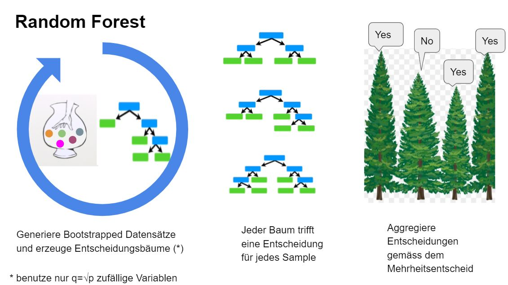
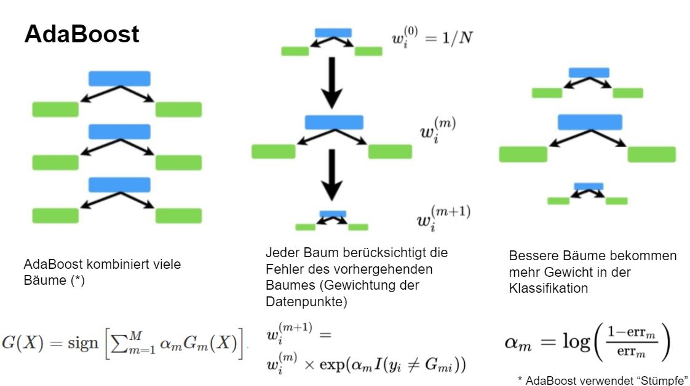

# Classification

```{r include=FALSE}
library(knitr)
library(caret)
library(mlbench)
library(pheatmap)
library(tidyverse)
library(MASS)
library(glmnet)
library(rpart)
```

Our high-dimensional considerations so far focused on the linear regression model. We now extend this to classification.

## Logistic regression

We start with standard logistic regression where the response $Y$ takes values $0$ and $1$, and the aim is to do prediction based on covariates $X=(X_1,\ldots,X_p)$. We model the probability of success (i.e., $Y=1$) $$p(x;\beta)=P(Y=1|X=x;\beta)$$ assuming a binomial distribution with logit link function

\[\text{logit}(x;\beta)=\log \Big(\frac{p(x;\beta)}{1-p(x;\beta)}\Big)=X^T\beta.\]

In logistic regression we estimate the regression parameter $\beta$ by maximizing the log-likelihood

\begin{align*}
\ell(\beta|\textbf{y},\textbf{X})&=\sum_{i=1}^{n}(1-y_i)\log(1-p(x_i;\beta))+y_i\log p(x_i;\beta)\\
&=\sum_{i=1}^{n}y_i x_i^T\beta - \log(1+\exp(x_i^T\beta)).
\end{align*}

Given an estimate $\hat \beta$ (from training data), prediction based on new input data $X_{\rm new}$ can be obtained via the predicted probability of success $p(X_{\rm new};\hat \beta)$, e.g. the class labels corresponding to the maximum probability

\begin{align*}
  \hat{Y}\equiv\hat{G}(X_{\textrm{new}})\equiv\left\{
    \begin{array}{ll}
      1, & \mbox{if $p(X_{\textrm{new}};\hat\beta)>0.5$}.\\
      0, & \mbox{otherwise}.
    \end{array}
  \right.
\end{align*}

There are different measures to judge the quality of the predictions. We focus on the misclassification error which is simply the fraction of misclassified test samples. Another important measure used in the context of classification is the receiver operating characteristic (ROC).

We illustrate logistic regression using an example taken from the book by @elements. The data shown in Figure \@ref(fig:sahd) are a
subset of the Coronary Risk-Factor Study (CORIS) baseline survey, carried
out in three rural areas of the Western Cape, South Africa. The aim of the study was to establish the intensity of ischemic
heart disease risk factors in that high-incidence region. The data represent
white males between 15 and 64, and the response variable is the presence or
absence of myocardial infarction (MI) at the time of the survey (the overall
prevalence of MI was 5.1% in this region). There are 160 cases in our data
set, and a sample of 302 controls. The variables are:

- sbp: systolic blood pressure
- tobacco: cumulative tobacco (kg)
- ldl: low densiity lipoprotein cholesterol adiposity
- famhist: family history of heart disease (Present, Absent)
- obesity
- alcohol: current alcohol consumption
- age: age at onset
- chd: response, coronary heart disease.


<!-- data source: https://web.stanford.edu/~hastie/ElemStatLearn/ -->
<!-- dat <-  read.table("http://www-stat.stanford.edu/~tibs/ElemStatLearn/datasets/SAheart.data",sep=",",head=T,row.names=1) -->

We start by drawing scatter plots of pairs of risk factors and by color coding cases and controls.

```{r sahd, fig.cap="Pairs plot of South African Heart Disease Data (red circles: cases, blue triangles: controls).",fig.height=10,fig.width=10}
dat <- readRDS(file="data/sahd.rds")
pairs(data.matrix(dat[,-1]),
      col=ifelse(dat$chd==1,"red","blue"),
      pch=ifelse(dat$chd==1,1,2))
```

Next, we fit a logistic regression model using the function `glm`.

```{r}
fit.logistic <- glm(chd~sbp+tobacco+ldl+famhist+obesity+alcohol+age,
                    data=dat,
                    family="binomial")
kable(broom::tidy(fit.logistic),digits=3,booktabs=TRUE)
```

There are some surprises in this table of coefficients, which must be interpreted with caution. Systolic blood pressure (sbp) is not significant! Nor
is obesity, and its sign is negative. This confusion is a result of the correlation between the set of predictors. On their own, both sbp and obesity
are significant, and with positive sign. However, in the presence of many other correlated variables, they are no longer needed (and can even get a
negative sign).

How does one interpret a coefficient of $0.080$ (Std. Error = $0.026$) for
tobacco, for example? Tobacco is measured in total lifetime usage in kilograms, with a median of $1.0$kg for the controls and $4.1$kg for the cases. Thus
an increase of 1kg in lifetime tobacco usage accounts for an increase in the
odds of coronary heart disease of $\exp(0.080)$=`r round(exp(0.080),3)` or $8.3$%. Incorporating the standard error we get an approximate $95$% confidence interval of
$\exp(0.081 ± 2 × 0.026)$=`r paste0(paste0("(",paste0(round(exp(c(0.080 -2*0.0226,0.080+2*0.0226)),3),collapse = ",")),")")`.

## Regularized logistic regression

Similar as for linear regression, in the high-dimensional setting where $n$ is small compared to $p$, the maximum likelihood estimator does lead to overfitting and a poor generalisation error. In the context of linear regression we introduced regularization by imposing constraints on the regression coefficients. It is easy to generalize this idea to logistic regression. In `R` subset- and stepwise logistic regression is implemented in `stepAIC` and elastic net regularization in `glmnet` (with argument `family="binomial"`). In the latter case the algorithm optimizes the negative log-likelihood penalized with the elastic net term: 

\begin{align*}
\hat{\beta}^{\rm EN}_{\alpha,\lambda}&=\text{arg}\min\limits_{\beta}\;-\frac{1}{n}\ell(\beta|{\bf y},{\bf X})+\lambda\big(\alpha\|\beta\|_1+(1-\alpha)\|\beta\|_2^2/2\big).
\end{align*}

With $\alpha=0$ and $\alpha=1$ we obtain the Ridge and the Lasso solution, respectively. 

We turn back to the heart disease example and perform backward stepwise logistic regression.

```{r warning=FALSE}
fit.bw <- stepAIC(fit.logistic,direction = "backward",trace=FALSE)
```

The terms removed in each step are provided in the next table.

```{r}
kable(as.data.frame(fit.bw$anova),digits=3,booktabs=TRUE)
```

The regression coefficients of the final model are shown below.

```{r}
kable(broom::tidy(fit.bw),digits=3,booktabs=TRUE)
```

We continue with the Lasso approach and show the trace plot.

```{r}
x <- scale(data.matrix(dat[,-1]))
y <- dat$chd
fit.lasso <- glmnet(x=x,y=y,family="binomial")
plot(fit.lasso,xvar = "lambda",label=TRUE)
```

The first coefficient which is shrunk to zero is alcohol followed by sbp and obesity. This is in line with the results from backward selection.


<!--  Example from https://cran.r-project.org/web/packages/varbvs/vignettes/leukemia.html -->

Let's now turn to a truly high-dimensional example. The data consists of expression levels recorded for $3'571$ genes in $72$ patients with leukemia. The binary outcome encodes the disease subtype: acute lymphobastic leukemia (ALL) or acute myeloid leukemia (AML). The data are represented as a 72 x 3,571 matrix $\bf X$ of gene expression values, and a vector $\bf y$ of 72 binary disease outcomes. We first create training and test data.

```{r}
# set seed
set.seed(15)

# get leukemia data
leukemia <- readRDS(file="data/leukemia.rds")
x <- leukemia$x
y <- leukemia$y

# test/train 
ind_train <- sample(1:length(y),size=length(y)/2)
xtrain <- x[ind_train,]
ytrain <- y[ind_train]
xtest <- x[-ind_train,]
ytest <- y[-ind_train]
```

The following heatmap illustrates the gene expression values for the different patients.

```{r, include=FALSE}
library(pheatmap)
xhp <- t(xtrain[,sample(1:ncol(xtrain),size=200)])
colnames(xhp) <- paste0("P",seq(ncol(xhp)))
annotation_col <- data.frame(
  y=factor(ytrain,labels=c("ALL","AML"))
)
rownames(annotation_col) <- colnames(xhp)
hp <- pheatmap(xhp,cluster_rows = FALSE,
               annotation_col = annotation_col,
               annotation_names_col = FALSE)
```

```{r echo=FALSE}
print(hp)
```


We now run the elastic net logistic regression approach and make a trace plot

```{r}
# run glmnet
alpha  <- 0.95                # elastic net mixing parameter.
fit.glmnet <-glmnet(xtrain,ytrain,family = "binomial",alpha=alpha)
plot(fit.glmnet,xvar="lambda",label=TRUE)
```

We perform 10-fold cross-validation and plot the misclassification error. 

```{r}
set.seed(118)
# run cv.glmnet
nfolds <- 10 # number of cross-validation folds.
cv.glmnet <- cv.glmnet(xtrain,ytrain,
                       family = "binomial",type.measure = "class",
                       alpha = alpha,nfolds = nfolds)
plot(cv.glmnet)
```

We take `lambda.1se` as the optimal tuning parameter

```{r}
#sum(coef(fit.glmnet, s = cv.glmnet$lambda.1se)!=0)
#sum(coef(fit.glmnet, s = cv.glmnet$lambda.min)!=0)
(lambda.opt <- cv.glmnet$lambda.1se)
```

and visualize the size of the coefficients using a barplot

```{r}
beta.glmnet <- coef(fit.glmnet, s = cv.glmnet$lambda.min)
df <- data.frame(Gene=paste0("G",1:(length(beta.glmnet)-1)),
                 Beta=as.numeric(beta.glmnet)[-1])
df%>%
  arrange(desc(abs(Beta)))%>%
  slice(1:200)%>%
  ggplot(.,aes(x=Gene,y=Beta))+
  geom_bar(stat="identity")+
  theme_bw()+
  theme(axis.text.x = element_blank())+
  geom_hline(yintercept = 0)
```

Finally, we predict the disease outcome of the test samples using the fitted model and compare against the observed outcomes of the test samples.
```{r}
pred <- c(predict(fit.glmnet,xtest,s = lambda.opt,type = "class"))
print(table(true = factor(ytest),pred = factor(pred)))
```
The misclassification error on the test data can be calculated as follows.

```{r}
round(mean(pred!=ytest),3)
```

## Classification trees and machine learning

Classification is a frequent task in data mining and besides logistic regression there is a variety of other methods developed for this task. We first introduce *classification trees* which learn a binary tree where *leaves* represent class labels and *branches* represent conjunctions of features that lead to those class labels. The package `rpart` can be used to learn classification trees.

```{r warning=FALSE}
# load packages
library(rpart)
library(rpart.plot)

# read south african heart disease data
dat <- readRDS(file="data/sahd.rds")

# grow a classification tree
fit.tree <- rpart(chd~.,data=dat,method="class")
# plot(fit.tree, uniform=TRUE)
# text(fit.tree, use.n=TRUE, all=TRUE, cex=.8)
rpart.plot(fit.tree,extra=1,under=TRUE,tweak = 1.2,faclen=3)
```


<!-- In the CORIS example the best first splitting criteria is `age < 51` followed by `famhist=Absent` and `tobacco<7.6`. -->
The algorithm starts by growing a typically too large tree which overfits the data. The next step is to "prune" the tree to obtain a good trade-off between goodness of fit and complexity. The following plot shows the relative cross-validation error (relative to the trivial tree consisting of only the root node) as a function of the complexity parameter. 

```{r}
plotcp(fit.tree,cex.lab=1.5,cex.axis=1.2,cex=1.5)
```

The optimally pruned tree has size 4 (i.e., 4 leave nodes).

```{r}
# prune the tree
fit.prune<- prune(fit.tree, 
                  cp=fit.tree$cptable[which.min(fit.tree$cptable[,"xerror"]),"CP"])
rpart.plot(fit.prune,extra=1)
```

Classification trees are the basis of powerful Machine Learning (ML) algorithms, namely *Random Forest* and *AdaBoost*. Both methods share the idea of growing various trees and combining the outputs to obtain a more powerful classification. However, the two approaches differ in the way they grow the trees and in how they do the aggregation. Random Forest works by building trees based on bootstrapped data sets and by aggregating the results using a majority vote (see Figure \@ref(fig:randomforest)). The key idea behind AdaBoost is to sequentially fit a "stump" (i.e., a tree with two leaves) to weighted data with repeatedly modified weights. The weights assure that each stump takes the errors made by the previous stump into account. In that way a sequence of weak classifiers $\{G_m\}_{m=1}^M$ is produced and finally a powerful new classifier is obtained by giving more influence towards the more accurate classifiers (see Figure \@ref(fig:adaboost)). More details on these methods are provided in the book by @elements. Random Forest is implemented in the package `RandomForest` and AdaBoost in the package `gbm`. We will explore examples in the exercises. 


<!-- More specifically AdaBoost proceeds as follows: -->

<!-- 1. Initialize the weights $w_i=1/n$, $i=1,\ldots,n$ -->
<!-- 2. For $m=1$ to $M$: -->
<!--    a) Fit a weak classifier $G_m$ (a "stump") to the training data using weights $w_i$. -->
<!--    b) Compute the weighted error rate -->
<!--   $${\rm err}_m=\frac{\sum_{i=1}^n w_i I(y_i\neq G_m(x_i))}{\sum_{i=1}^n w_i}.$$ -->
<!--    c) Compute $\alpha_m=\log((1-{\rm err}_m)/{\rm err}_m)$ -->
<!--    d) Update $w_i\leftarrow w_i \exp(\alpha_m I(y_i\neq G_m(x_i)))$, $i=1,2,...,n.$ -->

<!-- 3. Output the combined classifier $G(X)={\rm sign}\left[\sum_{m=1}^M \alpha_m G_m(X)\right]$. -->

<!-- In line 2d the weights are updated. Interestingly, the observations that where misclassified by $G_{m}(x)$ receive a larger weight which forces the next classifier $G_{m+1}(x)$ to focus on the misclassified observations. In line 3 the final predictor is assembled. The parameters $\alpha_m$ balance the influence of the individual classifiers towards the more accurate classifiers in the sequence. -->

```{r randomforest,echo=FALSE,out.width="80%",fig.cap="The key idea of Random Forest"}

```

```{r adaboost,echo=FALSE,out.width="80%",fig.cap="The key idea of AdaBoost"}

```
