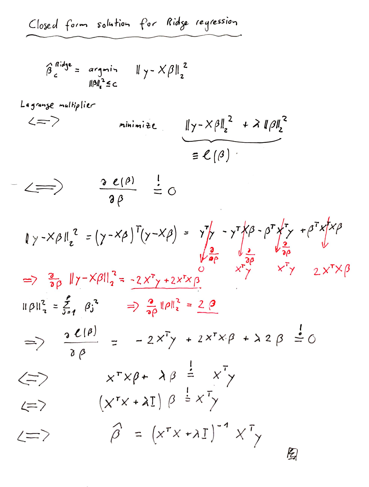
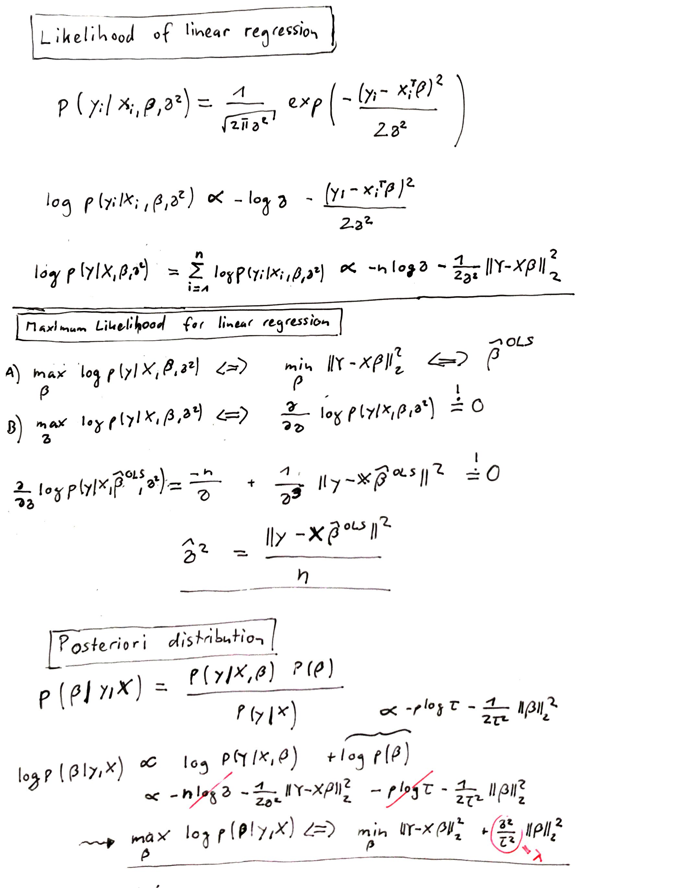
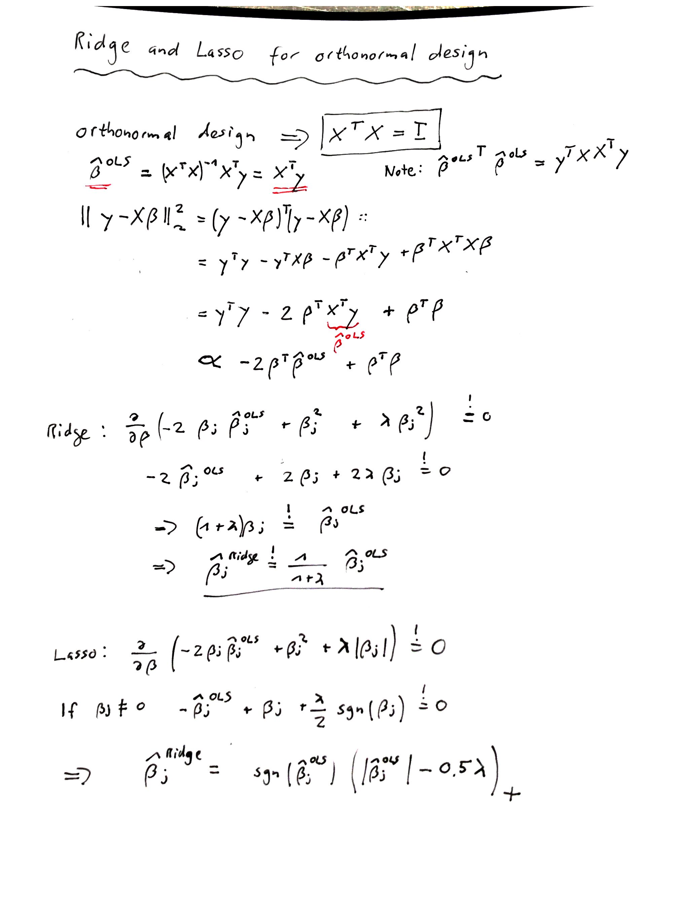

```{r setup, include=FALSE}
knitr::opts_chunk$set(echo = TRUE,warnings=FALSE,fig.align='center')
```


---

# Prerequisites

The data sets used in the following exercises can be downloaded from [here](https://github.com/staedlern/highdim_stats/tree/main/data). We recommend to install the following R packages.


```{r echo=FALSE}
library(knitr)
library(caret)
library(glmnet)
library(tidyverse)
library(MASS)
library(lars)
library(gridExtra)
library(gbm)
library(splines)
library(randomForest)
library(rpart)
library(rpart.plot)
library(ggpubr)
library(survminer)
library(survival)
```

# Diabetes data and linear regression

The data that we consider consist of 442 diabetes patients, with the response of interest being a quantitative
measure of disease progression one year after baseline. There are ten baseline
variables — age, sex, body-mass index, average blood pressure, and six blood
serum measurements — plus quadratic terms, giving a total of $p=64$ features. 

1. Read the diabetes data set `diabetes.rds` and make a histogram for the response variable `y`. Describe the distribution of the variable.
2. Create a scatterplot matrix for the 5 first variables in the data set. Use `pairs` or `ggpairs`.
3. Randomly assign patients to training and test data (use `sample`). 
4. Run a univariate regression model with `bmi` as covariate. Study the `summary` output. 

   - How do you interpret the regression coefficients for `bmi`?
   - What is the meaning of the  *multiple R-squared*? 
   - What is the *residual standard error*?
   - Generate a scatter plot of `y` against `bmi` and add the regression line with confidence band (use `geom_smooth`, `method="lm"`). 
   - Draw the Tukey Anscombe plot and the QQ plot (check `?plot.lm`). What are these two plots telling us?
   
5. Run a multiple regression model using all covariates. Study the `summary` output. 

   - What does change in the interpretation of the coefficient for `bmi`? 
   - What do you conclude from the *multiple R-squared*?
   - Create a Tukey Anscombe plot and a QQ plot.
   
6. Calculate the RSS for both models. Write down your observation.
7. Compare the two models using the `anova` function. What do you conclude?


Solution to the exercise.

Read the data set.

```{r}
diabetes <- readRDS(file="data/diabetes.rds")
data <- as.data.frame(cbind(y=diabetes$y,diabetes$x2))
colnames(data) <- gsub(":",".",colnames(data))
```

Generate a histogram of `y`.
```{r}
hist(data$y)
```

The distribution is right-skewed. Scatterplot matrix of the diabetes data.

```{r}
pairs(data[,1:5])
```

Create training and test data.

```{r}
train_ind <- sample(seq(nrow(data)),size=nrow(data)/2)
data_train <- data[train_ind,]
xtrain <- as.matrix(data_train[,-1])
ytrain <- data_train[,1]
data_test <- data[-train_ind,]
xtest <- as.matrix(data_test[,-1])
ytest <- data_test[,1]
```

Fit a univariate regression model.

```{r}
fit1 <- lm(y~bmi,data=data_train)
summary(fit1)
```

Scatter plot with regression line.

```{r}
data_train%>%
  ggplot(data=.,aes(x=bmi,y=y))+
  geom_point()+
  geom_smooth(method="lm")
```

The Tukey Anscombe plot. The residuals scatter around the 0 line and do not show any systematic pattern. This indicates that the residuals are independent and have mean 0.

```{r}
plot(fit1,which=1) # Tukey Anscombe plot
```

The QQ plot. This plot is used to check the normality assumption of the residuals. The residuals show slight tendency to be right-skewed (see also the histogram).
```{r}
plot(fit1,which=2) # Tukey Anscombe plot
hist(residuals(fit1))
```

We run the multiple regression model with all covariates. We print the `summary` and create TA and QQ plots.
```{r}
fit2 <- lm(y~.,data=data_train)
#summary(fit2)
plot(fit2,which=1)
plot(fit2,which=2)
```
Calculate the RSS. 

```{r}
sum(residuals(fit1)^2)
sum(residuals(fit2)^2)
```

Compare the 2 models using the `anova` function.

```{r}
anova(fit1,fit2)
```

# Diabetes data and model validation

In the previous section we developed 2 models to predict `y`. In this section we explore the generalizability of these models.

1. Calculate the RMSEs on the training data. Which model will perform best on future data?
2. Use the test data and make scatter plots of the observed against predicted outcomes. Use `ggplot` to create one plot per model and add the regression line (`geom_smooth`) and the "y=x" (`geom_abline`) line to the graph. This plot is also called "calibration plot". The model is "well" calibrated if the regression line agrees with the "y=x" line.
3. Generate boxplots of `predicted - observed` for the 2 models. What do you conclude?
4. Calculate the generalization error, i.e., the RMSE on the test data.


Solution to the exercise.

We calculate the RMSEs on the training data. RMSE on training data tells you how good the model "fits" the data. We
cannot make any conclusion about the generalizability of the models based on RMSEs on training data.

```{r}
RMSE(data_train$y,predict(fit1,newdata=data_train))
RMSE(data_train$y,predict(fit2,newdata=data_train))
```
We draw calibration plots for the 2 models. Model 1 calibrates slightly better.

```{r  fig.width=8,fig.height=4}
dd <- data.frame(pred=c(predict(fit1,newdata=data_test),
                        predict(fit2,newdata=data_test)),
                 obs = rep(data_test$y,times=2),
                 model=rep(c("mod1","mod2"),each=nrow(data_test))
)
dd%>%
  ggplot(.,aes(x=pred,y=obs))+
  geom_point()+
  geom_smooth(se=FALSE,method="lm")+
  geom_abline(slope=1,intercept=0)+
  theme_bw()+
  facet_wrap(~model)
```

Boxplots of predicted minus observed. 

```{r}
dd%>%
  ggplot(.,aes(x=model,y=pred-obs))+
  geom_boxplot()+
  geom_point()
```

Calculate RMSEs on test data.

```{r}
RMSE(data_test$y,predict(fit1,newdata=data_test))
RMSE(data_test$y,predict(fit2,newdata=data_test))
```

# Calculus, optimization and OLS

1. Consider the function $f(x)=2x^2 + x -5$. Draw a plot of the function.
2. Use `optimize` to find the minimum of $f(x)$.
3. Obtain the minimum of $f(x)$ by taking the derivative and setting equal to zero.
4. Show that $\|a\|^2_2=a^Ta$.
5. Use the result in 4. and show that $\bf RSS(\beta)=\bf y^Ty-2 y^T X \beta +\beta^T X^T X \beta$. 
6. Invoke the result obtained in 4. and show that $$\frac{\partial}{\partial \beta} \bf RSS(\beta)=\bf -2X^Ty+2X^TX\beta.$$ Hint: review the "Identities" section of [Wikipedia](https://en.wikipedia.org/wiki/Matrix_calculus).
7. Do you understand the derivation of the least squares estimator?


Solution to the exercise.


Plot of the function.
```{r}
myf <- function(x){
  2*x^2 + x -5
}
curve(myf,from=-1,to=1)
```


```{r}
optimize(myf,interval=c(-5,5))
```

# Diabetes data and regularization

The task is to use the diabetes data to construct a model that predicts the response `y` (disease progression) based on covariates. The two hopes are, that the model would produce accurate baseline predictions of response for future patients, and also that the form of the model would suggest which covariates were important factors in disease progression.

1. Read in the diabetes data set.
2. Run forward stepwise regression. Which is the first variable included in the selection process? Print the coefficients of the AIC-optimal model as a table.
3. Fit Ridge regression. Show the trace plot and the cross-validation plot.
4. Run the Lasso approach and show the trace and the cross-validation plots.
5. Calculate the root-mean-square errors (RMSE) for all 3 models on the test data and compare with the performance of the full model. Which model generalizes best?
6. Plot the regression coefficients for all 3 models.

The solution to this exercise. 

Read the data set and create training and test data.

```{r}
set.seed(007)
diabetes <- readRDS(file="data/diabetes.rds")
data <- as.data.frame(cbind(y=diabetes$y,diabetes$x2))
colnames(data) <- gsub(":",".",colnames(data))
train_ind <- sample(seq(nrow(data)),size=nrow(data)/2)
data_train <- data[train_ind,]
xtrain <- as.matrix(data_train[,-1])
ytrain <- data_train[,1]
data_test <- data[-train_ind,]
xtest <- as.matrix(data_test[,-1])
ytest <- data_test[,1]
```

We perform forward stepwise regression.

```{r}
# Full model
fit.full <- lm(y~.,data=data_train)

# Forward regression
fit.null <- lm(y~1,data=data_train)
fit.fw <- stepAIC(fit.null,direction="forward",
                  scope=list(lower=fit.null,
                             upper=fit.full
                             
                  ),
                  trace = FALSE
)
#summary(fit.fw)
```

The selection process is depicted in the following table.

```{r}
kable(as.data.frame(fit.fw$anova),digits=2,
      booktabs=TRUE)
```

The regression coefficients and the corresponding statistics of the AIC-optimal model are shown next.

```{r}
kable(broom::tidy(fit.fw),digits=2,
      booktabs=TRUE)
```

We continue by fitting Ridge regression. We show the trace plot and the cross-validation plot.

```{r}
# Ridge
set.seed(1515)
fit.ridge <- glmnet(xtrain,ytrain,alpha=0)
fit.ridge.cv <- cv.glmnet(xtrain,ytrain,alpha=0)
plot(fit.ridge,xvar="lambda")
plot(fit.ridge.cv)
```

Finally, we run the Lasso approach and show the trace and the cross-validation plots.

```{r, fit.cap="Trace and cross-validation lot."}
# Lasso
set.seed(1515)
fit.lasso <- glmnet(xtrain,ytrain,alpha=1)
fit.lasso.cv <- cv.glmnet(xtrain,ytrain,alpha=1)
plot(fit.lasso,xvar="lambda")
plot(fit.lasso.cv)#fit.lasso.cv$lambda.1se
```

We calculate the root-mean-square errors (RMSE) on the test data and compare with the full model.

```{r}
# RMSE
pred.full <- predict(fit.full,newdata=data_test)
pred.fw <- predict(fit.fw,newdata=data_test)
pred.ridge <- as.vector(predict(fit.ridge,newx=xtest,s=fit.ridge.cv$lambda.1se))
pred.lasso <- as.vector(predict(fit.lasso,newx=xtest,s=fit.lasso.cv$lambda.1se))
res.rmse <- data.frame(
  method=c("full","forward","ridge","lasso"),
  rmse=c(RMSE(pred.full,ytest),RMSE(pred.fw,ytest),RMSE(pred.ridge,ytest),RMSE(pred.lasso,ytest)))
kable(res.rmse,digits = 2,
      booktabs=TRUE)
```

The Lasso has the lowest generalization error (RMSE). We plot the regression coefficients for all 3 methods.

```{r, warning=FALSE}
beta.fw <- coef(fit.fw)
beta.ridge <- coef(fit.ridge,s=fit.ridge.cv$lambda.1se)
beta.lasso <- coef(fit.lasso,s=fit.lasso.cv$lambda.1se)
res.coef <- data.frame(forward=0,ridge=as.numeric(beta.ridge),lasso=as.numeric(beta.lasso))
rownames(res.coef) <- rownames(beta.ridge)
res.coef[names(beta.fw),"forward"] <- beta.fw
res.coef$coef <- rownames(res.coef)
res.coef.l <- pivot_longer(res.coef,cols=c("forward","ridge","lasso"),names_to="method")

res.coef.l%>%
  dplyr::mutate(coef=factor(coef,levels = unique(coef)))%>%
  ggplot(.,aes(x=coef,y=value,fill=method))+
  geom_bar(width=0.5,position = position_dodge(width = 0.8),stat="identity")+
  theme_bw()+
  theme(legend.position = "top",axis.text.x = element_text(angle = 90,vjust = 0.5, hjust=1))+
  scale_fill_grey(aesthetics = c("fill","color"))+
  xlab("")+ylab("beta")
```

# Diabetes data and the `caret` package

In the previous exercise we build predictive models for the Diabetes data. The `caret` package (short for Classification And REgression Training) is a set of functions that attempt to streamline the process for creating predictive models. The aim of this exercise is to get familiar with the `caret` package by running the code below and by investigating the purpose of the functions `train`, `trainControl`. Use the following [link](https://topepo.github.io/caret/) to learn more about `caret`.

```{r eval=FALSE}
## Load package
library(caret)

## Read and prepare the data
diabetes <- readRDS(file="data/diabetes.rds")
data <- as.data.frame(cbind(y=diabetes$y,diabetes$x2))
colnames(data) <- gsub(":",".",colnames(data))
train_ind <- sample(seq(nrow(data)),size=nrow(data)/2)
data_train <- data[train_ind,]
xtrain <- as.matrix(data_train[,-1])
ytrain <- data_train[,1]
data_test <- data[-train_ind,]
xtest <- as.matrix(data_test[,-1])
ytest <- data_test[,1]

## Setup trainControl: 10-fold cross-validation
tc <- trainControl(method = "cv", number = 10)

## Ridge
lambda.grid <- fit.ridge.cv$lambda
fit.ridge.caret<-train(x=xtrain,
                       y=ytrain, 
                       method = "glmnet",
                       tuneGrid = expand.grid(alpha = 0,
                                              lambda=lambda.grid),
                       trControl = tc
) 

# CV curve
plot(fit.ridge.caret)
# Best lambda
fit.ridge.caret$bestTune$lambda
# Model coefficients
coef(fit.ridge.caret$finalModel,fit.ridge.cv$lambda.1se)%>%head
# Make predictions
fit.ridge.caret %>% predict(xtest,s=fit.ridge.cv$lambda.1se)%>%head

## Lasso
lambda.grid <- fit.lasso.cv$lambda
fit.lasso.caret<-train(x=xtrain,
                       y=ytrain, 
                       method = "glmnet",
                       tuneGrid = expand.grid(alpha = 1,
                                              lambda=lambda.grid),
                       trControl = tc
) 

# CV curve
plot(fit.lasso.caret)
# Best lambda
fit.lasso.caret$bestTune$lambda
# Model coefficients
coef(fit.lasso.caret$finalModel,
     fit.lasso.caret$bestTune$lambda)%>%head
# Make predictions
fit.lasso.caret%>%predict(xtest,
                          s=fit.ridge.cv$lambda.1se)%>%head

## Compare Ridge and Lasso
models <- list(ridge=fit.ridge.caret,lasso=fit.lasso.caret)
resamples(models) %>% summary( metric = "RMSE")
```

# Closed form solution for Ridge regression

1. Show that the Ridge optimization problem has the closed form solution 

\begin{align*}
\hat{\beta}^{\rm Ridge}_{\lambda}&=(\bf X^T \bf X+\lambda \bf I)^{-1}\bf X^T \bf y.
\end{align*}

Hint: calculate the gradient of the loss function $\ell_{\rm Ridge}(\beta|\bf y,\bf X)=\rm{RSS}(\beta)+\lambda\|\beta\|_2^2$, set equal to zero and solve for $\beta$. 

2. Use the code below to generate simulated data. Use the formula from the script to calculate the
Ridge coefficients for $\lambda=35$. Compare the coefficients with those obtained using `glmnet`. Hint:
Read the following [blog](https://stats.stackexchange.com/questions/129179/why-is-glmnet-ridge-regression-giving-me-a-different-answer-than-manual-calculat) on how to scale the $\lambda$.

```{r}
set.seed(1)

# simulate data
n <- 20
p <- 15
x <-  matrix(rnorm(n * p), n, p)
y <- x[,1:4]%*%c(2,-2,2,-2)+rnorm(n)
```

Solution to the exercise.

```{r ridgeclosedform,echo=FALSE,out.width="100%"}

```


We obtain the Ridge coefficients using `glmnet`.

```{r}
my.lambda <- 35
fit.ridge <- glmnet(x,y,alpha=0,lambda=my.lambda,
                    intercept=FALSE,standardize = FALSE,thresh = 1e-20,exact=TRUE)
coef.ridge <- as.vector(coef(fit.ridge))[-1]
head(coef.ridge)
```

Next we calculate the coefficients based on the formula from the script. Note that we need to re-scale the lambda.

```{r}
sd_y <- sqrt(var(y)*(n-1)/n)[1,1]
my.lambda2 <- n*my.lambda/sd_y
coef.ridge2 <- solve(t(x)%*%x+my.lambda2*diag(nrow=ncol(x)))%*%t(x)%*%y
head(coef.ridge2)[,1]
```

# Bayesian interpretation of Ridge regression (difficult)

1. Write down the log-likelihood of the linear regression model. Note: 
$Y_i=X_{i}^T\beta +\epsilon_i,$ where $\epsilon_1,\ldots,\epsilon_n$ iid $N(0,\sigma^2)$ and $\bf{X}$ is a fixed
$n\times p$ design matrix.
2. Find the expression for the maximum likelihood estimator.
3. Assuming a prior distribution $\beta_1,\ldots,\beta_p$ iid $\sim N(0,\tau^2)$, derive the posterior distribution of $\beta$ and show that the maximum a posteriori estimator (MAP) coincides with the Ridge estimator.

The solution to this exercise.

```{r ridgemap,echo=FALSE,out.width="100%"}

```

# Riboflavin data and elasticnet mixing parameter

1. Load the `hdi` package and load the riboflavin data set `riboflavin.rds`. More information on the data can be obtained using `?riboflavin`. 
2. Run the Lasso and generate the trace plot.
3. Run the Elastic net with mixing parameters $\alpha=0.25, 0.5, 0.75$ and $1$ and compare the cross-validation curves. Hint: use the `foldid` argument in `glmnet`. 
4. Show the selected genes for the best performing model.

The solution to this exercise. 

We first load the data and check the data structure.

```{r}
library(hdi)
library(glmnet)
riboflavin <- readRDS(file="data/riboflavin.rds")
str(riboflavin)
```
Next we setup the design matrix and the response variable and we run the Lasso.

```{r}
x <- riboflavin[,-1]
y <- riboflavin[,1]
fit <- glmnet(x = x, y = y)
plot(fit)
```

We run 10-fold cross-validation for the different mixing parameters and plot the error curves.

```{r}
set.seed(1)
n.fold <- 10
foldid <- sample(rep(1:n.fold,length=length(y)))
cv1 <- cv.glmnet(x, y, foldid = foldid, alpha = 1) 
cv2  <- cv.glmnet(x, y, foldid = foldid, alpha = 0.75)
cv3  <- cv.glmnet(x, y, foldid = foldid, alpha = 0.5)
cv4  <- cv.glmnet(x, y, foldid = foldid, alpha = 0.25)

t.lambdarange <- range(log(c(cv1$lambda,
                             cv2$lambda,
                             cv3$lambda,
                             cv4$lambda)))
t.crange <- range(c(cv1$cvm,cv2$cvm,cv3$cvm,cv4$cvm))
plot(log(cv1$lambda), cv1$cvm , 
     pch = 19, col = "red",
     xlab = "log(Lambda)",
     ylab=cv1$name,
     type="l",
     xlim=t.lambdarange,
     ylim=t.crange)
lines(log(cv2$lambda), cv2$cvm, pch = 19, col = "grey")
lines(log(cv3$lambda) , cv3$cvm , pch = 19, col = "blue")
lines(log(cv4$lambda) , cv4$cvm , pch = 19, col = "green")
```

Finally, we print the gene names of the non-zero coefficients.

```{r}
## Get selected genes
b <- as.matrix(coef(cv1))
rownames(b)[b!=0]
## By default, the selected variables are based on the largest value of
## lambda such that the cv-error is within 1 standard error of the minimum
```

# Ridge and Lasso for the orthonormal design (difficult)

1. Calculate the Ridge and the Lasso solution for the special case of an orthonormal design matrix.

The solution to this exercise.

```{r lassoorthonormal,echo=FALSE,out.width="100%"}

```

# Heart disease data and logistic regression

We explore logistic regression based on the South African heart disease data `sahd.rds`. Proceed as follows:

1. Fit a univariate logistic regression model with `age` as the covariate. Calculate the odds-ratio and elaborate on the interpretation. 
2. Predict the probability of heart disease at age 65.   
3. Fit a logistic regression model including all covariates. Run stepwise backward selection. Which variables are excluded? What is the AIC value of the final model?
4. Fit a logistic regression model using four natural cubic spline bases for each term in the model. Run backward selection and summarise the final model. Plot the natural cubic spline functions for the age term (use `termplot`). What does the plot tell you?

The solution to this exercise.

We load the data and fit a logistic regression with age as the covariate.
```{r}
sahd <- readRDS(file="data/sahd.rds")
fit <- glm(chd~age, data=sahd, family=binomial )
summary(fit)
```

The odds ratio for age is given next. 

```{r}
exp(coef(fit)[2])
```
This means that an increase of 1 year in age leads to a $6.6\%$ increase in the odds of having a heart disease.

The estimated probability of having a heart disease at age 65 can be calculated using the `predict` function.

```{r}
predict(fit,newdata=data.frame(age=65),type="response")
```
Alternatively, we can use the inverse logit formula.

```{r}
lp <- coef(fit)[1]+coef(fit)[2]*65
exp(lp)/(exp(lp)+1)
```

We fit a logistic regression model including all covariates. Then we perform stepwise backward selection using `stepAIC`.

```{r}
fit.full <- glm(chd~sbp+tobacco+ldl+famhist+obesity+alcohol+age,
                    data=sahd,
                    family="binomial")
fit.bw <- stepAIC(fit.full,direction = "backward",trace=FALSE)
```

The terms removed in each step are provided in the next table.

```{r}
kable(as.data.frame(fit.bw$anova),digits=3,booktabs=TRUE)
```

The variables alcohol, sbp and obesity are excluded from the model. The AIC values are provided in the table above. We can also re-calculate the AIC for the final model.

```{r}
AIC(fit.bw)
```

We fit a logistic regression model using natural splines.

```{r}
# Computes the logistic regression model using natural splines (note famhist is included as a factor): 
form <-  "chd ~ ns(sbp,df=4) + ns(tobacco,df=4) + ns(ldl,df=4) + famhist + ns(obesity,df=4)+ ns(alcohol,df=4)  + ns(age,df=4)"
form <-  formula(form)
fit <-  glm( form, data=sahd, family=binomial )

# stepwise backward selection
fit.bw <- stepAIC(fit,direction="backward",trace = 0)
kable(as.data.frame(fit.bw$anova),digits=3,booktabs=TRUE)
```


The summary of the final model is provided next.

```{r}
kable(as.data.frame(drop1(fit.bw, test="Chisq" )),digits=2,booktabs=TRUE)
```

We can plot the natural spline function for the first term as follows.

```{r}
termplot(fit.bw,se=TRUE,rug=TRUE,term=6)
```

The plot shows how the log-odds change with age (keeping the other variables fixed). We observe a slight deviation from linearity, i.e. the log-odds increase more strongly for age <35 than for age >35.

# Phoneme recognition

In this exercise we investigate prediction of phonemes based on digitized speech data.

1. Read the data set, subset the phonemes "aa" and "ao" and create training and test data.

```{r eval=FALSE}
dat <- readRDS(file="data/phoneme.rds")
dat2 <- dat[dat$g%in%c("aa","ao"),]

dtrain <- dat2[grepl("^train",dat2$speaker),-c(1,259)]
xtrain <- as.matrix(dtrain[,-257])
ytrain <- ifelse(dtrain$g=="ao",1,0)
dtest <- dat2[grepl("^test",dat2$speaker),-c(1,259)]
xtest <- as.matrix(dtest[,-257])
ytest <- ifelse(dtest$g=="ao",1,0)

dtrain$y <- ytrain
dtest$y <- ytest
dtrain <- dtrain[,-257]
dtest <- dtest[,-257]
```

2. Plot the log-periodogram as a function of frequency for 5 examples each of the phonemes "aa" and "ao".

3. Fit a logistic regression model and evaluate the training and test misclassification errors.

4. Run Lasso regression and evaluate the training and test misclassification errors.

5. In the previous approaches we assumed logit-link 

\begin{eqnarray*}
\textrm{logit}(x;\beta)&=&\sum_{j=1}^{256} X_j\beta_j.
\end{eqnarray*}
Next we assume that the coefficients are a smooth function of the frequency $\beta(f)$, i.e. 
\begin{eqnarray*}
\beta(f)&=&\sum_{m=1}^{\nu} h_m(f)\theta_m,
\end{eqnarray*}
where $h_m$ are B-spline basis functions for a natural cubic spline with $\nu=12$ degrees of freedom (defined on the set of frequencies). 
Consider filtered inputs $x^*=\textbf{H}^T x$ and fit $\theta$ by logistic regression on the $x^*$. Evaluate the training and test misclassification errors.  

6. Plot the coefficients of the different models.

The solution to this exercise. 

We prepare the data set.

 <!-- https://github.com/empathy87/The-Elements-of-Statistical-Learning-Python-Notebooks/blob/master/examples/Phoneme%20Recognition.ipynb -->
 <!-- https://waxworksmath.com/Authors/G_M/Hastie/Code/Chapter5/dup_fig_5_5.R -->
 <!-- https://waxworksmath.com/Authors/G_M/Hastie/WriteUp/Weatherwax_Epstein_Hastie_Solution_Manual.pdf -->


<!-- dat <- read.csv("https://web.stanford.edu/~hastie/ElemStatLearn/datasets/phoneme.data") -->

```{r}
library(splines)
dat <- readRDS(file="data/phoneme.rds")
dat2 <- dat[dat$g%in%c("aa","ao"),]

dtrain <- dat2[grepl("^train",dat2$speaker),-c(1,259)]
xtrain <- as.matrix(dtrain[,-257])
ytrain <- ifelse(dtrain$g=="ao",1,0)
dtest <- dat2[grepl("^test",dat2$speaker),-c(1,259)]
xtest <- as.matrix(dtest[,-257])
ytest <- ifelse(dtest$g=="ao",1,0)

dtrain$y <- ytrain
dtest$y <- ytest
dtrain <- dtrain[,-257]
dtest <- dtest[,-257]
```

We plot the log-periodograms.

```{r}
id.ao <- sample(which(ytrain==1),5)
id.aa <- sample(which(ytrain==0),5)
plot(xtrain[id.ao[1],],type="l",
     xlab="Frequency",ylab="Log-periodogram")
for(i in 2:5){
  lines(xtrain[id.ao[i],])
}
for(i in 1:5){
  lines(xtrain[id.aa[i],],col="red")
}

```

We run logistic regression and calculate the train and test errors.

```{r}
# logistic regression
fit <- glm(y~.,data=dtrain,family=binomial)
coef.glm <-  coefficients(fit)
pred_train <- as.numeric((predict(fit,type="response")>0.5))
pred_test <- as.numeric((predict(fit,type="response",newdata=dtest)>0.5))
mean(pred_train!=ytrain)
mean(pred_test!=ytest)
```

```{r eval=FALSE, include=FALSE}
plot( coef.glm, ylim=c(-0.4,+0.4),
      type="l", xlab="Frequency",
      ylab="Logistic Regression Coefficients" )
```

We run Lasso regression and calculate the train and test errors.
```{r}
# lasso regression
fit.glmnet <-glmnet(xtrain,ytrain,family = "binomial",alpha=1)
cv.glmnet <- cv.glmnet(xtrain,ytrain,family = "binomial",type.measure = "class",
                       alpha = 1,nfolds = 10)
coef.lasso <- as.numeric(coefficients(fit.glmnet,s = cv.glmnet$lambda.1se))[-1]
plot(cv.glmnet)
pred_train <- c(predict(fit.glmnet,xtrain,s = cv.glmnet$lambda.1se,type = "class"))
pred_test <- c(predict(fit.glmnet,xtest,s = cv.glmnet$lambda.1se,type = "class"))
mean(pred_train!=ytrain)
mean(pred_test!=ytest)
```

We use the natural cubic spline basis with $\nu=12$ to express the coefficients as a smooth function of the frequencies. We calculate the train and test errors.

```{r}
# coefficient smoothing
hmat <- ns(x=1:256,df=12)
xstar <- xtrain%*%hmat
fit.smooth <- glm(dtrain$y~.,data=data.frame(xstar),family="binomial")
coef.smooth <- as.numeric(hmat%*%coef(fit.smooth)[-1])
pred_train <- as.numeric((predict(fit.smooth,type="response")>0.5))
pred_test <- as.numeric((predict(fit.smooth,type="response",
                                 newdata=data.frame(xtest%*%hmat))>0.5))

mean(pred_train!=ytrain)
mean(pred_test!=ytest)
```

We plot the regression coefficients.

```{r}
plot( coef.glm[-1], 
      ylim=c(-0.4,+0.4), 
      type="l", 
      lwd=2,
      xlab="Frequency", 
      ylab="Logistic Regression Coefficients" )
lines(coef.lasso,col="green",lwd=3)
lines(coef.smooth,col="red",lwd=3)
abline(h=0)
```

# Classification and the `caret` package

Follow the short [tutorial](https://cran.r-project.org/web/packages/caret/vignettes/caret.html) which guides you through a classification example using the `caret` package.

# Survival analysis and the Lymphoma data

In this exercise we explore the Lymphoma data set to predict survival based on gene expression data.

1. Load the Lymphoma data and make a histogram of the survival times (`lymphx.txt` and `lymphtime.txt`) .

2. Plot the estimated survival curve using `survfit` (Kaplan-Meier method).

3. Fit a Cox regression model with the first three genes as predictors. Use the function `coxph`.

4. Build a predictive model using `glmnet` (data pre-processing: use the top 100 genes and scale the resulting predictor matrix). Which genes are selected? What is the C-index for the optimal tuning parameter?

5. Use the predictive model and classify patients into "good" and "poor" prognostic groups by thresholding the linear predictor at zero. Calculate the Kaplan-Meier curves for the two groups. What is your conclusion? Do you have any concerns?

6. The linear predictor scores computed in 5. are biased as they are evaluated on the same data for which they were computed. We now use a variant of cross-validation, known as *pre-validation*, in order to obtain a fair evaluation of the model. Calculate a pre-validated data set using the code below and calculate the Kaplan-Meier curves for patients with good and poor prognosis.


```{r eval=FALSE}
# split data into K=5 folds
n.fold <- 5
foldid <- sample(rep(1:n.fold, length = nrow(x)))

# pre-validation
dat.preval <- data.frame(y) 
dat.preval$lp <- NA

for (i in 1:n.fold){
  
  # train model on samples not in the kth fold
  omitk <- which(foldid==i)
  fitk <- cv.glmnet(x[-omitk,],y.surv[-omitk,],
                    family="cox",
                    type.measure="C",
                    nfolds = 5,
                    alpha=1)
  
  # calculated linear predictor on samples in the kth fold
  lp <- predict(fitk,
                newx=x[omitk,],
                s=fitk$lambda.1se,
                type="link")
  dat.preval$lp[omitk] <- lp
}
```

Solution to the exercise.

We load the data set.

```{r}
# read gene expression matrix
x <- read.table("data/lymphx.txt")%>%
  as.matrix

# read survival data
y <- read.table("data/lymphtime.txt",header = TRUE)%>%
  as.matrix
```

Plot the distribution of the survival times.

```{r echo=FALSE,fig.height=3, warning=FALSE, message=FALSE}
dd <- data.frame(y)
p1 <- dd%>%
  ggplot(.,aes(x=time))+
  geom_histogram(alpha=0.8)+
  theme_bw()
p2 <- p1+
  scale_x_continuous(trans='log2')
ggarrange(p1,p2)
```

Plot of the Kaplan-Meier estimates.

```{r}
dat <- data.frame(y)
fit.surv <- survfit(Surv(time, status) ~ 1, 
                    data = dat)
ggsurvplot(fit.surv,conf.int=FALSE)
```

Fit a Cox regression model.

```{r}
dat <- data.frame(cbind(y,x[,1:3]))
fit <- coxph(Surv(time,status)~.,data=dat)
summary(fit)
```

Build a predictive model using `glmnet`. Data pre-processing.

```{r}
# filter for top genes (highest variance) and scale the input matrix
topvar.genes <- order(apply(x,2,var),decreasing=TRUE)[1:100]
x <- scale(x[,topvar.genes])
```

Run `glmnet` using `family="cox"`.

```{r}
set.seed(1)
y.surv <- Surv(y[,"time"],y[,"status"])
fit.coxnet <- glmnet(x, y.surv, family = "cox")
plot(fit.coxnet,xvar="lambda")
```

Calculate the cross-validated C-index.
```{r}
cv.coxnet <- cv.glmnet(x,y.surv,
                       family="cox",
                       type.measure="C",
                       nfolds = 5)
plot(cv.coxnet)
```

Classify patients into groups with good and poor prognosis (based on thresholding the linear predictor at zero).

```{r}
# linear predictor
lp <- predict(fit.coxnet,
              newx=x,
              s=cv.coxnet$lambda.1se,
              type="link")
dat <- data.frame(y)
dat$prognosis <- ifelse(lp>0,"poor","good")
fit.surv <- survfit(Surv(time, status) ~ prognosis, 
                    data = dat)
ggsurvplot(fit.surv,conf.int = TRUE,pval=TRUE)
```

The curves are very well separated. However, these linear predictor scores are biased: we are evaluating their performance on the same data for which they were computed.

In order to obtain a fair evaluation of the model we calculate a pre-validated data set.

```{r}
set.seed(150381)

# split data into K=5 folds
n.fold <- 5
foldid <- sample(rep(1:n.fold, length = nrow(x)))

# pre-validation
dat.preval <- data.frame(y) 
dat.preval$lp <- NA

for (i in 1:n.fold){
  
  # train model on samples not in the kth fold
  omitk <- which(foldid==i)
  fitk <- cv.glmnet(x[-omitk,],y.surv[-omitk,],
                    family="cox",
                    type.measure="C",
                    nfolds = 5,
                    alpha=1)
  
  # calculated linear predictor on samples in the kth fold
  lp <- predict(fitk,
                newx=x[omitk,],
                s=fitk$lambda.1se,
                type="link")
  dat.preval$lp[omitk] <- lp
}
```

Plot the Kaplan-Meier curves for the good and poor prognosic groups based on the pre-validated data.

```{r}
dat.preval$prognosis <- ifelse(dat.preval$lp>0,"poor","good")
fit.surv <- survfit(Surv(time, status) ~ prognosis, 
                    data = dat.preval)
ggsurvplot(fit.surv,conf.int = TRUE,pval=TRUE)
```

# Decision trees, Random Forest and AdaBoost

In this exercise we explore decision trees based on the South African heart disease data `sahd.rds`.

1. Load the South African heart disease data and grow a decision tree using `rpart`. Visualize the tree using `rpart.plot`. How many leave nodes has the tree?
2. Re-grow the tree but now relax the "default" control parameters (choose `rpart.control(cp=0, minsplit=50)`). How many leaves has the tree now?
3. Plot the cross-validation error against the complexity parameter $\alpha$. What is the tree size of the optimal model?
4. Prune the tree using `prune` and by choosing cp (=$\alpha$) to achieve minimal cross-validation error.
5. Calculate the confusion matrix and the misclassification error.
6. Generate a bootstrap sample. Grow a tree and calculate the out-of-bag error.
7. Fit a random forest using `randomForest`. Plot the fitted object. What is this plot telling us? Calculate the variable importance. Which are the most important variables?
8. Run AdaBoost using `gbm`. What is the prediction for a patient with covariates sbp=100, tobacco=0, ldl=5, famhist="Present", obesity=25, alcohol=10 and age=50. Compute the variable importance.

The solution to this exercise. 

First we read the data and grow the tree.

```{r warning=FALSE}
# load packages
library(rpart)
library(rpart.plot)

# grow a classification tree
fit.tree <- rpart(chd~.,data=sahd,method="class")
rpart.plot(fit.tree,extra=1,under=TRUE,tweak = 1.2,faclen=3)
```

We re-grow the tree using different control parameters.

```{r}
# controlling the growth of the tree with rpart.control
# cp: improvement in each split needs to be > cp
# minsplit: minimal number of samples in a node inorder to do a split
fit.tree2 <- rpart(chd~.,data=sahd,method="class",
                   control = rpart.control(cp = 0,minsplit=10)
                   
)
rpart.plot(fit.tree2,extra=1,under=TRUE,tweak = 1.2,faclen=3)
```

We can get the tree size from the cptable (tree size=number of leaves=number splits+1).

```{r}
fit.tree2$cptable[fit.tree2$cptable[,"CP"]==0,"nsplit"]+1 # number of leaves
```

Next, we plot the cross-validation error against the complexity parameter $\alpha$.

```{r}
plotcp(fit.tree2,cex.lab=1.5,cex.axis=1.2,cex=1.5)
```

We prune the tree and visualize the result.


```{r}
# prune the tree
fit.prune<- prune(fit.tree2, 
                  cp=fit.tree2$cptable[which.min(fit.tree2$cptable[,"xerror"]),"CP"])
rpart.plot(fit.prune,extra=1)
```


Finally, we compute the confusion matrix and the misclassification error.

```{r}
# confusion matrix of actual and fitted class labels
table(Actual=sahd$chd,Fitted=predict(fit.prune,type="class"))

# missclassification error
mean(sahd$chd!=predict(fit.prune,type="class"))
```

We sample with replacement (bootstrap sample).

```{r}
set.seed(1)
inthebag <- sample(1:nrow(sahd),size=nrow(sahd),replace=TRUE)
outofbag <- setdiff(1:nrow(sahd),inthebag)
```

We fit a tree on the in-the-bag samples and calculate the misclassification error on the out-of-bag samples.

```{r}
fit.in <- rpart(chd~.,data=sahd[inthebag,],method="class")
pred.oob <- predict(fit.in,newdata=sahd[outofbag,],type="class")
mean(sahd$chd[outofbag]!=pred.oob)
```

We fit the random forest, plot the error as a function of the number of trees and plot the variable importance.

```{r message=FALSE, warning=FALSE}
library(randomForest)
sahd$chd <- factor(sahd$chd)
fit.rf <- randomForest(chd~.,data=sahd,importance=TRUE)
plot(fit.rf)
varImpPlot(fit.rf,type=1)
```
We run AdaBoost using `gbm` and by specifying `distribution = "adaboost"`. The `summary` provides a measure of variable importance. Prediction can be made using `predict`.

```{r}
fit.boost <-gbm(chd~.,data=sahd,distribution = "adaboost") # note: for adaboost the outcome must be numeric
summary(fit.boost)
newd <- data.frame(sbp=100,tobacco=0,ldl=5,famhist=factor("Present"),obesity=25,alcohol=10,age=50)
predict(fit.boost,
        newdata=newd,
        type="response" )
```


# Email spam and data mining

In this exercise we explore a typical data mining task. We use the `spam.rds` data set.
The data for this example consists of information from 4601 email messages. The aim is to predict whether the email is spam. For all 4601
email messages, the true outcome (email type) "email" or "spam" is available,
along with the relative frequencies of 57 of the most commonly occurring
words and punctuation marks in the email message. This is a supervised
learning problem, with the outcome the class variable email/spam. It is also
called a classification problem. 

1. Read the data set and partition it into 2/3 of training and 1/3 of test data.

2. Use `rpart` to fit a decision tree. Examine the cross-validation output, prune the tree and calculate the misclassification error.

3. Use `randomForest`, calculate the misclassification error and plot the variable importance.

4. Run AdaBoost using `gbm`, print the misclassication error and plot the relative influence of the variables.


The solution to the exercise.

We read the data and divide into 2/3 training and 1/3 test data.
```{r}
spam <- readRDS(file="data/spam.rds")
set.seed(102)
train <- sort(sample(nrow(spam),3065))
spam.train<- spam[train,]
spam.test<- spam[-train,]
```

We grow a classification tree and examine the 10-fold cross-validation output.
```{r}
# grow tree
library(rpart)
fit.rpart <- rpart(spam~.,data=spam.train,method='class',cp=1e-5)

# cross-validation output
t.tab <- printcp(fit.rpart)
kable(t.tab,digits = 3,booktabs=TRUE)
```

We prune the tree and visualize the result.
```{r}
fit.rpart2 <- prune(fit.rpart,cp=.0033)
rpart.plot(fit.rpart2,extra=1)
```
We compute the misclassification error.

```{r}
(err.rpart2 <- mean(spam.test$spam!=predict(fit.rpart2,newdata=spam.test,type="class")))
```

We fit the random forest, calculate the misclassification error and plot the variable importance.
```{r}
fit.rf <- randomForest(spam ~ ., 
                       data = spam.train%>%
                         dplyr::mutate(spam=factor(spam)), 
                       ntree = 100,
                       importance=TRUE)
fit.rf
```

```{r}
(err.rf <- mean(spam.test$spam!=predict(fit.rf,newdata=spam.test)))
```

```{r fig.height=8,fig.width=8}
varImpPlot(fit.rf,type=1)
```
We run AdaBoost using `gbm` and by specifying `distribution = "adaboost"`. 
We plot the relative influence of each variable and calculate the misclassification error.
```{r}
fit.boost <-gbm(spam~.,data=spam.train,distribution = "adaboost") 
fit.boost
```

```{r fig.height=5,fig.width=8}
drelimp <- summary(fit.boost,plotit=FALSE)%>%
  data.frame

drelimp2 <- drelimp%>%
  slice(1:30)

drelimp2%>%
  ggplot(.,aes(x=reorder(var,-rel.inf),y=rel.inf))+
  geom_bar(stat="identity",fill="red")+
  theme_bw()+
  theme(axis.text.x = element_text(angle = 45, hjust = 1),
        text = element_text(size=15))+
  ylab("Relative influence")+
  xlab("")
```


```{r}
pred.boost <- ifelse(predict(fit.boost, newdata = spam.test,type="response")>0.5,1,0)
(err.adaboost <- mean(spam.test$spam!=pred.boost))
```

# Multiple testing and gene expression

In this exercise we explore the issue of multiple testing using the gene expression data from the mouse experiment (see lecture slides).

1. Load the gene expression data set `esetmouse.rds` and explore the structure of the object (use the functions `str`, `dim`, `pData`, `expr`).

2. Carry out a two-sample t-test for a single gene and print the p-value.

3. Repeat 2. for all genes, generate a histogram of p-values and calculated the number of p-values < 0.05. 

4. Perform multiple testing correction using the Bonferroni and FDR methods and count the number of significant genes (`p.adjust`).

5. Use the `limma` package to run the differential expression analysis and plot the result using a volcano plot (use the functions `lmFit`, `eBayes` and `volcanoplot`)


Solution to the exercise.

We load the `ExpressionSet`.

```{r}
esetmouse <- readRDS(file="data/esetmouse.rds")
class(esetmouse)
dim(esetmouse)
```

We can look at the expression values of the first sample and the first 6 genes.

```{r }
exprs(esetmouse)[1:6,1]
```

An overview on the phenotype data can be obtained using the following commands.
```{r}
table(pData(esetmouse)$strain)
```
We run a two-sample t-test for gene $j=11425$.

```{r}
x <- esetmouse$strain # strain information
y <- t(exprs(esetmouse)) # gene expressions matrix (columns refer to genes)

ttest <- t.test(y[,11425]~x,var.equal=TRUE)
ttest$statistic #tscore
ttest$p.value
```

We calculate p-values for all genes, plot them as a histogram and count the number < 0.05.

```{r}
pvals <- apply(y,2,FUN=
                 function(y){
                   t.test(y~x,var.equal=TRUE)$p.value
                 })
hist(pvals)
sum(pvals<0.05)
```

We run the Bonferroni and FDR correction methods.

```{r}
sum(p.adjust(pvals,method="bonferroni")<0.05)
sum(p.adjust(pvals,method="fdr")<0.05)
```


Finally, we use the `limma` package to perform the differential expression analysis and we plot the results using a 
volcano plot.

```{r}
library(limma)
# first argument: gene expression matrix with genes in rows and sample in columns
# second argument: design matrix
fit.limma <- lmFit(t(y), design=model.matrix(~ x)) 

# eBayes
ebfit <- eBayes(fit.limma)

# volcanplot
volcanoplot(ebfit,coef=2)
```


<!-- rmarkdown::render("_exercises_and_solutions.Rmd",output_format = "html_document") -->

<!-- rmarkdown::render("_exercises_and_solutions.Rmd",output_format = "github_document") -->

<!-- rmarkdown::render("_exercises_and_solutions.Rmd",output_format = "pdf_document") -->
