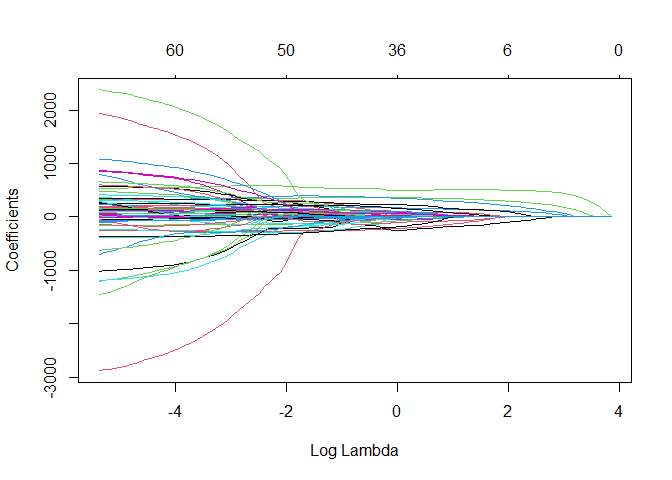
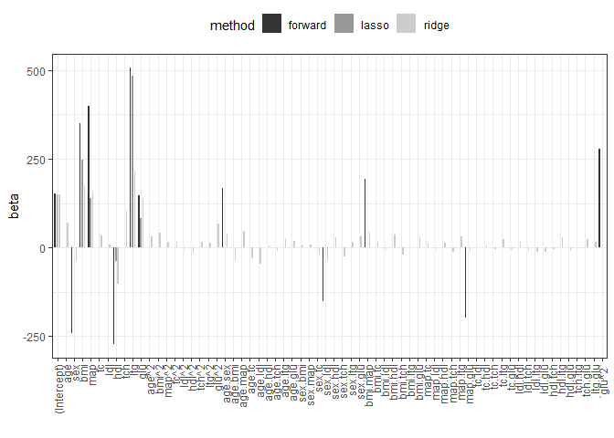
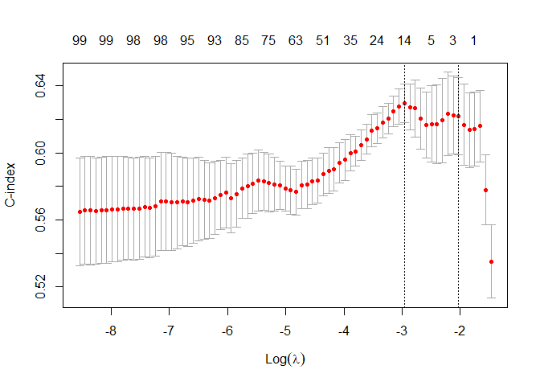
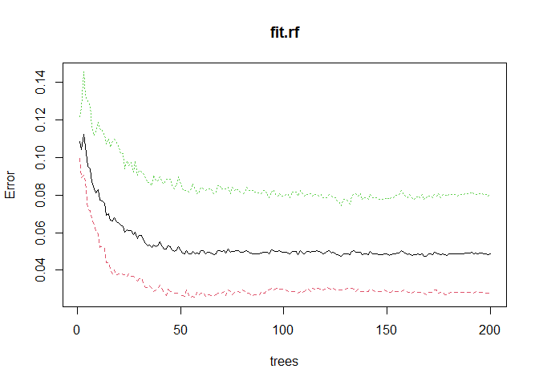
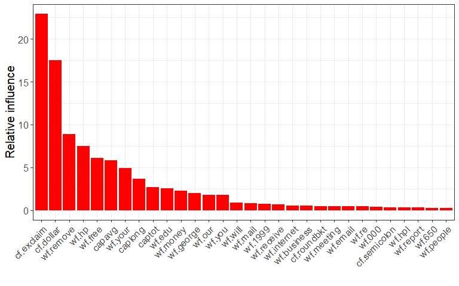

Exercises and Solutions - Analysis of High-Dimensional Data
================
Nicolas Städler
2022-10-24

- <a href="#1-diabetes-data-and-linear-regression"
  id="toc-1-diabetes-data-and-linear-regression">1 Diabetes data and
  linear regression</a>
- <a href="#2-diabetes-data-and-model-validation"
  id="toc-2-diabetes-data-and-model-validation">2 Diabetes data and model
  validation</a>
- <a href="#3-calculus-optimization-and-ols"
  id="toc-3-calculus-optimization-and-ols">3 Calculus, optimization and
  OLS</a>
- <a href="#4-diabetes-data-and-regularization"
  id="toc-4-diabetes-data-and-regularization">4 Diabetes data and
  regularization</a>
- <a href="#5-diabetes-data-and-the-caret-package"
  id="toc-5-diabetes-data-and-the-caret-package">5 Diabetes data and the
  <code>caret</code> package</a>
- <a href="#6-closed-form-solution-for-ridge-regression"
  id="toc-6-closed-form-solution-for-ridge-regression">6 Closed form
  solution for Ridge regression</a>
- <a href="#7-bayesian-interpretation-of-ridge-regression-difficult"
  id="toc-7-bayesian-interpretation-of-ridge-regression-difficult">7
  Bayesian interpretation of Ridge regression (difficult)</a>
- <a href="#8-riboflavin-data-and-elasticnet-mixing-parameter"
  id="toc-8-riboflavin-data-and-elasticnet-mixing-parameter">8 Riboflavin
  data and elasticnet mixing parameter</a>
- <a href="#9-ridge-and-lasso-for-the-orthonormal-design-difficult"
  id="toc-9-ridge-and-lasso-for-the-orthonormal-design-difficult">9 Ridge
  and Lasso for the orthonormal design (difficult)</a>
- <a href="#10-heart-disease-data-and-logistic-regression"
  id="toc-10-heart-disease-data-and-logistic-regression">10 Heart disease
  data and logistic regression</a>
- <a href="#11-phoneme-recognition" id="toc-11-phoneme-recognition">11
  Phoneme recognition</a>
- <a href="#12-classification-and-the-caret-package"
  id="toc-12-classification-and-the-caret-package">12 Classification and
  the <code>caret</code> package</a>
- <a href="#13-survival-analysis-and-the-lymphoma-data"
  id="toc-13-survival-analysis-and-the-lymphoma-data">13 Survival analysis
  and the Lymphoma data</a>
- <a href="#14-decision-trees-random-forest-and-adaboost"
  id="toc-14-decision-trees-random-forest-and-adaboost">14 Decision trees,
  Random Forest and AdaBoost</a>
- <a href="#15-email-spam-and-data-mining"
  id="toc-15-email-spam-and-data-mining">15 Email spam and data mining</a>
- <a href="#16-multiple-testing-and-gene-expression"
  id="toc-16-multiple-testing-and-gene-expression">16 Multiple testing and
  gene expression</a>

# 1 Diabetes data and linear regression

The data that we consider consist of 442 diabetes patients, with the
response of interest being a quantitative measure of disease progression
one year after baseline. There are ten baseline variables — age, sex,
body-mass index, average blood pressure, and six blood serum
measurements — plus quadratic terms, giving a total of $p=64$ features.

1.  Read the diabetes data set and make a histogram for the response
    variable `y`. Describe the distribution of the variable.

2.  Create a scatterplot matrix for the 5 first variables in the data
    set. Use `pairs` or `ggpairs`.

3.  Randomly assign patients to training and test data (use `sample`).

4.  Run a univariate regression model with `bmi` as covariate. Study the
    `summary` output.

    - How do you interpret the regression coefficients for `bmi`?
    - What is the meaning of the *multiple R-squared*?
    - What is the *residual standard error*?
    - Generate a scatter plot of `y` against `bmi` and add the
      regression line with confidence band (use `geom_smooth`,
      `method="lm"`).
    - Draw the Tukey Anscombe plot and the QQ plot (check `?plot.lm`).
      What are these two plots telling us?

5.  Run a multiple regression model using all covariates. Study the
    `summary` output.

    - What does change in the interpretation of the coefficient for
      `bmi`?
    - What do you conclude from the *multiple R-squared*?
    - Create a Tukey Anscombe plot and a QQ plot.

6.  Calculate the RSS for both models. Write down your observation.

7.  Compare the two models using the `anova` function. What do you
    conclude?

Solution to the exercise.

Read the data set.

``` r
diabetes <- readRDS(file="data/diabetes.rds")
data <- as.data.frame(cbind(y=diabetes$y,diabetes$x2))
colnames(data) <- gsub(":",".",colnames(data))
```

Generate a histogram of `y`.

``` r
hist(data$y)
```


The distribution is right-skewed. Scatterplot matrix of the diabetes
data.

``` r
pairs(data[,1:5])
```


Create training and test data.

``` r
train_ind <- sample(seq(nrow(data)),size=nrow(data)/2)
data_train <- data[train_ind,]
xtrain <- as.matrix(data_train[,-1])
ytrain <- data_train[,1]
data_test <- data[-train_ind,]
xtest <- as.matrix(data_test[,-1])
ytest <- data_test[,1]
```

Fit a univariate regression model.

``` r
fit1 <- lm(y~bmi,data=data_train)
summary(fit1)
```

    ## 
    ## Call:
    ## lm(formula = y ~ bmi, data = data_train)
    ## 
    ## Residuals:
    ##      Min       1Q   Median       3Q      Max 
    ## -172.449  -41.609   -5.818   47.382  149.160 
    ## 
    ## Coefficients:
    ##             Estimate Std. Error t value Pr(>|t|)    
    ## (Intercept)  156.202      4.179   37.38   <2e-16 ***
    ## bmi          997.903     88.154   11.32   <2e-16 ***
    ## ---
    ## Signif. codes:  0 '***' 0.001 '**' 0.01 '*' 0.05 '.' 0.1 ' ' 1
    ## 
    ## Residual standard error: 61.99 on 219 degrees of freedom
    ## Multiple R-squared:  0.3691, Adjusted R-squared:  0.3663 
    ## F-statistic: 128.1 on 1 and 219 DF,  p-value: < 2.2e-16

Scatter plot with regression line.

``` r
data_train%>%
  ggplot(data=.,aes(x=bmi,y=y))+
  geom_point()+
  geom_smooth(method="lm")
```

    ## `geom_smooth()` using formula 'y ~ x'



The Tukey Anscombe plot. The residuals scatter around the 0 line and do
not show any systematic pattern. This indicates that the residuals are
independent and have mean 0.

``` r
plot(fit1,which=1) # Tukey Anscombe plot
```


The QQ plot. This plot is used to check the normality assumption of the
residuals. The residuals show slight tendency to be right-skewed (see
also the histogram).

``` r
plot(fit1,which=2) # Tukey Anscombe plot
```



``` r
hist(residuals(fit1))
```


We run the multiple regression model with all covariates. We print the
`summary` and create TA and QQ plots.

``` r
fit2 <- lm(y~.,data=data_train)
#summary(fit2)
plot(fit2,which=1)
```


``` r
plot(fit2,which=2)
```


Calculate the RSS.

``` r
sum(residuals(fit1)^2)
```

    ## [1] 841643.6

``` r
sum(residuals(fit2)^2)
```

    ## [1] 446482

Compare the 2 models using the `anova` function.

``` r
anova(fit1,fit2)
```

    ## Analysis of Variance Table
    ## 
    ## Model 1: y ~ bmi
    ## Model 2: y ~ age + sex + bmi + map + tc + ldl + hdl + tch + ltg + glu + 
    ##     `age^2` + `bmi^2` + `map^2` + `tc^2` + `ldl^2` + `hdl^2` + 
    ##     `tch^2` + `ltg^2` + `glu^2` + age.sex + age.bmi + age.map + 
    ##     age.tc + age.ldl + age.hdl + age.tch + age.ltg + age.glu + 
    ##     sex.bmi + sex.map + sex.tc + sex.ldl + sex.hdl + sex.tch + 
    ##     sex.ltg + sex.glu + bmi.map + bmi.tc + bmi.ldl + bmi.hdl + 
    ##     bmi.tch + bmi.ltg + bmi.glu + map.tc + map.ldl + map.hdl + 
    ##     map.tch + map.ltg + map.glu + tc.ldl + tc.hdl + tc.tch + 
    ##     tc.ltg + tc.glu + ldl.hdl + ldl.tch + ldl.ltg + ldl.glu + 
    ##     hdl.tch + hdl.ltg + hdl.glu + tch.ltg + tch.glu + ltg.glu
    ##   Res.Df    RSS Df Sum of Sq      F    Pr(>F)    
    ## 1    219 841644                                  
    ## 2    156 446482 63    395162 2.1916 4.648e-05 ***
    ## ---
    ## Signif. codes:  0 '***' 0.001 '**' 0.01 '*' 0.05 '.' 0.1 ' ' 1

# 2 Diabetes data and model validation

In the previous section we developed 2 models to predict `y`. In this
section we explore the generalizability of these models.

1.  Calculate the RMSEs on the training data. Which model will perform
    best on future data?
2.  Use the test data and make scatter plots of the observed against
    predicted outcomes. Use `ggplot` to create one plot per model and
    add the regression line (`geom_smooth`) and the “y=x”
    (`geom_abline`) line to the graph. This plot is also called
    “calibration plot”. The model is “well” calibrated if the regression
    line agrees with the “y=x” line.
3.  Generate boxplots of `predicted - observed` for the 2 models. What
    do you conclude?
4.  Calculate the generalization error, i.e., the RMSE on the test data.

Solution to the exercise.

We calculate the RMSEs on the training data. RMSE on training data tells
you how good the model “fits” the data. We cannot make any conclusion
about the generalizability of the models based on RMSEs on training
data.

``` r
RMSE(data_train$y,predict(fit1,newdata=data_train))
```

    ## [1] 61.71177

``` r
RMSE(data_train$y,predict(fit2,newdata=data_train))
```

    ## [1] 44.94753

We draw calibration plots for the 2 models. Model 1 calibrates slightly
better.

``` r
dd <- data.frame(pred=c(predict(fit1,newdata=data_test),
                        predict(fit2,newdata=data_test)),
                 obs = rep(data_test$y,times=2),
                 model=rep(c("mod1","mod2"),each=nrow(data_test))
)
dd%>%
  ggplot(.,aes(x=pred,y=obs))+
  geom_point()+
  geom_smooth(se=FALSE,method="lm")+
  geom_abline(slope=1,intercept=0)+
  theme_bw()+
  facet_wrap(~model)
```

    ## `geom_smooth()` using formula 'y ~ x'


Boxplots of predicted minus observed.

``` r
dd%>%
  ggplot(.,aes(x=model,y=pred-obs))+
  geom_boxplot()+
  geom_point()
```


Calculate RMSEs on test data.

``` r
RMSE(data_test$y,predict(fit1,newdata=data_test))
```

    ## [1] 63.37433

``` r
RMSE(data_test$y,predict(fit2,newdata=data_test))
```

    ## [1] 64.13462

# 3 Calculus, optimization and OLS

1.  Consider the function $f(x)=2x^2 + x -5$. Draw a plot of the
    function.
2.  Use `optimize` to find the minimum of $f(x)$.
3.  Obtain the minimum of $f(x)$ by taking the derivative and setting
    equal to zero.
4.  Show that $\|a\|^2_2=a^Ta$.
5.  Use the result in 4. and show that
    $\bf RSS(\beta)=\bf y^Ty-2 y^T X \beta +\beta^T X^T X \beta$.
6.  Invoke the result obtained in 4. and show that
    $$\frac{\partial}{\partial \beta} \bf RSS(\beta)=\bf -2X^Ty+2X^TX\beta.$$
    Hint: review the “Identities” section of
    [Wikipedia](https://en.wikipedia.org/wiki/Matrix_calculus).
7.  Do you understand the derivation of the least squares estimator?

Solution to the exercise.

Plot of the function.

``` r
myf <- function(x){
  2*x^2 + x -5
}
curve(myf,from=-1,to=1)
```


``` r
optimize(myf,interval=c(-5,5))
```

    ## $minimum
    ## [1] -0.25
    ## 
    ## $objective
    ## [1] -5.125

# 4 Diabetes data and regularization

The task is to use the diabetes data to construct a model that predicts
the response `y` (disease progression) based on covariates. The two
hopes are, that the model would produce accurate baseline predictions of
response for future patients, and also that the form of the model would
suggest which covariates were important factors in disease progression.

1.  Read in the diabetes data set.
2.  Run forward stepwise regression. Which is the first variable
    included in the selection process? Print the coefficients of the
    AIC-optimal model as a table.
3.  Fit Ridge regression. Show the trace plot and the cross-validation
    plot.
4.  Run the Lasso approach and show the trace and the cross-validation
    plots.
5.  Calculate the root-mean-square errors (RMSE) for all 3 models on the
    test data and compare with the performance of the full model. Which
    model generalizes best?
6.  Plot the regression coefficients for all 3 models.

The solution to this exercise.

Read the data set and create training and test data.

``` r
set.seed(007)
diabetes <- readRDS(file="data/diabetes.rds")
data <- as.data.frame(cbind(y=diabetes$y,diabetes$x2))
colnames(data) <- gsub(":",".",colnames(data))
train_ind <- sample(seq(nrow(data)),size=nrow(data)/2)
data_train <- data[train_ind,]
xtrain <- as.matrix(data_train[,-1])
ytrain <- data_train[,1]
data_test <- data[-train_ind,]
xtest <- as.matrix(data_test[,-1])
ytest <- data_test[,1]
```

We perform forward stepwise regression.

``` r
# Full model
fit.full <- lm(y~.,data=data_train)

# Forward regression
fit0 <- lm(y~1,data=data_train)
fit.fw <- stepAIC(fit0,direction="forward",
                  scope=list(lower=fit0,
                             upper=fit.full
                             
                  ),
                  trace = TRUE
)
```

    ## Start:  AIC=1919.37
    ## y ~ 1
    ## 
    ##           Df Sum of Sq     RSS    AIC
    ## + ltg      1    480436  814576 1818.9
    ## + bmi      1    359452  935560 1849.5
    ## + glu      1    290384 1004629 1865.2
    ## + map      1    276208 1018805 1868.3
    ## + tch      1    264983 1030029 1870.8
    ## + hdl      1    194710 1100303 1885.4
    ## + tc       1     89464 1205549 1905.5
    ## + age      1     83863 1211150 1906.6
    ## + ldl      1     64468 1230545 1910.1
    ## + age.ldl  1     47419 1247594 1913.1
    ## + `glu^2`  1     41176 1253837 1914.2
    ## + age.tc   1     27805 1267208 1916.6
    ## + age.bmi  1     27055 1267958 1916.7
    ## + `tch^2`  1     23035 1271978 1917.4
    ## + `bmi^2`  1     22401 1272612 1917.5
    ## + `hdl^2`  1     21286 1273727 1917.7
    ## + tch.glu  1     19155 1275857 1918.1
    ## + map.ltg  1     16382 1278631 1918.5
    ## + ltg.glu  1     15641 1279372 1918.7
    ## + tc.ltg   1     15391 1279622 1918.7
    ## + sex.hdl  1     14678 1280334 1918.8
    ## + bmi.glu  1     13851 1281162 1919.0
    ## + `ltg^2`  1     13328 1281685 1919.1
    ## + tch.ltg  1     12117 1282895 1919.3
    ## + `map^2`  1     11967 1283045 1919.3
    ## <none>                 1295013 1919.4
    ## + age.tch  1     11149 1283864 1919.5
    ## + sex.ldl  1     10206 1284807 1919.6
    ## + tc.tch   1      9848 1285165 1919.7
    ## + `tc^2`   1      8545 1286468 1919.9
    ## + bmi.hdl  1      7904 1287108 1920.0
    ## + sex      1      6477 1288535 1920.3
    ## + hdl.glu  1      5007 1290005 1920.5
    ## + map.glu  1      4990 1290023 1920.5
    ## + bmi.map  1      4973 1290040 1920.5
    ## + tc.hdl   1      4921 1290092 1920.5
    ## + sex.tch  1      4900 1290113 1920.5
    ## + tc.ldl   1      4146 1290867 1920.7
    ## + age.map  1      3989 1291023 1920.7
    ## + map.ldl  1      3975 1291038 1920.7
    ## + bmi.ltg  1      3843 1291170 1920.7
    ## + ldl.hdl  1      3795 1291217 1920.7
    ## + bmi.tc   1      2958 1292055 1920.9
    ## + sex.glu  1      2726 1292287 1920.9
    ## + `ldl^2`  1      2682 1292330 1920.9
    ## + map.hdl  1      2111 1292901 1921.0
    ## + age.sex  1      1885 1293127 1921.0
    ## + hdl.ltg  1      1410 1293603 1921.1
    ## + sex.ltg  1      1379 1293634 1921.1
    ## + sex.tc   1      1345 1293667 1921.1
    ## + ldl.tch  1       893 1294120 1921.2
    ## + ldl.ltg  1       893 1294120 1921.2
    ## + bmi.ldl  1       742 1294271 1921.2
    ## + sex.bmi  1       710 1294303 1921.2
    ## + map.tch  1       670 1294342 1921.2
    ## + ldl.glu  1       651 1294361 1921.3
    ## + map.tc   1       646 1294367 1921.3
    ## + tc.glu   1       595 1294418 1921.3
    ## + age.glu  1       566 1294447 1921.3
    ## + bmi.tch  1       435 1294578 1921.3
    ## + age.ltg  1       236 1294777 1921.3
    ## + `age^2`  1       187 1294826 1921.3
    ## + age.hdl  1       187 1294826 1921.3
    ## + hdl.tch  1       107 1294906 1921.3
    ## + sex.map  1       102 1294910 1921.3
    ## 
    ## Step:  AIC=1818.91
    ## y ~ ltg
    ## 
    ##           Df Sum of Sq    RSS    AIC
    ## + bmi      1     90618 723958 1794.8
    ## + map      1     64191 750385 1802.8
    ## + glu      1     56049 758528 1805.2
    ## + hdl      1     33164 781413 1811.7
    ## + `glu^2`  1     26035 788541 1813.7
    ## + ltg.glu  1     22280 792296 1814.8
    ## + age      1     15819 798758 1816.6
    ## + age.sex  1     15596 798980 1816.6
    ## + sex.tch  1     13031 801545 1817.3
    ## + bmi.glu  1     12638 801938 1817.5
    ## + sex.hdl  1     11379 803198 1817.8
    ## + `bmi^2`  1     11163 803413 1817.9
    ## + tch      1     11001 803576 1817.9
    ## + `hdl^2`  1     10227 804350 1818.1
    ## + sex.ldl  1     10052 804524 1818.2
    ## + bmi.hdl  1      9976 804600 1818.2
    ## + bmi.map  1      9957 804619 1818.2
    ## + map.ltg  1      8336 806241 1818.6
    ## + hdl.ltg  1      7508 807068 1818.9
    ## <none>                 814576 1818.9
    ## + map.glu  1      7157 807419 1819.0
    ## + bmi.ltg  1      7095 807482 1819.0
    ## + age.tc   1      6967 807609 1819.0
    ## + tch.glu  1      5978 808599 1819.3
    ## + hdl.tch  1      5937 808640 1819.3
    ## + age.ldl  1      5820 808757 1819.3
    ## + age.glu  1      5522 809054 1819.4
    ## + tc       1      5245 809331 1819.5
    ## + sex.glu  1      4927 809649 1819.6
    ## + sex.tc   1      4758 809818 1819.6
    ## + `map^2`  1      4588 809988 1819.7
    ## + age.map  1      4570 810007 1819.7
    ## + tch.ltg  1      3045 811532 1820.1
    ## + age.hdl  1      2860 811717 1820.1
    ## + bmi.tc   1      2805 811771 1820.2
    ## + age.ltg  1      2655 811921 1820.2
    ## + tc.glu   1      2338 812239 1820.3
    ## + ldl.hdl  1      2273 812303 1820.3
    ## + map.tc   1      2172 812404 1820.3
    ## + map.hdl  1      2115 812461 1820.3
    ## + hdl.glu  1      2088 812489 1820.3
    ## + bmi.tch  1      1878 812699 1820.4
    ## + `ldl^2`  1      1761 812815 1820.4
    ## + sex.map  1      1695 812881 1820.5
    ## + sex      1      1430 813146 1820.5
    ## + ldl.tch  1      1133 813444 1820.6
    ## + map.tch  1      1109 813468 1820.6
    ## + `tch^2`  1      1089 813488 1820.6
    ## + tc.tch   1      1063 813513 1820.6
    ## + sex.bmi  1       869 813708 1820.7
    ## + tc.ldl   1       607 813969 1820.7
    ## + sex.ltg  1       582 813995 1820.8
    ## + ldl.glu  1       578 813998 1820.8
    ## + map.ldl  1       530 814047 1820.8
    ## + `age^2`  1       493 814084 1820.8
    ## + age.bmi  1       377 814200 1820.8
    ## + `tc^2`   1       369 814208 1820.8
    ## + age.tch  1       224 814353 1820.8
    ## + tc.ltg   1       221 814355 1820.8
    ## + `ltg^2`  1       186 814391 1820.9
    ## + tc.hdl   1        59 814518 1820.9
    ## + bmi.ldl  1        50 814527 1820.9
    ## + ldl      1        32 814544 1820.9
    ## + ldl.ltg  1         0 814576 1820.9
    ## 
    ## Step:  AIC=1794.85
    ## y ~ ltg + bmi
    ## 
    ##           Df Sum of Sq    RSS    AIC
    ## + map      1     39190 684768 1784.5
    ## + `glu^2`  1     31227 692732 1787.1
    ## + glu      1     25496 698463 1788.9
    ## + age.sex  1     17175 706783 1791.5
    ## + ltg.glu  1     16447 707512 1791.8
    ## + age.map  1     15956 708002 1791.9
    ## + hdl      1     15301 708657 1792.1
    ## + age.glu  1     14710 709248 1792.3
    ## + age.ltg  1     12358 711600 1793.0
    ## + bmi.hdl  1     12354 711604 1793.0
    ## + bmi.map  1     11606 712352 1793.3
    ## + tc       1     11133 712825 1793.4
    ## + map.ltg  1     10643 713315 1793.6
    ## + sex.tch  1     10412 713547 1793.6
    ## + age      1      9008 714950 1794.1
    ## + sex.ldl  1      8914 715045 1794.1
    ## + hdl.ltg  1      8379 715580 1794.3
    ## + map.glu  1      7620 716338 1794.5
    ## + bmi.glu  1      7173 716786 1794.7
    ## + sex.hdl  1      6820 717138 1794.8
    ## <none>                 723958 1794.8
    ## + map.tc   1      5642 718317 1795.1
    ## + sex.tc   1      5578 718380 1795.1
    ## + `map^2`  1      4871 719088 1795.3
    ## + sex      1      4698 719260 1795.4
    ## + bmi.tch  1      4687 719271 1795.4
    ## + tch.glu  1      4393 719566 1795.5
    ## + hdl.tch  1      4312 719646 1795.5
    ## + age.tch  1      3668 720290 1795.7
    ## + tch.ltg  1      3659 720300 1795.7
    ## + `hdl^2`  1      3442 720516 1795.8
    ## + ldl      1      3300 720658 1795.8
    ## + ldl.hdl  1      3253 720706 1795.8
    ## + tc.glu   1      3137 720821 1795.9
    ## + sex.glu  1      3098 720860 1795.9
    ## + tc.tch   1      2673 721285 1796.0
    ## + age.hdl  1      2669 721290 1796.0
    ## + `age^2`  1      2653 721305 1796.0
    ## + ldl.tch  1      2541 721417 1796.1
    ## + `tch^2`  1      2522 721436 1796.1
    ## + map.ldl  1      2404 721554 1796.1
    ## + `ldl^2`  1      2127 721832 1796.2
    ## + tc.hdl   1      1967 721992 1796.2
    ## + sex.ltg  1      1762 722197 1796.3
    ## + tch      1      1361 722597 1796.4
    ## + sex.map  1      1349 722609 1796.4
    ## + bmi.ltg  1      1315 722643 1796.4
    ## + ldl.glu  1      1083 722875 1796.5
    ## + bmi.tc   1      1046 722913 1796.5
    ## + map.hdl  1      1008 722950 1796.5
    ## + hdl.glu  1       939 723020 1796.6
    ## + tc.ldl   1       823 723135 1796.6
    ## + age.bmi  1       640 723319 1796.7
    ## + tc.ltg   1       602 723356 1796.7
    ## + bmi.ldl  1       535 723423 1796.7
    ## + `ltg^2`  1       504 723455 1796.7
    ## + age.ldl  1       315 723644 1796.8
    ## + sex.bmi  1       149 723809 1796.8
    ## + `bmi^2`  1       106 723852 1796.8
    ## + `tc^2`   1        93 723865 1796.8
    ## + ldl.ltg  1        72 723887 1796.8
    ## + age.tc   1        34 723924 1796.8
    ## + map.tch  1         4 723954 1796.8
    ## 
    ## Step:  AIC=1784.55
    ## y ~ ltg + bmi + map
    ## 
    ##           Df Sum of Sq    RSS    AIC
    ## + `glu^2`  1     32561 652207 1775.8
    ## + hdl      1     20922 663845 1779.7
    ## + ltg.glu  1     17646 667122 1780.8
    ## + age.sex  1     17446 667322 1780.8
    ## + age.glu  1     15365 669403 1781.5
    ## + tc       1     15326 669441 1781.5
    ## + bmi.map  1     13707 671061 1782.1
    ## + glu      1     12274 672494 1782.5
    ## + age.map  1     11599 673169 1782.8
    ## + sex      1     10796 673972 1783.0
    ## + bmi.glu  1     10336 674431 1783.2
    ## + age.ltg  1     10112 674656 1783.3
    ## + sex.tch  1      9998 674770 1783.3
    ## + sex.ldl  1      9827 674940 1783.3
    ## + bmi.hdl  1      9192 675576 1783.6
    ## + tch.glu  1      8597 676171 1783.8
    ## + map.ltg  1      8517 676251 1783.8
    ## + sex.hdl  1      7924 676844 1784.0
    ## + hdl.ltg  1      7191 677577 1784.2
    ## <none>                 684768 1784.5
    ## + tc.glu   1      5592 679176 1784.7
    ## + age.tch  1      5429 679338 1784.8
    ## + sex.map  1      5121 679647 1784.9
    ## + sex.glu  1      4803 679965 1785.0
    ## + ldl      1      4594 680174 1785.1
    ## + sex.tc   1      4580 680188 1785.1
    ## + `hdl^2`  1      4517 680251 1785.1
    ## + bmi.tc   1      4129 680639 1785.2
    ## + hdl.tch  1      4096 680672 1785.2
    ## + map.glu  1      4075 680693 1785.2
    ## + `age^2`  1      3931 680837 1785.3
    ## + age.hdl  1      3828 680940 1785.3
    ## + ldl.hdl  1      3108 681660 1785.5
    ## + ldl.glu  1      3055 681713 1785.6
    ## + age      1      2708 682060 1785.7
    ## + tch      1      2603 682165 1785.7
    ## + bmi.ltg  1      2513 682255 1785.7
    ## + map.tc   1      2371 682396 1785.8
    ## + tc.ltg   1      2075 682693 1785.9
    ## + `bmi^2`  1      1745 683023 1786.0
    ## + age.bmi  1      1702 683066 1786.0
    ## + tch.ltg  1      1572 683196 1786.0
    ## + hdl.glu  1      1562 683206 1786.0
    ## + `ldl^2`  1      1299 683468 1786.1
    ## + tc.hdl   1      1245 683523 1786.1
    ## + `map^2`  1      1230 683538 1786.2
    ## + ldl.tch  1      1215 683553 1786.2
    ## + `tch^2`  1      1079 683688 1786.2
    ## + bmi.tch  1      1047 683721 1786.2
    ## + tc.tch   1       939 683829 1786.2
    ## + map.ldl  1       918 683850 1786.2
    ## + `ltg^2`  1       673 684095 1786.3
    ## + ldl.ltg  1       317 684451 1786.4
    ## + sex.ltg  1       215 684553 1786.5
    ## + tc.ldl   1       186 684582 1786.5
    ## + bmi.ldl  1       166 684601 1786.5
    ## + `tc^2`   1        42 684726 1786.5
    ## + map.hdl  1        40 684728 1786.5
    ## + map.tch  1        16 684751 1786.5
    ## + sex.bmi  1        10 684758 1786.5
    ## + age.ldl  1         8 684760 1786.5
    ## + age.tc   1         0 684767 1786.5
    ## 
    ## Step:  AIC=1775.78
    ## y ~ ltg + bmi + map + `glu^2`
    ## 
    ##           Df Sum of Sq    RSS    AIC
    ## + hdl      1   17629.8 634577 1771.7
    ## + age.sex  1   14643.3 637564 1772.8
    ## + bmi.hdl  1   13022.4 639185 1773.3
    ## + tc       1   12417.3 639790 1773.5
    ## + hdl.ltg  1   11950.3 640257 1773.7
    ## + sex.ldl  1   11233.3 640974 1773.9
    ## + glu      1   10543.9 641663 1774.2
    ## + sex.tch  1    9742.8 642464 1774.5
    ## + sex      1    7822.8 644384 1775.1
    ## + sex.hdl  1    6677.2 645530 1775.5
    ## + bmi.map  1    6445.8 645761 1775.6
    ## + hdl.tch  1    6420.0 645787 1775.6
    ## + sex.tc   1    6400.9 645806 1775.6
    ## <none>                 652207 1775.8
    ## + age.map  1    5034.6 647172 1776.1
    ## + tch.ltg  1    4929.6 647277 1776.1
    ## + ldl.hdl  1    4826.8 647380 1776.1
    ## + bmi.tch  1    4243.9 647963 1776.3
    ## + age.ltg  1    4105.2 648102 1776.4
    ## + `hdl^2`  1    3927.6 648279 1776.5
    ## + `age^2`  1    3781.0 648426 1776.5
    ## + tc.hdl   1    3646.1 648561 1776.5
    ## + age      1    3602.8 648604 1776.6
    ## + hdl.glu  1    3343.7 648863 1776.6
    ## + `tch^2`  1    3252.3 648955 1776.7
    ## + ldl      1    3237.5 648969 1776.7
    ## + age.tch  1    2748.6 649458 1776.8
    ## + map.glu  1    2662.3 649545 1776.9
    ## + sex.map  1    2535.1 649672 1776.9
    ## + tc.tch   1    2317.9 649889 1777.0
    ## + ldl.tch  1    2272.8 649934 1777.0
    ## + map.ltg  1    2022.1 650185 1777.1
    ## + age.hdl  1    1876.9 650330 1777.1
    ## + `ldl^2`  1    1581.7 650625 1777.2
    ## + age.glu  1    1544.9 650662 1777.3
    ## + bmi.tc   1    1474.1 650733 1777.3
    ## + tch      1    1468.3 650739 1777.3
    ## + sex.bmi  1     905.3 651302 1777.5
    ## + map.hdl  1     764.4 651442 1777.5
    ## + ldl.glu  1     731.0 651476 1777.5
    ## + sex.ltg  1     700.7 651506 1777.5
    ## + map.tc   1     648.0 651559 1777.6
    ## + sex.glu  1     621.4 651585 1777.6
    ## + tc.ltg   1     564.8 651642 1777.6
    ## + map.tch  1     454.8 651752 1777.6
    ## + tc.ldl   1     364.3 651843 1777.7
    ## + tch.glu  1     299.2 651908 1777.7
    ## + `bmi^2`  1     232.2 651975 1777.7
    ## + age.tc   1     177.6 652029 1777.7
    ## + age.ldl  1     159.1 652048 1777.7
    ## + ltg.glu  1     150.2 652057 1777.7
    ## + map.ldl  1     135.9 652071 1777.7
    ## + `map^2`  1     107.1 652100 1777.7
    ## + age.bmi  1      89.4 652118 1777.8
    ## + tc.glu   1      76.6 652130 1777.8
    ## + bmi.ldl  1      43.8 652163 1777.8
    ## + ldl.ltg  1      39.5 652167 1777.8
    ## + bmi.ltg  1      27.0 652180 1777.8
    ## + bmi.glu  1      15.4 652191 1777.8
    ## + `tc^2`   1       8.8 652198 1777.8
    ## + `ltg^2`  1       0.6 652206 1777.8
    ## 
    ## Step:  AIC=1771.72
    ## y ~ ltg + bmi + map + `glu^2` + hdl
    ## 
    ##           Df Sum of Sq    RSS    AIC
    ## + sex      1   24729.2 609848 1764.9
    ## + age.sex  1   12206.8 622370 1769.4
    ## + sex.ldl  1   10611.8 623965 1770.0
    ## + tc.hdl   1    7993.4 626584 1770.9
    ## + glu      1    7978.3 626599 1770.9
    ## + sex.tch  1    7845.1 626732 1771.0
    ## + hdl.ltg  1    7713.9 626863 1771.0
    ## + sex.tc   1    7478.3 627099 1771.1
    ## + bmi.map  1    7156.5 627421 1771.2
    ## + tch.ltg  1    5723.5 628854 1771.7
    ## + age.map  1    5720.0 628857 1771.7
    ## <none>                 634577 1771.7
    ## + tc.tch   1    5339.7 629237 1771.9
    ## + tc       1    5241.8 629335 1771.9
    ## + age.ltg  1    4668.4 629909 1772.1
    ## + ldl      1    4593.3 629984 1772.1
    ## + `tch^2`  1    4202.6 630375 1772.3
    ## + tch      1    4123.8 630453 1772.3
    ## + age      1    3764.3 630813 1772.4
    ## + bmi.hdl  1    3754.4 630823 1772.4
    ## + ldl.tch  1    3122.7 631454 1772.6
    ## + `age^2`  1    2919.0 631658 1772.7
    ## + bmi.tch  1    2649.0 631928 1772.8
    ## + map.glu  1    2629.6 631948 1772.8
    ## + ldl.hdl  1    2544.7 632032 1772.8
    ## + sex.map  1    2237.2 632340 1772.9
    ## + `ldl^2`  1    2017.6 632559 1773.0
    ## + map.ltg  1    1964.0 632613 1773.0
    ## + sex.glu  1    1955.1 632622 1773.0
    ## + age.tch  1    1768.6 632808 1773.1
    ## + sex.hdl  1    1764.3 632813 1773.1
    ## + ldl.glu  1    1626.6 632951 1773.2
    ## + hdl.tch  1    1506.6 633071 1773.2
    ## + tc.glu   1    1131.4 633446 1773.3
    ## + age.hdl  1     933.2 633644 1773.4
    ## + map.tch  1     878.8 633698 1773.4
    ## + tc.ldl   1     759.5 633818 1773.5
    ## + `bmi^2`  1     591.4 633986 1773.5
    ## + hdl.glu  1     566.9 634010 1773.5
    ## + age.ldl  1     490.7 634086 1773.5
    ## + age.glu  1     480.1 634097 1773.6
    ## + map.hdl  1     475.3 634102 1773.6
    ## + `map^2`  1     447.9 634129 1773.6
    ## + tch.glu  1     298.1 634279 1773.6
    ## + bmi.tc   1     244.7 634332 1773.6
    ## + sex.ltg  1     219.1 634358 1773.7
    ## + `hdl^2`  1     217.8 634359 1773.7
    ## + age.tc   1     200.4 634377 1773.7
    ## + map.tc   1     157.2 634420 1773.7
    ## + tc.ltg   1     151.8 634425 1773.7
    ## + ltg.glu  1      79.7 634497 1773.7
    ## + sex.bmi  1      73.2 634504 1773.7
    ## + bmi.ldl  1      37.8 634539 1773.7
    ## + `ltg^2`  1      27.4 634550 1773.7
    ## + ldl.ltg  1      27.4 634550 1773.7
    ## + bmi.ltg  1      19.7 634557 1773.7
    ## + bmi.glu  1       7.5 634570 1773.7
    ## + map.ldl  1       0.5 634577 1773.7
    ## + `tc^2`   1       0.2 634577 1773.7
    ## + age.bmi  1       0.0 634577 1773.7
    ## 
    ## Step:  AIC=1764.94
    ## y ~ ltg + bmi + map + `glu^2` + hdl + sex
    ## 
    ##           Df Sum of Sq    RSS    AIC
    ## + age.sex  1   10928.1 598920 1762.9
    ## + glu      1    9174.8 600673 1763.6
    ## + tc.hdl   1    8508.4 601339 1763.8
    ## + sex.ldl  1    7563.8 602284 1764.2
    ## + bmi.map  1    7014.1 602834 1764.4
    ## + hdl.ltg  1    6663.2 603185 1764.5
    ## + sex.tch  1    5985.1 603863 1764.8
    ## + sex.tc   1    5728.3 604120 1764.8
    ## <none>                 609848 1764.9
    ## + tch.ltg  1    5428.2 604420 1765.0
    ## + tc.tch   1    5353.8 604494 1765.0
    ## + tc       1    4926.1 604922 1765.2
    ## + age      1    4732.5 605115 1765.2
    ## + age.map  1    4706.0 605142 1765.2
    ## + `age^2`  1    4383.6 605464 1765.3
    ## + ldl      1    4306.3 605542 1765.4
    ## + `tch^2`  1    3857.3 605991 1765.5
    ## + map.glu  1    3577.6 606270 1765.6
    ## + tch      1    3531.6 606316 1765.7
    ## + sex.map  1    3278.1 606570 1765.8
    ## + age.ltg  1    2889.9 606958 1765.9
    ## + ldl.tch  1    2846.4 607002 1765.9
    ## + sex.glu  1    2630.2 607218 1766.0
    ## + bmi.tch  1    2408.7 607439 1766.1
    ## + bmi.hdl  1    2366.8 607481 1766.1
    ## + ldl.hdl  1    2104.3 607744 1766.2
    ## + `ldl^2`  1    1837.0 608011 1766.3
    ## + ldl.glu  1    1652.2 608196 1766.3
    ## + tc.glu   1    1150.4 608697 1766.5
    ## + age.ldl  1    1139.7 608708 1766.5
    ## + age.hdl  1    1082.5 608765 1766.5
    ## + age.tc   1    1049.5 608798 1766.6
    ## + hdl.tch  1    1001.6 608846 1766.6
    ## + age.tch  1     870.5 608977 1766.6
    ## + map.tch  1     861.3 608987 1766.6
    ## + map.ltg  1     815.5 609032 1766.6
    ## + `hdl^2`  1     697.3 609151 1766.7
    ## + tc.ldl   1     640.0 609208 1766.7
    ## + hdl.glu  1     574.5 609273 1766.7
    ## + tch.glu  1     549.9 609298 1766.7
    ## + sex.hdl  1     542.4 609305 1766.7
    ## + `bmi^2`  1     450.1 609398 1766.8
    ## + bmi.ltg  1     446.3 609402 1766.8
    ## + age.glu  1     390.5 609457 1766.8
    ## + bmi.tc   1     223.2 609625 1766.9
    ## + tc.ltg   1     183.1 609665 1766.9
    ## + map.hdl  1     160.0 609688 1766.9
    ## + ltg.glu  1     157.2 609691 1766.9
    ## + bmi.glu  1      86.9 609761 1766.9
    ## + sex.bmi  1      68.4 609779 1766.9
    ## + `map^2`  1      66.1 609782 1766.9
    ## + age.bmi  1      60.1 609788 1766.9
    ## + sex.ltg  1      54.1 609794 1766.9
    ## + bmi.ldl  1      42.2 609806 1766.9
    ## + map.tc   1       9.3 609839 1766.9
    ## + `tc^2`   1       6.7 609841 1766.9
    ## + `ltg^2`  1       0.9 609847 1766.9
    ## + map.ldl  1       0.8 609847 1766.9
    ## + ldl.ltg  1       0.0 609848 1766.9
    ## 
    ## Step:  AIC=1762.94
    ## y ~ ltg + bmi + map + `glu^2` + hdl + sex + age.sex
    ## 
    ##           Df Sum of Sq    RSS    AIC
    ## + sex.ldl  1   12011.6 586908 1760.5
    ## + sex.tc   1   10385.3 588534 1761.1
    ## + sex.tch  1    9034.6 589885 1761.6
    ## + tc.hdl   1    8627.1 590293 1761.7
    ## + glu      1    8310.5 590609 1761.9
    ## + hdl.ltg  1    5880.7 593039 1762.8
    ## + bmi.map  1    5760.7 593159 1762.8
    ## + tc.tch   1    5494.8 593425 1762.9
    ## <none>                 598920 1762.9
    ## + map.glu  1    4144.6 594775 1763.4
    ## + tch.ltg  1    4036.7 594883 1763.5
    ## + tc       1    3821.8 595098 1763.5
    ## + `tch^2`  1    3578.0 595342 1763.6
    ## + `age^2`  1    3475.9 595444 1763.7
    ## + ldl      1    3443.5 595476 1763.7
    ## + ldl.tch  1    2897.3 596022 1763.9
    ## + age      1    2891.9 596028 1763.9
    ## + bmi.hdl  1    2589.6 596330 1764.0
    ## + age.map  1    2553.1 596367 1764.0
    ## + tch      1    2389.6 596530 1764.1
    ## + age.ltg  1    2289.7 596630 1764.1
    ## + `ldl^2`  1    2104.0 596816 1764.2
    ## + ldl.hdl  1    1976.3 596943 1764.2
    ## + age.ldl  1    1939.0 596981 1764.2
    ## + bmi.tch  1    1862.6 597057 1764.2
    ## + map.ltg  1    1395.5 597524 1764.4
    ## + ldl.glu  1    1276.1 597644 1764.5
    ## + hdl.glu  1    1229.0 597691 1764.5
    ## + bmi.ltg  1    1100.1 597820 1764.5
    ## + `bmi^2`  1    1081.2 597839 1764.5
    ## + `hdl^2`  1    1058.9 597861 1764.5
    ## + sex.ltg  1    1055.9 597864 1764.5
    ## + map.tch  1     979.1 597941 1764.6
    ## + sex.hdl  1     977.0 597943 1764.6
    ## + tc.ltg   1     912.5 598007 1764.6
    ## + tch.glu  1     900.8 598019 1764.6
    ## + age.tc   1     890.1 598030 1764.6
    ## + sex.bmi  1     885.1 598035 1764.6
    ## + bmi.tc   1     883.9 598036 1764.6
    ## + sex.map  1     835.8 598084 1764.6
    ## + tc.glu   1     687.1 598233 1764.7
    ## + tc.ldl   1     678.1 598242 1764.7
    ## + hdl.tch  1     627.7 598292 1764.7
    ## + map.hdl  1     413.2 598507 1764.8
    ## + ldl.ltg  1     287.1 598633 1764.8
    ## + `ltg^2`  1     233.5 598686 1764.9
    ## + sex.glu  1     229.5 598690 1764.9
    ## + ltg.glu  1     170.8 598749 1764.9
    ## + age.hdl  1     104.9 598815 1764.9
    ## + age.glu  1      84.7 598835 1764.9
    ## + age.bmi  1      81.1 598839 1764.9
    ## + map.tc   1      53.4 598866 1764.9
    ## + bmi.ldl  1      35.6 598884 1764.9
    ## + `map^2`  1      32.5 598887 1764.9
    ## + age.tch  1      22.8 598897 1764.9
    ## + `tc^2`   1      14.7 598905 1764.9
    ## + bmi.glu  1       0.6 598919 1764.9
    ## + map.ldl  1       0.1 598920 1764.9
    ## 
    ## Step:  AIC=1760.47
    ## y ~ ltg + bmi + map + `glu^2` + hdl + sex + age.sex + sex.ldl
    ## 
    ##           Df Sum of Sq    RSS    AIC
    ## + glu      1    7553.7 579354 1759.6
    ## + bmi.map  1    6704.2 580204 1759.9
    ## <none>                 586908 1760.5
    ## + hdl.ltg  1    3941.9 582966 1761.0
    ## + map.glu  1    3939.8 582968 1761.0
    ## + `age^2`  1    3407.4 583501 1761.2
    ## + tc.hdl   1    2699.5 584209 1761.5
    ## + tc       1    2492.3 584416 1761.5
    ## + tch.ltg  1    2383.9 584524 1761.6
    ## + age.map  1    2289.3 584619 1761.6
    ## + sex.map  1    2239.0 584669 1761.6
    ## + ldl      1    2192.1 584716 1761.6
    ## + bmi.tc   1    2083.7 584824 1761.7
    ## + bmi.hdl  1    1975.6 584933 1761.7
    ## + map.ltg  1    1888.8 585019 1761.8
    ## + map.ldl  1    1864.6 585044 1761.8
    ## + map.tc   1    1796.8 585111 1761.8
    ## + sex.glu  1    1770.0 585138 1761.8
    ## + tc.ltg   1    1565.5 585343 1761.9
    ## + tc.tch   1    1561.5 585347 1761.9
    ## + age      1    1530.6 585378 1761.9
    ## + `hdl^2`  1    1484.6 585424 1761.9
    ## + `bmi^2`  1    1482.4 585426 1761.9
    ## + ldl.ltg  1    1252.3 585656 1762.0
    ## + bmi.ltg  1    1171.0 585737 1762.0
    ## + age.ltg  1    1012.7 585895 1762.1
    ## + bmi.tch  1     973.1 585935 1762.1
    ## + age.ldl  1     940.3 585968 1762.1
    ## + tch      1     893.1 586015 1762.1
    ## + hdl.glu  1     883.7 586024 1762.1
    ## + `tch^2`  1     850.5 586058 1762.2
    ## + sex.tch  1     774.6 586134 1762.2
    ## + bmi.ldl  1     671.0 586237 1762.2
    ## + age.hdl  1     419.6 586488 1762.3
    ## + age.bmi  1     374.3 586534 1762.3
    ## + age.tc   1     374.3 586534 1762.3
    ## + `ldl^2`  1     242.6 586665 1762.4
    ## + `tc^2`   1     222.5 586686 1762.4
    ## + ldl.tch  1     207.3 586701 1762.4
    ## + `ltg^2`  1     194.6 586714 1762.4
    ## + tch.glu  1     185.7 586722 1762.4
    ## + sex.hdl  1     155.1 586753 1762.4
    ## + map.hdl  1      99.0 586809 1762.4
    ## + ltg.glu  1      96.7 586811 1762.4
    ## + bmi.glu  1      54.7 586853 1762.5
    ## + ldl.hdl  1      18.4 586890 1762.5
    ## + tc.ldl   1      16.1 586892 1762.5
    ## + age.glu  1      13.0 586895 1762.5
    ## + age.tch  1      10.7 586897 1762.5
    ## + sex.tc   1      10.4 586898 1762.5
    ## + tc.glu   1       6.7 586901 1762.5
    ## + hdl.tch  1       5.6 586903 1762.5
    ## + sex.bmi  1       4.0 586904 1762.5
    ## + `map^2`  1       3.2 586905 1762.5
    ## + sex.ltg  1       3.0 586905 1762.5
    ## + ldl.glu  1       0.8 586907 1762.5
    ## + map.tch  1       0.3 586908 1762.5
    ## 
    ## Step:  AIC=1759.6
    ## y ~ ltg + bmi + map + `glu^2` + hdl + sex + age.sex + sex.ldl + 
    ##     glu
    ## 
    ##           Df Sum of Sq    RSS    AIC
    ## + bmi.map  1    6805.6 572549 1759.0
    ## <none>                 579354 1759.6
    ## + hdl.ltg  1    4550.8 574804 1759.9
    ## + `age^2`  1    4300.5 575054 1760.0
    ## + map.glu  1    3646.5 575708 1760.2
    ## + tc.hdl   1    3596.1 575758 1760.2
    ## + tc       1    3576.2 575778 1760.2
    ## + ldl      1    3291.8 576063 1760.3
    ## + bmi.hdl  1    3113.3 576241 1760.4
    ## + age.map  1    2715.1 576639 1760.6
    ## + sex.glu  1    2714.9 576640 1760.6
    ## + map.tc   1    2714.4 576640 1760.6
    ## + tch.ltg  1    2678.3 576676 1760.6
    ## + map.ldl  1    2629.8 576725 1760.6
    ## + bmi.tc   1    2571.4 576783 1760.6
    ## + map.ltg  1    2208.6 577146 1760.8
    ## + sex.map  1    2158.3 577196 1760.8
    ## + tc.tch   1    2130.8 577224 1760.8
    ## + tc.ltg   1    2081.5 577273 1760.8
    ## + tch      1    1658.9 577696 1761.0
    ## + `tch^2`  1    1641.2 577713 1761.0
    ## + bmi.tch  1    1449.6 577905 1761.0
    ## + `bmi^2`  1    1381.2 577973 1761.1
    ## + hdl.glu  1    1331.4 578023 1761.1
    ## + ldl.ltg  1    1315.2 578039 1761.1
    ## + age.ltg  1    1085.9 578269 1761.2
    ## + bmi.ltg  1    1040.3 578314 1761.2
    ## + `hdl^2`  1     966.4 578388 1761.2
    ## + age.hdl  1     945.5 578409 1761.2
    ## + bmi.ldl  1     832.2 578522 1761.3
    ## + age.ldl  1     815.1 578539 1761.3
    ## + tch.glu  1     801.2 578553 1761.3
    ## + ldl.tch  1     568.5 578786 1761.4
    ## + bmi.glu  1     554.4 578800 1761.4
    ## + age      1     437.2 578917 1761.4
    ## + sex.tch  1     383.5 578971 1761.5
    ## + `ltg^2`  1     361.0 578993 1761.5
    ## + `tc^2`   1     335.0 579019 1761.5
    ## + `ldl^2`  1     331.2 579023 1761.5
    ## + age.bmi  1     209.7 579145 1761.5
    ## + map.hdl  1     176.3 579178 1761.5
    ## + age.tc   1     175.4 579179 1761.5
    ## + ldl.glu  1     115.5 579239 1761.6
    ## + `map^2`  1     105.4 579249 1761.6
    ## + age.tch  1      94.2 579260 1761.6
    ## + hdl.tch  1      78.9 579276 1761.6
    ## + ldl.hdl  1      77.7 579277 1761.6
    ## + age.glu  1      60.1 579294 1761.6
    ## + sex.hdl  1      50.7 579304 1761.6
    ## + tc.glu   1      45.3 579309 1761.6
    ## + sex.ltg  1      39.9 579315 1761.6
    ## + map.tch  1      15.9 579339 1761.6
    ## + tc.ldl   1      13.9 579341 1761.6
    ## + sex.tc   1      13.3 579341 1761.6
    ## + ltg.glu  1       3.4 579351 1761.6
    ## + sex.bmi  1       0.4 579354 1761.6
    ## 
    ## Step:  AIC=1758.99
    ## y ~ ltg + bmi + map + `glu^2` + hdl + sex + age.sex + sex.ldl + 
    ##     glu + bmi.map
    ## 
    ##           Df Sum of Sq    RSS    AIC
    ## + map.glu  1   10462.1 562087 1756.9
    ## + hdl.ltg  1    5158.8 567390 1759.0
    ## <none>                 572549 1759.0
    ## + bmi.hdl  1    4366.1 568183 1759.3
    ## + `age^2`  1    4035.7 568513 1759.4
    ## + tch.ltg  1    3431.2 569118 1759.7
    ## + bmi.tch  1    3098.0 569451 1759.8
    ## + tc.hdl   1    2656.8 569892 1760.0
    ## + `map^2`  1    2584.5 569964 1760.0
    ## + tc       1    2299.2 570250 1760.1
    ## + ldl      1    2016.3 570533 1760.2
    ## + age.bmi  1    2013.5 570535 1760.2
    ## + tc.tch   1    1922.0 570627 1760.2
    ## + age.hdl  1    1913.8 570635 1760.2
    ## + map.hdl  1    1847.3 570702 1760.3
    ## + age.map  1    1772.7 570776 1760.3
    ## + tc.ltg   1    1509.4 571039 1760.4
    ## + map.tc   1    1453.0 571096 1760.4
    ## + hdl.glu  1    1433.0 571116 1760.4
    ## + sex.tch  1    1195.5 571353 1760.5
    ## + `hdl^2`  1    1184.3 571365 1760.5
    ## + age      1    1175.0 571374 1760.5
    ## + `tch^2`  1    1159.0 571390 1760.5
    ## + map.ldl  1    1145.2 571404 1760.5
    ## + sex.glu  1    1122.2 571427 1760.6
    ## + bmi.tc   1    1073.5 571475 1760.6
    ## + sex.map  1    1023.2 571526 1760.6
    ## + ldl.ltg  1     916.4 571633 1760.6
    ## + tch      1     864.1 571685 1760.7
    ## + tch.glu  1     848.9 571700 1760.7
    ## + map.tch  1     836.5 571712 1760.7
    ## + age.ldl  1     798.2 571751 1760.7
    ## + age.ltg  1     725.9 571823 1760.7
    ## + sex.bmi  1     705.3 571844 1760.7
    ## + bmi.ldl  1     346.4 572202 1760.9
    ## + sex.hdl  1     330.5 572218 1760.9
    ## + map.ltg  1     300.7 572248 1760.9
    ## + bmi.glu  1     291.9 572257 1760.9
    ## + ltg.glu  1     255.9 572293 1760.9
    ## + ldl.tch  1     247.6 572301 1760.9
    ## + age.tch  1     244.8 572304 1760.9
    ## + `ldl^2`  1     242.4 572306 1760.9
    ## + `tc^2`   1     169.0 572380 1760.9
    ## + `ltg^2`  1     167.2 572382 1760.9
    ## + age.tc   1     107.6 572441 1761.0
    ## + tc.glu   1      95.5 572453 1761.0
    ## + ldl.glu  1      90.2 572459 1761.0
    ## + bmi.ltg  1      44.4 572504 1761.0
    ## + ldl.hdl  1      42.2 572507 1761.0
    ## + tc.ldl   1      32.6 572516 1761.0
    ## + sex.tc   1      26.7 572522 1761.0
    ## + `bmi^2`  1      22.9 572526 1761.0
    ## + sex.ltg  1      17.4 572531 1761.0
    ## + age.glu  1       0.4 572548 1761.0
    ## + hdl.tch  1       0.0 572549 1761.0
    ## 
    ## Step:  AIC=1756.92
    ## y ~ ltg + bmi + map + `glu^2` + hdl + sex + age.sex + sex.ldl + 
    ##     glu + bmi.map + map.glu
    ## 
    ##           Df Sum of Sq    RSS    AIC
    ## <none>                 562087 1756.9
    ## + age.map  1    4983.3 557104 1757.0
    ## + hdl.ltg  1    4864.0 557223 1757.0
    ## + bmi.hdl  1    4417.3 557669 1757.2
    ## + `age^2`  1    3859.8 558227 1757.4
    ## + map.ltg  1    3678.0 558409 1757.5
    ## + bmi.tch  1    3527.6 558559 1757.5
    ## + tc       1    3431.9 558655 1757.6
    ## + ldl      1    3318.2 558769 1757.6
    ## + map.tc   1    3306.7 558780 1757.6
    ## + hdl.glu  1    2843.1 559244 1757.8
    ## + tch.ltg  1    2828.2 559259 1757.8
    ## + sex.glu  1    2544.4 559542 1757.9
    ## + map.ldl  1    2371.5 559715 1758.0
    ## + age.hdl  1    2278.1 559809 1758.0
    ## + tc.hdl   1    2236.6 559850 1758.0
    ## + tc.ltg   1    2194.8 559892 1758.0
    ## + tch      1    2067.4 560019 1758.1
    ## + tc.tch   1    1888.3 560198 1758.2
    ## + tch.glu  1    1859.4 560227 1758.2
    ## + age.bmi  1    1853.8 560233 1758.2
    ## + `tch^2`  1    1759.8 560327 1758.2
    ## + sex.map  1    1491.1 560596 1758.3
    ## + age.ltg  1    1323.4 560763 1758.4
    ## + age      1    1194.5 560892 1758.5
    ## + ldl.ltg  1     952.1 561135 1758.5
    ## + bmi.tc   1     884.4 561202 1758.6
    ## + age.ldl  1     876.8 561210 1758.6
    ## + sex.tch  1     849.7 561237 1758.6
    ## + map.hdl  1     819.2 561268 1758.6
    ## + `hdl^2`  1     815.2 561272 1758.6
    ## + `ltg^2`  1     781.7 561305 1758.6
    ## + age.glu  1     681.6 561405 1758.7
    ## + sex.hdl  1     490.4 561596 1758.7
    ## + ldl.tch  1     464.3 561622 1758.7
    ## + `ldl^2`  1     360.3 561726 1758.8
    ## + bmi.ldl  1     284.2 561803 1758.8
    ## + bmi.glu  1     220.4 561866 1758.8
    ## + `map^2`  1     155.3 561931 1758.8
    ## + `tc^2`   1     147.6 561939 1758.9
    ## + bmi.ltg  1     143.7 561943 1758.9
    ## + age.tch  1     141.6 561945 1758.9
    ## + ldl.glu  1     124.6 561962 1758.9
    ## + ltg.glu  1     122.0 561965 1758.9
    ## + sex.bmi  1     121.9 561965 1758.9
    ## + tc.ldl   1      64.5 562022 1758.9
    ## + hdl.tch  1      59.6 562027 1758.9
    ## + sex.tc   1      58.9 562028 1758.9
    ## + sex.ltg  1      51.0 562036 1758.9
    ## + age.tc   1      43.6 562043 1758.9
    ## + ldl.hdl  1      14.6 562072 1758.9
    ## + tc.glu   1      12.8 562074 1758.9
    ## + `bmi^2`  1       5.5 562081 1758.9
    ## + map.tch  1       2.3 562084 1758.9

``` r
#summary(fit.fw)
```

The selection process is depicted in the following table.

``` r
kable(as.data.frame(fit.fw$anova),digits=2,
      booktabs=TRUE)
```

| Step       |  Df |  Deviance | Resid. Df | Resid. Dev |     AIC |
|:-----------|----:|----------:|----------:|-----------:|--------:|
|            |  NA |        NA |       220 |  1295012.8 | 1919.37 |
| \+ ltg     |   1 | 480436.38 |       219 |   814576.4 | 1818.91 |
| \+ bmi     |   1 |  90618.04 |       218 |   723958.3 | 1794.85 |
| \+ map     |   1 |  39190.49 |       217 |   684767.8 | 1784.55 |
| \+ `glu^2` |   1 |  32560.95 |       216 |   652206.9 | 1775.78 |
| \+ hdl     |   1 |  17629.79 |       215 |   634577.1 | 1771.72 |
| \+ sex     |   1 |  24729.23 |       214 |   609847.9 | 1764.94 |
| \+ age.sex |   1 |  10928.14 |       213 |   598919.7 | 1762.94 |
| \+ sex.ldl |   1 |  12011.61 |       212 |   586908.1 | 1760.47 |
| \+ glu     |   1 |   7553.66 |       211 |   579354.5 | 1759.60 |
| \+ bmi.map |   1 |   6805.57 |       210 |   572548.9 | 1758.99 |
| \+ map.glu |   1 |  10462.13 |       209 |   562086.8 | 1756.92 |

The regression coefficients and the corresponding statistics of the
AIC-optimal model are shown next.

``` r
kable(broom::tidy(fit.fw),digits=2,
      booktabs=TRUE)
```

| term        | estimate | std.error | statistic | p.value |
|:------------|---------:|----------:|----------:|--------:|
| (Intercept) |   152.74 |      3.54 |     43.13 |    0.00 |
| ltg         |   506.51 |     97.36 |      5.20 |    0.00 |
| bmi         |   351.03 |     90.31 |      3.89 |    0.00 |
| map         |   399.67 |     90.07 |      4.44 |    0.00 |
| `glu^2`     |   278.25 |     89.96 |      3.09 |    0.00 |
| hdl         |  -271.94 |     85.48 |     -3.18 |    0.00 |
| sex         |  -240.93 |     84.40 |     -2.85 |    0.00 |
| age.sex     |   166.79 |     75.08 |      2.22 |    0.03 |
| sex.ldl     |  -152.53 |     71.14 |     -2.14 |    0.03 |
| glu         |   148.03 |     90.65 |      1.63 |    0.10 |
| bmi.map     |   193.57 |     86.01 |      2.25 |    0.03 |
| map.glu     |  -196.91 |     99.84 |     -1.97 |    0.05 |

We continue by fitting Ridge regression. We show the trace plot and the
cross-validation plot.

``` r
# Ridge
set.seed(1515)
fit.ridge <- glmnet(xtrain,ytrain,alpha=0)
fit.ridge.cv <- cv.glmnet(xtrain,ytrain,alpha=0)
plot(fit.ridge,xvar="lambda")
```


``` r
plot(fit.ridge.cv)
```


Finally, we run the Lasso approach and show the trace and the
cross-validation plots.

``` r
# Lasso
set.seed(1515)
fit.lasso <- glmnet(xtrain,ytrain,alpha=1)
fit.lasso.cv <- cv.glmnet(xtrain,ytrain,alpha=1)
plot(fit.lasso,xvar="lambda")
```


``` r
plot(fit.lasso.cv)#fit.lasso.cv$lambda.1se
```


We calculate the root-mean-square errors (RMSE) on the test data and
compare with the full model.

``` r
# RMSE
pred.full <- predict(fit.full,newdata=data_test)
pred.fw <- predict(fit.fw,newdata=data_test)
pred.ridge <- as.vector(predict(fit.ridge,newx=xtest,s=fit.ridge.cv$lambda.1se))
pred.lasso <- as.vector(predict(fit.lasso,newx=xtest,s=fit.lasso.cv$lambda.1se))
res.rmse <- data.frame(
  method=c("full","forward","ridge","lasso"),
  rmse=c(RMSE(pred.full,ytest),RMSE(pred.fw,ytest),RMSE(pred.ridge,ytest),RMSE(pred.lasso,ytest)))
kable(res.rmse,digits = 2,
      booktabs=TRUE)
```

| method  |  rmse |
|:--------|------:|
| full    | 81.90 |
| forward | 55.64 |
| ridge   | 60.62 |
| lasso   | 59.64 |

The Lasso has the lowest generalization error (RMSE). We plot the
regression coefficients for all 3 methods.

    ## Warning: Removed 2 rows containing missing values (geom_bar).


# 5 Diabetes data and the `caret` package

In the previous exercise we build predictive models for the Diabetes
data. The `caret` package (short for Classification And REgression
Training) is a set of functions that attempt to streamline the process
for creating predictive models. The aim of this exercise is to get
familiar with the `caret` package by running the code below and by
investigating the purpose of the functions `train`, `trainControl`. Use
the following [link](https://topepo.github.io/caret/) to learn more
about `caret`.

``` r
## Load package
library(caret)

## Read and prepare the data
diabetes <- readRDS(file="data/diabetes.rds")
data <- as.data.frame(cbind(y=diabetes$y,diabetes$x2))
colnames(data) <- gsub(":",".",colnames(data))
train_ind <- sample(seq(nrow(data)),size=nrow(data)/2)
data_train <- data[train_ind,]
xtrain <- as.matrix(data_train[,-1])
ytrain <- data_train[,1]
data_test <- data[-train_ind,]
xtest <- as.matrix(data_test[,-1])
ytest <- data_test[,1]

## Setup trainControl: 10-fold cross-validation
tc <- trainControl(method = "cv", number = 10)

## Ridge
lambda.grid <- fit.ridge.cv$lambda
fit.ridge.caret<-train(x=xtrain,
                       y=ytrain, 
                       method = "glmnet",
                       tuneGrid = expand.grid(alpha = 0,
                                              lambda=lambda.grid),
                       trControl = tc
) 

# CV curve
plot(fit.ridge.caret)
# Best lambda
fit.ridge.caret$bestTune$lambda
# Model coefficients
coef(fit.ridge.caret$finalModel,fit.ridge.cv$lambda.1se)%>%head
# Make predictions
fit.ridge.caret %>% predict(xtest,s=fit.ridge.cv$lambda.1se)%>%head

## Lasso
lambda.grid <- fit.lasso.cv$lambda
fit.lasso.caret<-train(x=xtrain,
                       y=ytrain, 
                       method = "glmnet",
                       tuneGrid = expand.grid(alpha = 1,
                                              lambda=lambda.grid),
                       trControl = tc
) 

# CV curve
plot(fit.lasso.caret)
# Best lambda
fit.lasso.caret$bestTune$lambda
# Model coefficients
coef(fit.lasso.caret$finalModel,
     fit.lasso.caret$bestTune$lambda)%>%head
# Make predictions
fit.lasso.caret%>%predict(xtest,
                          s=fit.ridge.cv$lambda.1se)%>%head

## Compare Ridge and Lasso
models <- list(ridge=fit.ridge.caret,lasso=fit.lasso.caret)
resamples(models) %>% summary( metric = "RMSE")
```

# 6 Closed form solution for Ridge regression

1.  Show that the Ridge optimization problem has the closed form
    solution

Hint: calculate the gradient of the loss function
$\ell_{\rm Ridge}(\beta|\bf y,\bf X)=\rm{RSS}(\beta)+\lambda\|\beta\|_2^2$,
set equal to zero and solve for $\beta$.

2.  Use the code below to generate simulated data. Use the formula from
    the script to calculate the Ridge coefficients for $\lambda=35$.
    Compare the coefficients with those obtained using `glmnet`. Hint:
    Read the following
    [blog](https://stats.stackexchange.com/questions/129179/why-is-glmnet-ridge-regression-giving-me-a-different-answer-than-manual-calculat)
    on how to scale the $\lambda$.

``` r
set.seed(1)

# simulate data
n <- 20
p <- 15
x <-  matrix(rnorm(n * p), n, p)
y <- x[,1:4]%*%c(2,-2,2,-2)+rnorm(n)
```

Solution to the exercise.


We obtain the Ridge coefficients using `glmnet`.

``` r
my.lambda <- 35
fit.ridge <- glmnet(x,y,alpha=0,lambda=my.lambda,
                    intercept=FALSE,standardize = FALSE,thresh = 1e-20,exact=TRUE)
coef.ridge <- as.vector(coef(fit.ridge))[-1]
head(coef.ridge)
```

    ## [1]  0.27330465 -0.24799766  0.19686435 -0.21942808  0.05302251
    ## [6] -0.02458886

Next we calculate the coefficients based on the formula from the script.
Note that we need to re-scale the lambda.

``` r
sd_y <- sqrt(var(y)*(n-1)/n)[1,1]
my.lambda2 <- n*my.lambda/sd_y
coef.ridge2 <- solve(t(x)%*%x+my.lambda2*diag(nrow=ncol(x)))%*%t(x)%*%y
head(coef.ridge2)[,1]
```

    ## [1]  0.27031012 -0.24528806  0.19469189 -0.21696366  0.05244081
    ## [6] -0.02429057

# 7 Bayesian interpretation of Ridge regression (difficult)

1.  Write down the log-likelihood of the linear regression model. Note:
    $Y_i=X_{i}^T\beta +\epsilon_i,$ where $\epsilon_1,\ldots,\epsilon_n$
    iid $N(0,\sigma^2)$ and $\bf{X}$ is a fixed $n\times p$ design
    matrix.
2.  Find the expression for the maximum likelihood estimator.
3.  Assuming a prior distribution $\beta_1,\ldots,\beta_p$ iid
    $\sim N(0,\tau^2)$, derive the posterior distribution of $\beta$ and
    show that the maximum a posteriori estimator (MAP) coincides with
    the Ridge estimator.

The solution to this exercise.


# 8 Riboflavin data and elasticnet mixing parameter

1.  Load the `hdi` package and read the riboflavin data set
    (`?riboflavin`).
2.  Run the Lasso and generate the trace plot.
3.  Run the Elastic net with mixing parameters $\alpha=0.25, 0.5, 0.75$
    and $1$ and compare the cross-validation curves. Hint: use the
    `foldid` argument in `glmnet`.
4.  Show the selected genes for the best performing model.

The solution to this exercise.

We first load the data and check the data structure.

``` r
library(hdi)
```

    ## Loading required package: scalreg

``` r
library(glmnet)
riboflavin <- readRDS(file="data/riboflavin.rds")
str(riboflavin)
```

    ## 'data.frame':    71 obs. of  2 variables:
    ##  $ y: num  -6.64 -6.95 -7.93 -8.29 -7.31 ...
    ##  $ x: 'AsIs' num [1:71, 1:4088] 8.49 7.64 8.09 7.89 6.81 ...
    ##   ..- attr(*, "dimnames")=List of 2
    ##   .. ..$ : chr [1:71] "b_Fbat107PT24.CEL" "b_Fbat107PT30.CEL" "b_Fbat107PT48.CEL" "b_Fbat107PT52.CEL" ...
    ##   .. ..$ : chr [1:4088] "AADK_at" "AAPA_at" "ABFA_at" "ABH_at" ...

Next we setup the design matrix and the response variable and we run the
Lasso.

``` r
x <- riboflavin[,-1]
y <- riboflavin[,1]
fit <- glmnet(x = x, y = y)
plot(fit)
```


We run 10-fold cross-validation for the different mixing parameters and
plot the error curves.

``` r
set.seed(1)
n.fold <- 10
foldid <- sample(1:n.fold, size = length(y), replace = TRUE)
cv1 <- cv.glmnet(x, y, foldid = foldid, alpha = 1) 
cv2  <- cv.glmnet(x, y, foldid = foldid, alpha = 0.75)
cv3  <- cv.glmnet(x, y, foldid = foldid, alpha = 0.5)
cv4  <- cv.glmnet(x, y, foldid = foldid, alpha = 0.25)

t.lambdarange <- range(log(c(cv1$lambda,
                             cv2$lambda,
                             cv3$lambda,
                             cv4$lambda)))
t.crange <- range(c(cv1$cvm,cv2$cvm,cv3$cvm,cv4$cvm))
plot(log(cv1$lambda), cv1$cvm , 
     pch = 19, col = "red",
     xlab = "log(Lambda)",
     ylab=cv1$name,
     type="l",
     xlim=t.lambdarange,
     ylim=t.crange)
lines(log(cv2$lambda), cv2$cvm, pch = 19, col = "grey")
lines(log(cv3$lambda) , cv3$cvm , pch = 19, col = "blue")
lines(log(cv4$lambda) , cv4$cvm , pch = 19, col = "green")
```


Finally, we print the gene names of the non-zero coefficients.

``` r
## Get selected genes
b <- as.matrix(coef(cv1))
rownames(b)[b!=0]
```

    ##  [1] "(Intercept)" "ARGF_at"     "DNAJ_at"     "GAPB_at"    
    ##  [5] "LYSC_at"     "PKSA_at"     "SPOIISA_at"  "SPOVAA_at"  
    ##  [9] "XHLB_at"     "XKDS_at"     "XTRA_at"     "YBFI_at"    
    ## [13] "YCDH_at"     "YCGO_at"     "YCKE_at"     "YCLB_at"    
    ## [17] "YCLF_at"     "YDDH_at"     "YDDK_at"     "YEBC_at"    
    ## [21] "YEZB_at"     "YFHE_r_at"   "YFIR_at"     "YHDS_r_at"  
    ## [25] "YKBA_at"     "YOAB_at"     "YQJU_at"     "YRVJ_at"    
    ## [29] "YTGB_at"     "YURQ_at"     "YXLD_at"     "YXLE_at"    
    ## [33] "YYDA_at"

``` r
## By default, the selected variables are based on the largest value of
## lambda such that the cv-error is within 1 standard error of the minimum
```

# 9 Ridge and Lasso for the orthonormal design (difficult)

1.  Calculate the Ridge and the Lasso solution for the special case of
    an orthonormal design matrix.

The solution to this exercise.


# 10 Heart disease data and logistic regression

We explore logistic regression based on the South African heart disease
data. Proceed as follows:

1.  Fit a univariate logistic regression model with `age` as the
    covariate. Calculate the odds-ratio and elaborate on the
    interpretation.
2.  Predict the probability of heart disease at age 65.  
3.  Fit a logistic regression model including all covariates. Run
    stepwise backward selection. Which variables are excluded? What is
    the AIC value of the final model?
4.  Fit a logistic regression model using four natural cubic spline
    bases for each term in the model. Run backward selection and
    summarise the final model. Plot the natural cubic spline functions
    for the age term (use `termplot`). What does the plot tell you?

The solution to this exercise.

We load the data and fit a logistic regression with age as the
covariate.

``` r
sahd <- readRDS(file="data/sahd.rds")
fit <- glm(chd~age, data=sahd, family=binomial )
summary(fit)
```

    ## 
    ## Call:
    ## glm(formula = chd ~ age, family = binomial, data = sahd)
    ## 
    ## Deviance Residuals: 
    ##     Min       1Q   Median       3Q      Max  
    ## -1.4321  -0.9215  -0.5392   1.0952   2.2433  
    ## 
    ## Coefficients:
    ##              Estimate Std. Error z value Pr(>|z|)    
    ## (Intercept) -3.521710   0.416031  -8.465  < 2e-16 ***
    ## age          0.064108   0.008532   7.513 5.76e-14 ***
    ## ---
    ## Signif. codes:  0 '***' 0.001 '**' 0.01 '*' 0.05 '.' 0.1 ' ' 1
    ## 
    ## (Dispersion parameter for binomial family taken to be 1)
    ## 
    ##     Null deviance: 596.11  on 461  degrees of freedom
    ## Residual deviance: 525.56  on 460  degrees of freedom
    ## AIC: 529.56
    ## 
    ## Number of Fisher Scoring iterations: 4

The odds ratio for age is given next.

``` r
exp(coef(fit)[2])
```

    ##      age 
    ## 1.066208

This means that an increase of 1 year in age leads to a $6.6\%$ increase
in the odds of having a heart disease.

The estimated probability of having a heart disease at age 65 can be
calculated using the `predict` function.

``` r
predict(fit,newdata=data.frame(age=65),type="response")
```

    ##         1 
    ## 0.6559532

Alternatively, we can use the inverse logit formula.

``` r
lp <- coef(fit)[1]+coef(fit)[2]*65
exp(lp)/(exp(lp)+1)
```

    ## (Intercept) 
    ##   0.6559532

We fit a logistic regression model including all covariates. Then we
perform stepwise backward selection using `stepAIC`.

``` r
fit.full <- glm(chd~sbp+tobacco+ldl+famhist+obesity+alcohol+age,
                    data=sahd,
                    family="binomial")
fit.bw <- stepAIC(fit.full,direction = "backward",trace=FALSE)
```

The terms removed in each step are provided in the next table.

``` r
kable(as.data.frame(fit.bw$anova),digits=3,booktabs=TRUE)
```

| Step       |  Df | Deviance | Resid. Df | Resid. Dev |     AIC |
|:-----------|----:|---------:|----------:|-----------:|--------:|
|            |  NA |       NA |       454 |    483.174 | 499.174 |
| \- alcohol |   1 |    0.019 |       455 |    483.193 | 497.193 |
| \- sbp     |   1 |    1.104 |       456 |    484.297 | 496.297 |
| \- obesity |   1 |    1.147 |       457 |    485.444 | 495.444 |

The variables alcohol, sbp and obesity are excluded from the model. The
AIC values are provided in the table above. We can also re-calculate the
AIC for the final model.

``` r
AIC(fit.bw)
```

    ## [1] 495.4439

We fit a logistic regression model using natural splines.

``` r
# Computes the logistic regression model using natural splines (note famhist is included as a factor): 
form <-  "chd ~ ns(sbp,df=4) + ns(tobacco,df=4) + ns(ldl,df=4) + famhist + ns(obesity,df=4)+ ns(alcohol,df=4)  + ns(age,df=4)"
form <-  formula(form)
fit <-  glm( form, data=sahd, family=binomial )

# stepwise backward selection
fit.bw <- stepAIC(fit,direction="backward",trace = 0)
kable(as.data.frame(fit.bw$anova),digits=3,booktabs=TRUE)
```

| Step                   |  Df | Deviance | Resid. Df | Resid. Dev |     AIC |
|:-----------------------|----:|---------:|----------:|-----------:|--------:|
|                        |  NA |       NA |       436 |    457.632 | 509.632 |
| \- ns(alcohol, df = 4) |   4 |    0.456 |       440 |    458.088 | 502.088 |

The summary of the final model is provided next.

``` r
kable(as.data.frame(drop1(fit.bw, test="Chisq" )),digits=2,booktabs=TRUE)
```

|                     |  Df | Deviance |    AIC |   LRT | Pr(\>Chi) |
|---------------------|----:|---------:|-------:|------:|----------:|
| <none>              |  NA |   458.09 | 502.09 |    NA |        NA |
| ns(sbp, df = 4)     |   4 |   467.16 | 503.16 |  9.08 |      0.06 |
| ns(tobacco, df = 4) |   4 |   470.48 | 506.48 | 12.39 |      0.01 |
| ns(ldl, df = 4)     |   4 |   472.39 | 508.39 | 14.31 |      0.01 |
| famhist             |   1 |   479.44 | 521.44 | 21.36 |      0.00 |
| ns(obesity, df = 4) |   4 |   466.24 | 502.24 |  8.15 |      0.09 |
| ns(age, df = 4)     |   4 |   481.86 | 517.86 | 23.77 |      0.00 |

We can plot the natural spline function for the first term as follows.

``` r
termplot(fit.bw,se=TRUE,rug=TRUE,term=6)
```



The plot shows how the log-odds change with age (keeping the other
variables fixed). We observe a slight deviation from linearity, i.e. the
log-odds increase more strongly for age \<35 than for age \>35.

# 11 Phoneme recognition

In this exercise we investigate prediction of phonemes based on
digitized speech data.

1.  Read the data set, subset the phonemes “aa” and “ao” and create
    training and test data.

``` r
dat <- readRDS(file="data/phoneme.rds")
dat2 <- dat[dat$g%in%c("aa","ao"),]

dtrain <- dat2[grepl("^train",dat2$speaker),-c(1,259)]
xtrain <- as.matrix(dtrain[,-257])
ytrain <- ifelse(dtrain$g=="ao",1,0)
dtest <- dat2[grepl("^test",dat2$speaker),-c(1,259)]
xtest <- as.matrix(dtest[,-257])
ytest <- ifelse(dtest$g=="ao",1,0)

dtrain$y <- ytrain
dtest$y <- ytest
dtrain <- dtrain[,-257]
dtest <- dtest[,-257]
```

2.  Plot the log-periodogram as a function of frequency for 5 examples
    each of the phonemes “aa” and “ao”.

3.  Fit a logistic regression model and evaluate the training and test
    misclassification errors.

4.  Run Lasso regression and evaluate the training and test
    misclassification errors.

5.  In the previous approaches we assumed logit-link

Next we assume that the coefficients are a smooth function of the
frequency $\beta(f)$, i.e.  where $h_m$ are B-spline basis functions for
a natural cubic spline with $\nu=12$ degrees of freedom (defined on the
set of frequencies). Consider filtered inputs $x^*=\textbf{H}^T x$ and
fit $\theta$ by logistic regression on the $x^*$. Evaluate the training
and test misclassification errors.

6.  Plot the coefficients of the different models.

The solution to this exercise.

We prepare the data set.

<!-- https://github.com/empathy87/The-Elements-of-Statistical-Learning-Python-Notebooks/blob/master/examples/Phoneme%20Recognition.ipynb -->
<!-- https://waxworksmath.com/Authors/G_M/Hastie/Code/Chapter5/dup_fig_5_5.R -->
<!-- https://waxworksmath.com/Authors/G_M/Hastie/WriteUp/Weatherwax_Epstein_Hastie_Solution_Manual.pdf -->

<!-- dat <- read.csv("https://web.stanford.edu/~hastie/ElemStatLearn/datasets/phoneme.data") -->

``` r
library(splines)
dat <- readRDS(file="data/phoneme.rds")
dat2 <- dat[dat$g%in%c("aa","ao"),]

dtrain <- dat2[grepl("^train",dat2$speaker),-c(1,259)]
xtrain <- as.matrix(dtrain[,-257])
ytrain <- ifelse(dtrain$g=="ao",1,0)
dtest <- dat2[grepl("^test",dat2$speaker),-c(1,259)]
xtest <- as.matrix(dtest[,-257])
ytest <- ifelse(dtest$g=="ao",1,0)

dtrain$y <- ytrain
dtest$y <- ytest
dtrain <- dtrain[,-257]
dtest <- dtest[,-257]
```

We plot the log-periodograms.

``` r
id.ao <- sample(which(ytrain==1),5)
id.aa <- sample(which(ytrain==0),5)
plot(xtrain[id.ao[1],],type="l",
     xlab="Frequency",ylab="Log-periodogram")
for(i in 2:5){
  lines(xtrain[id.ao[i],])
}
for(i in 1:5){
  lines(xtrain[id.aa[i],],col="red")
}
```


We run logistic regression and calculate the train and test errors.

``` r
# logistic regression
fit <- glm(y~.,data=dtrain,family=binomial)
coef.glm <-  coefficients(fit)
pred_train <- as.numeric((predict(fit,type="response")>0.5))
pred_test <- as.numeric((predict(fit,type="response",newdata=dtest)>0.5))
mean(pred_train!=ytrain)
```

    ## [1] 0.09311424

``` r
mean(pred_test!=ytest)
```

    ## [1] 0.2437358

We run Lasso regression and calculate the train and test errors.

``` r
# lasso regression
fit.glmnet <-glmnet(xtrain,ytrain,family = "binomial",alpha=1)
cv.glmnet <- cv.glmnet(xtrain,ytrain,family = "binomial",type.measure = "class",
                       alpha = 1,nfolds = 10)
coef.lasso <- as.numeric(coefficients(fit.glmnet,s = cv.glmnet$lambda.1se))[-1]
plot(cv.glmnet)
```


``` r
pred_train <- c(predict(fit.glmnet,xtrain,s = cv.glmnet$lambda.1se,type = "class"))
pred_test <- c(predict(fit.glmnet,xtest,s = cv.glmnet$lambda.1se,type = "class"))
mean(pred_train!=ytrain)
```

    ## [1] 0.1690141

``` r
mean(pred_test!=ytest)
```

    ## [1] 0.2050114

We use the natural cubic spline basis with $\nu=12$ to express the
coefficients as a smooth function of the frequencies. We calculate the
train and test errors.

``` r
# coefficient smoothing
hmat <- ns(x=1:256,df=12)
xstar <- xtrain%*%hmat
fit.smooth <- glm(dtrain$y~.,data=data.frame(xstar),family="binomial")
coef.smooth <- as.numeric(hmat%*%coef(fit.smooth)[-1])
pred_train <- as.numeric((predict(fit.smooth,type="response")>0.5))
pred_test <- as.numeric((predict(fit.smooth,type="response",
                                 newdata=data.frame(xtest%*%hmat))>0.5))

mean(pred_train!=ytrain)
```

    ## [1] 0.1690141

``` r
mean(pred_test!=ytest)
```

    ## [1] 0.1867882

We plot the regression coefficients.

``` r
plot( coef.glm[-1], 
      ylim=c(-0.4,+0.4), 
      type="l", 
      lwd=2,
      xlab="Frequency", 
      ylab="Logistic Regression Coefficients" )
lines(coef.lasso,col="green",lwd=3)
lines(coef.smooth,col="red",lwd=3)
abline(h=0)
```


# 12 Classification and the `caret` package

Follow the short
[tutorial](https://cran.r-project.org/web/packages/caret/vignettes/caret.html)
which guides you through a classification example using the `caret`
package.

# 13 Survival analysis and the Lymphoma data

In this exercise we explore the Lymphoma data set to predict survival
based on gene expression data.

1.  Load the Lymphoma data and make a histogram of the survival times.

2.  Plot the estimated survival curve using `survfit` (Kaplan-Meier
    method).

3.  Fit a Cox regression model with the first three genes as predictors.
    Use the function `coxph`.

4.  Build a predictive model using `glmnet` (data pre-processing: use
    the top 100 genes and scale the resulting predictor matrix). Which
    genes are selected? What is the C-index for the optimal tuning
    parameter?

5.  Use the predictive model and classify patients into “good” and
    “poor” prognostic groups by thresholding the linear predictor at
    zero. Calculate the Kaplan-Meier curves for the two groups. What is
    your conclusion? Do you have any concerns?

6.  The linear predictor scores computed in 5. are biased as they are
    evaluated on the same data for which they were computed. We now use
    a variant of cross-validation, known as *pre-validation*, in order
    to obtain a fair evaluation of the model. Calculate a pre-validated
    data set using the code below and calculate the Kaplan-Meier curves
    for patients with good and poor prognosis.

``` r
# split data into K=5 folds
n.fold <- 5
foldid <- sample(1:n.fold, size = nrow(x), replace = TRUE)

# pre-validation
dat.preval <- data.frame(y) 
dat.preval$lp <- NA

for (i in 1:n.fold){
  
  # train model on samples not in the kth fold
  omitk <- which(foldid==i)
  fitk <- cv.glmnet(x[-omitk,],y.surv[-omitk,],
                    family="cox",
                    type.measure="C",
                    nfolds = 5,
                    alpha=1)
  
  # calculated linear predictor on samples in the kth fold
  lp <- predict(fitk,
                newx=x[omitk,],
                s=cv.coxnet$lambda.min,
                type="link")
  dat.preval$lp[omitk] <- lp
}
```

Solution to the exercise.

We load the data set.

``` r
# read gene expression matrix
x <- read.table("data/lymphx.txt")%>%
  as.matrix

# read survival data
y <- read.table("data/lymphtime.txt",header = TRUE)%>%
  as.matrix
```

Plot the distribution of the survival times.


Plot of the Kaplan-Meier estimates.

``` r
dat <- data.frame(y)
fit.surv <- survfit(Surv(time, status) ~ 1, 
                    data = dat)
ggsurvplot(fit.surv,conf.int=FALSE)
```


Fit a Cox regression model.

``` r
dat <- data.frame(cbind(y,x[,1:3]))
fit <- coxph(Surv(time,status)~.,data=dat)
summary(fit)
```

    ## Call:
    ## coxph(formula = Surv(time, status) ~ ., data = dat)
    ## 
    ##   n= 240, number of events= 138 
    ## 
    ##       coef exp(coef) se(coef)      z Pr(>|z|)
    ## V1  0.6382    1.8931   0.4504  1.417    0.156
    ## V2 -0.5778    0.5611   0.4023 -1.436    0.151
    ## V3 -0.1508    0.8600   0.3785 -0.398    0.690
    ## 
    ##    exp(coef) exp(-coef) lower .95 upper .95
    ## V1    1.8931     0.5282    0.7831     4.577
    ## V2    0.5611     1.7822    0.2551     1.234
    ## V3    0.8600     1.1627    0.4095     1.806
    ## 
    ## Concordance= 0.559  (se = 0.028 )
    ## Likelihood ratio test= 4.46  on 3 df,   p=0.2
    ## Wald test            = 4.66  on 3 df,   p=0.2
    ## Score (logrank) test = 4.66  on 3 df,   p=0.2

Build a predictive model using `glmnet`. Data pre-processing.

``` r
# filter for top genes (highest variance) and scale the input matrix
topvar.genes <- order(apply(x,2,var),decreasing=TRUE)[1:100]
x <- scale(x[,topvar.genes])
```

Run `glmnet` using `family="cox"`.

``` r
set.seed(1)
y.surv <- Surv(y[,"time"],y[,"status"])
fit.coxnet <- glmnet(x, y.surv, family = "cox")
plot(fit.coxnet,xvar="lambda")
```


Calculate the cross-validated C-index.

``` r
cv.coxnet <- cv.glmnet(x,y.surv,
                       family="cox",
                       type.measure="C",
                       nfolds = 5)
plot(cv.coxnet)
```


Classify patients into groups with good and poor prognosis (based on
thresholding the linear predictor at zero).

``` r
# linear predictor
lp <- predict(fit.coxnet,
              newx=x,
              s=cv.coxnet$lambda.1se,
              type="link")
dat <- data.frame(y)
dat$prognosis <- ifelse(lp>0,"poor","good")
fit.surv <- survfit(Surv(time, status) ~ prognosis, 
                    data = dat)
ggsurvplot(fit.surv,conf.int = TRUE,pval=TRUE)
```


The curves are very well separated. However, these linear predictor
scores are biased: we are evaluating their performance on the same data
for which they were computed.

In order to obtain a fair evaluation of the model we calculate a
pre-validated data set.

``` r
set.seed(150381)

# split data into K=5 folds
n.fold <- 5
foldid <- sample(1:n.fold, size = nrow(x), replace = TRUE)

# pre-validation
dat.preval <- data.frame(y) 
dat.preval$lp <- NA

for (i in 1:n.fold){
  
  # train model on samples not in the kth fold
  omitk <- which(foldid==i)
  fitk <- cv.glmnet(x[-omitk,],y.surv[-omitk,],
                    family="cox",
                    type.measure="C",
                    nfolds = 5,
                    alpha=1)
  
  # calculated linear predictor on samples in the kth fold
  lp <- predict(fitk,
                newx=x[omitk,],
                s=cv.coxnet$lambda.min,
                type="link")
  dat.preval$lp[omitk] <- lp
}
```

Plot the Kaplan-Meier curves for the good and poor prognosic groups
based on the pre-validated data.

``` r
dat.preval$prognosis <- ifelse(dat.preval$lp>0,"poor","good")
fit.surv <- survfit(Surv(time, status) ~ prognosis, 
                    data = dat.preval)
ggsurvplot(fit.surv,conf.int = TRUE,pval=TRUE)
```


# 14 Decision trees, Random Forest and AdaBoost

In this exercise we explore decision trees based on the South African
heart disease data.

1.  Load the South African heart disease data and grow a decision tree
    using `rpart`. Visualize the tree using `rpart.plot`. How many leave
    nodes has the tree?
2.  Re-grow the tree but now relax the “default” control parameters
    (choose `rpart.control(cp=0, minsplit=50)`). How many leaves has the
    tree now?
3.  Plot the cross-validation error against the complexity parameter
    $\alpha$. What is the tree size of the optimal model?
4.  Prune the tree using `prune` and by choosing cp (=$\alpha$) to
    achieve minimal cross-validation error.
5.  Calculate the confusion matrix and the misclassification error.
6.  Generate a bootstrap sample. Grow a tree and calculate the
    out-of-bag error.
7.  Fit a random forest using `randomForest`. Plot the fitted object.
    What is this plot telling us? Calculate the variable importance.
    Which are the most important variables?
8.  Run AdaBoost using `gbm`. What is the prediction for a patient with
    covariates sbp=100, tobacco=0, ldl=5, famhist=“Present”, obesity=25,
    alcohol=10 and age=50. Compute the variable importance.

The solution to this exercise.

First we read the data and grow the tree.

``` r
# load packages
library(rpart)
library(rpart.plot)

# grow a classification tree
fit.tree <- rpart(chd~.,data=sahd,method="class")
rpart.plot(fit.tree,extra=1,under=TRUE,tweak = 1.2,faclen=3)
```



We re-grow the tree using different control parameters.

``` r
# controlling the growth of the tree with rpart.control
# cp: improvement in each split needs to be > cp
# minsplit: minimal number of samples in a node inorder to do a split
fit.tree2 <- rpart(chd~.,data=sahd,method="class",
                   control = rpart.control(cp = 0,minsplit=10)
                   
)
rpart.plot(fit.tree2,extra=1,under=TRUE,tweak = 1.2,faclen=3)
```


We can get the tree size from the cptable (tree size=number of
leaves=number splits+1).

``` r
fit.tree2$cptable[fit.tree2$cptable[,"CP"]==0,"nsplit"]+1 # number of leaves
```

    ## [1] 43

Next, we plot the cross-validation error against the complexity
parameter $\alpha$.

``` r
plotcp(fit.tree2,cex.lab=1.5,cex.axis=1.2,cex=1.5)
```



We prune the tree and visualize the result.

``` r
# prune the tree
fit.prune<- prune(fit.tree2, 
                  cp=fit.tree2$cptable[which.min(fit.tree2$cptable[,"xerror"]),"CP"])
rpart.plot(fit.prune,extra=1)
```


Finally, we compute the confusion matrix and the misclassification
error.

``` r
# confusion matrix of actual and fitted class labels
table(Actual=sahd$chd,Fitted=predict(fit.prune,type="class"))
```

    ##       Fitted
    ## Actual   0   1
    ##      0 268  34
    ##      1  80  80

``` r
# missclassification error
mean(sahd$chd!=predict(fit.prune,type="class"))
```

    ## [1] 0.2467532

We sample with replacement (bootstrap sample).

``` r
set.seed(1)
inthebag <- sample(1:nrow(sahd),size=nrow(sahd),replace=TRUE)
outofbag <- setdiff(1:nrow(sahd),inthebag)
```

We fit a tree on the in-the-bag samples and calculate the
misclassification error on the out-of-bag samples.

``` r
fit.in <- rpart(chd~.,data=sahd[inthebag,],method="class")
pred.oob <- predict(fit.in,newdata=sahd[outofbag,],type="class")
mean(sahd$chd[outofbag]!=pred.oob)
```

    ## [1] 0.3559322

We fit the random forest, plot the error as a function of the number of
trees and plot the variable importance.

``` r
library(randomForest)
sahd$chd <- factor(sahd$chd)
fit.rf <- randomForest(chd~.,data=sahd,importance=TRUE)
plot(fit.rf)
```


``` r
varImpPlot(fit.rf,type=1)
```


We run AdaBoost using `gbm` and by specifying
`distribution = "adaboost"`. The `summary` provides a measure of
variable importance. Prediction can be made using `predict`.

``` r
fit.boost <-gbm(chd~.,data=sahd,distribution = "adaboost") # note: for adaboost the outcome must be numeric
summary(fit.boost)
```


    ##             var    rel.inf
    ## tobacco tobacco 96.4821033
    ## age         age  2.9567803
    ## ldl         ldl  0.5611164
    ## sbp         sbp  0.0000000
    ## famhist famhist  0.0000000
    ## obesity obesity  0.0000000
    ## alcohol alcohol  0.0000000

``` r
newd <- data.frame(sbp=100,tobacco=0,ldl=5,famhist=factor("Present"),obesity=25,alcohol=10,age=50)
predict(fit.boost,
        newdata=newd,
        type="response" )
```

    ## Using 100 trees...

    ## [1] 1

# 15 Email spam and data mining

In this exercise we explore a typical data mining task. We use the
`spam.rds` data set. The data for this example consists of information
from 4601 email messages. The aim is to predict whether the email is
spam. For all 4601 email messages, the true outcome (email type) “email”
or “spam” is available, along with the relative frequencies of 57 of the
most commonly occurring words and punctuation marks in the email
message. This is a supervised learning problem, with the outcome the
class variable email/spam. It is also called a classification problem.

1.  Read the data set and partition it into 2/3 of training and 1/3 of
    test data.

2.  Use `rpart` to fit a decision tree. Examine the cross-validation
    output, prune the tree and calculate the misclassification error.

3.  Use `randomForest`, calculate the misclassification error and plot
    the variable importance.

4.  Run AdaBoost using `gbm`, print the misclassication error and plot
    the relative influence of the variables.

The solution to the exercise.

We read the data and divide into 2/3 training and 1/3 test data.

``` r
spam <- readRDS(file="data/spam.rds")
set.seed(102)
train <- sort(sample(nrow(spam),3065))
spam.train<- spam[train,]
spam.test<- spam[-train,]
```

We grow a classification tree and examine the 10-fold cross-validation
output.

``` r
# grow tree
library(rpart)
fit.rpart <- rpart(spam~.,data=spam.train,method='class',cp=1e-5)

# cross-validation output
t.tab <- printcp(fit.rpart)
```

    ## 
    ## Classification tree:
    ## rpart(formula = spam ~ ., data = spam.train, method = "class", 
    ##     cp = 1e-05)
    ## 
    ## Variables actually used in tree construction:
    ##  [1] capavg      caplong     captot      cf.dollar   cf.exclaim 
    ##  [6] wf.000      wf.650      wf.all      wf.business wf.edu     
    ## [11] wf.free     wf.george   wf.hp       wf.hpl      wf.internet
    ## [16] wf.money    wf.our      wf.over     wf.pm       wf.re      
    ## [21] wf.remove   wf.you      wf.your    
    ## 
    ## Root node error: 1223/3065 = 0.39902
    ## 
    ## n= 3065 
    ## 
    ##            CP nsplit rel error  xerror     xstd
    ## 1  0.48569092      0   1.00000 1.00000 0.022167
    ## 2  0.06868357      1   0.51431 0.53557 0.018556
    ## 3  0.06132461      2   0.44563 0.44481 0.017296
    ## 4  0.02698283      4   0.32298 0.33279 0.015361
    ## 5  0.02371218      5   0.29599 0.31562 0.015019
    ## 6  0.01635323      6   0.27228 0.29027 0.014486
    ## 7  0.01471791      7   0.25593 0.28618 0.014397
    ## 8  0.00735895      8   0.24121 0.26574 0.013937
    ## 9  0.00572363      9   0.23385 0.26165 0.013842
    ## 10 0.00490597     11   0.22240 0.25675 0.013727
    ## 11 0.00408831     13   0.21259 0.24612 0.013471
    ## 12 0.00327065     19   0.18806 0.24285 0.013391
    ## 13 0.00245298     22   0.17825 0.23385 0.013167
    ## 14 0.00218043     24   0.17334 0.22567 0.012958
    ## 15 0.00163532     27   0.16680 0.22077 0.012830
    ## 16 0.00130826     36   0.15127 0.21668 0.012722
    ## 17 0.00081766     41   0.14473 0.21504 0.012679
    ## 18 0.00040883     47   0.13982 0.20932 0.012524
    ## 19 0.00001000     51   0.13818 0.20769 0.012480

``` r
kable(t.tab,digits = 3,booktabs=TRUE)
```

|    CP | nsplit | rel error | xerror |  xstd |
|------:|-------:|----------:|-------:|------:|
| 0.486 |      0 |     1.000 |  1.000 | 0.022 |
| 0.069 |      1 |     0.514 |  0.536 | 0.019 |
| 0.061 |      2 |     0.446 |  0.445 | 0.017 |
| 0.027 |      4 |     0.323 |  0.333 | 0.015 |
| 0.024 |      5 |     0.296 |  0.316 | 0.015 |
| 0.016 |      6 |     0.272 |  0.290 | 0.014 |
| 0.015 |      7 |     0.256 |  0.286 | 0.014 |
| 0.007 |      8 |     0.241 |  0.266 | 0.014 |
| 0.006 |      9 |     0.234 |  0.262 | 0.014 |
| 0.005 |     11 |     0.222 |  0.257 | 0.014 |
| 0.004 |     13 |     0.213 |  0.246 | 0.013 |
| 0.003 |     19 |     0.188 |  0.243 | 0.013 |
| 0.002 |     22 |     0.178 |  0.234 | 0.013 |
| 0.002 |     24 |     0.173 |  0.226 | 0.013 |
| 0.002 |     27 |     0.167 |  0.221 | 0.013 |
| 0.001 |     36 |     0.151 |  0.217 | 0.013 |
| 0.001 |     41 |     0.145 |  0.215 | 0.013 |
| 0.000 |     47 |     0.140 |  0.209 | 0.013 |
| 0.000 |     51 |     0.138 |  0.208 | 0.012 |

We prune the tree and visualize the result.

``` r
fit.rpart2 <- prune(fit.rpart,cp=.0033)
rpart.plot(fit.rpart2,extra=1)
```


We compute the misclassification error.

``` r
(err.rpart2 <- mean(spam.test$spam!=predict(fit.rpart2,newdata=spam.test,type="class")))
```

    ## [1] 0.09570312

We fit the random forest, calculate the misclassification error and plot
the variable importance.

``` r
fit.rf <- randomForest(spam ~ ., 
                       data = spam.train%>%
                         dplyr::mutate(spam=factor(spam)), 
                       ntree = 100,
                       importance=TRUE)
fit.rf
```

    ## 
    ## Call:
    ##  randomForest(formula = spam ~ ., data = spam.train %>% dplyr::mutate(spam = factor(spam)),      ntree = 100, importance = TRUE) 
    ##                Type of random forest: classification
    ##                      Number of trees: 100
    ## No. of variables tried at each split: 7
    ## 
    ##         OOB estimate of  error rate: 4.96%
    ## Confusion matrix:
    ##      0    1 class.error
    ## 0 1787   55  0.02985885
    ## 1   97 1126  0.07931316

``` r
(err.rf <- mean(spam.test$spam!=predict(fit.rf,newdata=spam.test)))
```

    ## [1] 0.05533854

``` r
varImpPlot(fit.rf,type=1)
```


We run AdaBoost using `gbm` and by specifying
`distribution = "adaboost"`. We plot the relative influence of each
variable and calculate the misclassification error.

``` r
fit.boost <-gbm(spam~.,data=spam.train,distribution = "adaboost") 
fit.boost
```

    ## gbm(formula = spam ~ ., distribution = "adaboost", data = spam.train)
    ## A gradient boosted model with adaboost loss function.
    ## 100 iterations were performed.
    ## There were 57 predictors of which 21 had non-zero influence.

``` r
drelimp <- summary(fit.boost,plotit=FALSE)%>%
  data.frame

drelimp2 <- drelimp%>%
  slice(1:30)

drelimp2%>%
  ggplot(.,aes(x=reorder(var,-rel.inf),y=rel.inf))+
  geom_bar(stat="identity",fill="red")+
  theme_bw()+
  theme(axis.text.x = element_text(angle = 45, hjust = 1),
        text = element_text(size=15))+
  ylab("Relative influence")+
  xlab("")
```


``` r
pred.boost <- ifelse(predict(fit.boost, newdata = spam.test,type="response")>0.5,1,0)
```

    ## Using 100 trees...

``` r
(err.adaboost <- mean(spam.test$spam!=pred.boost))
```

    ## [1] 0.06640625

# 16 Multiple testing and gene expression

In this exercise we explore the issue of multiple testing using the gene
expression data from the mouse experiment (see lecture slides).

1.  Load the gene expression data set `esetmouse.rds` and explore the
    structure of the object (use the functions `str`, `dim`, `pData`,
    `expr`).

2.  Carry out a two-sample t-test for a single gene and print the
    p-value.

3.  Repeat 2. for all genes, generate a histogram of p-values and
    calculated the number of p-values \< 0.05.

4.  Perform multiple testing correction using the Bonferroni and FDR
    methods and count the number of significant genes (`p.adjust`).

5.  Use the `limma` package to run the differential expression analysis
    and plot the result using a volcano plot (use the functions `lmFit`,
    `eBayes` and `volcanoplot`)

Solution to the exercise.

We load the `ExpressionSet`.

``` r
esetmouse <- readRDS(file="data/esetmouse.rds")
class(esetmouse)
```

    ## [1] "ExpressionSet"
    ## attr(,"package")
    ## [1] "Biobase"

``` r
dim(esetmouse)
```

    ## Loading required package: Biobase

    ## Loading required package: BiocGenerics

    ## 
    ## Attaching package: 'BiocGenerics'

    ## The following object is masked from 'package:randomForest':
    ## 
    ##     combine

    ## The following object is masked from 'package:gridExtra':
    ## 
    ##     combine

    ## The following objects are masked from 'package:dplyr':
    ## 
    ##     combine, intersect, setdiff, union

    ## The following objects are masked from 'package:stats':
    ## 
    ##     IQR, mad, sd, var, xtabs

    ## The following objects are masked from 'package:base':
    ## 
    ##     anyDuplicated, append, as.data.frame, basename, cbind,
    ##     colnames, dirname, do.call, duplicated, eval, evalq,
    ##     Filter, Find, get, grep, grepl, intersect, is.unsorted,
    ##     lapply, Map, mapply, match, mget, order, paste, pmax,
    ##     pmax.int, pmin, pmin.int, Position, rank, rbind, Reduce,
    ##     rownames, sapply, setdiff, sort, table, tapply, union,
    ##     unique, unsplit, which.max, which.min

    ## Welcome to Bioconductor
    ## 
    ##     Vignettes contain introductory material; view with
    ##     'browseVignettes()'. To cite Bioconductor, see
    ##     'citation("Biobase")', and for packages
    ##     'citation("pkgname")'.

    ## Features  Samples 
    ##    15923       24

We can look at the expression values of the first sample and the first 6
genes.

``` r
exprs(esetmouse)[1:6,1]
```

    ## 1367452_at 1367453_at 1367454_at 1367455_at 1367456_at 1367457_at 
    ##  10.051651  10.163334  10.211724  10.334899  10.889349   9.666755

An overview on the phenotype data can be obtained using the following
commands.

``` r
table(pData(esetmouse)$strain)
```

    ## 
    ##  A  B 
    ## 12 12

We run a two-sample t-test for gene $j=11425$.

``` r
x <- esetmouse$strain # strain information
y <- t(exprs(esetmouse)) # gene expressions matrix (columns refer to genes)

ttest <- t.test(y[,11425]~x,var.equal=TRUE)
ttest$statistic #tscore
```

    ##        t 
    ## 1.774198

``` r
ttest$p.value
```

    ## [1] 0.0898726

We calculate p-values for all genes, plot them as a histogram and count
the number \< 0.05.

``` r
pvals <- apply(y,2,FUN=
                 function(y){
                   t.test(y~x,var.equal=TRUE)$p.value
                 })
hist(pvals)
```


``` r
sum(pvals<0.05)
```

    ## [1] 2908

We run the Bonferroni and FDR correction methods.

``` r
sum(p.adjust(pvals,method="bonferroni")<0.05)
```

    ## [1] 82

``` r
sum(p.adjust(pvals,method="fdr")<0.05)
```

    ## [1] 1123

Finally, we use the `limma` package to perform the differential
expression analysis and we plot the results using a volcano plot.

``` r
library(limma)
```

    ## 
    ## Attaching package: 'limma'

    ## The following object is masked from 'package:BiocGenerics':
    ## 
    ##     plotMA

``` r
# first argument: gene expression matrix with genes in rows and sample in columns
# second argument: design matrix
fit.limma <- lmFit(t(y), design=model.matrix(~ x)) 

# eBayes
ebfit <- eBayes(fit.limma)

# volcanplot
volcanoplot(ebfit,coef=2)
```


<!-- rmarkdown::render("_exercises_and_solutions.Rmd",output_format = "html_document") -->
<!-- rmarkdown::render("_exercises_and_solutions.Rmd",output_format = "github_document") -->
<!-- rmarkdown::render("_exercises_and_solutions.Rmd",output_format = "pdf_document") -->
