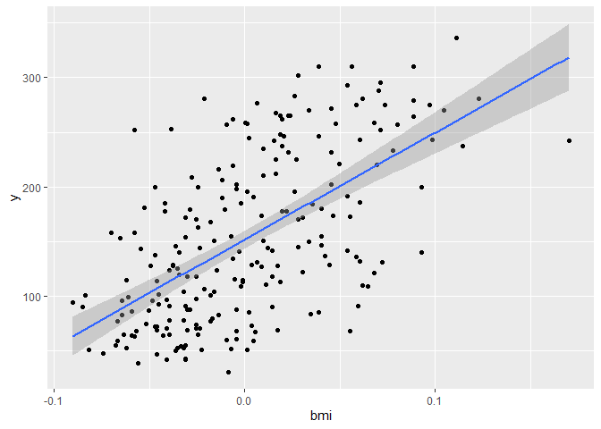
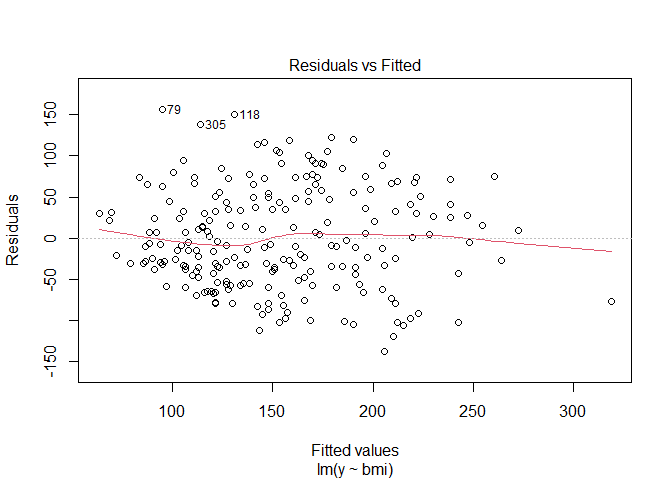
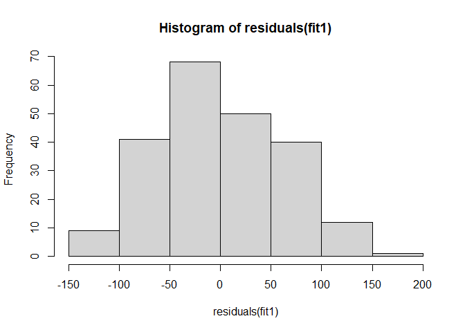
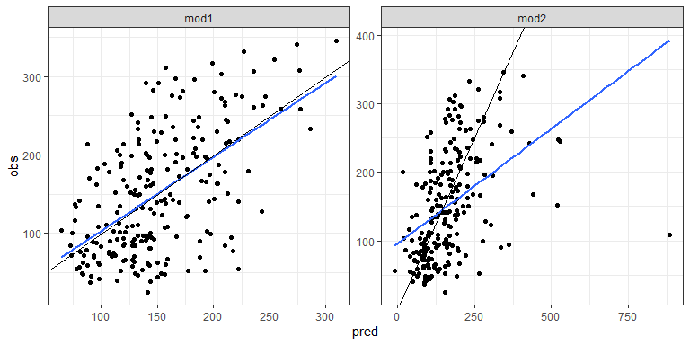

Exercises and Solutions - Analysis of High-Dimensional Data
================
Nicolas Städler
2022-03-28

-   [1 Diabetes data and linear
    regression](#diabetes-data-and-linear-regression)
-   [2 Diabetes data and model
    validation](#diabetes-data-and-model-validation)
-   [3 Calculus, optimization and OLS](#calculus-optimization-and-ols)
-   [4 Diabetes data and
    regularization](#diabetes-data-and-regularization)
-   [5 Closed form solution for Ridge
    regression](#closed-form-solution-for-ridge-regression)
-   [6 Bayesian interpretation of Ridge regression
    (difficult)](#bayesian-interpretation-of-ridge-regression-difficult)
-   [7 Elastic net mixing parameter and
    cross-validation](#elastic-net-mixing-parameter-and-cross-validation)
-   [8 Ridge and Lasso for the orthonormal design
    (difficult)](#ridge-and-lasso-for-the-orthonormal-design-difficult)
-   [9 Logistic regression and
    splines](#logistic-regression-and-splines)
-   [10 Decision trees, Random Forest and
    AdaBoost](#decision-trees-random-forest-and-adaboost)
-   [11 Phoneme recognition](#phoneme-recognition)
-   [12 Survival analysis and the Lymphoma
    data](#survival-analysis-and-the-lymphoma-data)

# 1 Diabetes data and linear regression

The data that we consider consist of 442 diabetes patients, with the
response of interest being a quantitative measure of disease progression
one year after baseline. There are ten baseline variables — age, sex,
body-mass index, average blood pressure, and six blood serum
measurements — plus quadratic terms, giving a total of *p* = 64
features.

1.  Read the diabetes data set and make a histogram for the response
    variable `y`. Describe the distribution of the variable.

2.  Create a scatterplot matrix for the 5 first variables in the data
    set. Use `pairs` or `ggpairs`.

3.  Randomly assign patients to training and test data (use `sample`).

4.  Run a univariate regression model with `bmi` as covariate. Study the
    `summary` output.

    -   How do you interpret the regression coefficients for `bmi`?
    -   What is the meaning of the *multiple R-squared*?
    -   What is the *residual standard error*?
    -   Generate a scatter plot of `y` against `bmi` and add the
        regression line with confidence band (use `geom_smooth`,
        `method="lm"`).
    -   Draw the Tukey Anscombe plot and the QQ plot (check `?plot.lm`).
        What are these two plots telling us?

5.  Run a multiple regression model using all covariates. Study the
    `summary` output.

    -   What does change in the interpretation of the coefficient for
        `bmi`?
    -   What do you conclude from the *multiple R-squared*?
    -   Create a Tukey Anscombe plot and a QQ plot.

6.  Calculate the RSS for both models. Write down your observation.

7.  Compare the two models using the `anova` function. What do you
    conclude?

Solution to the exercise.

Read the data set.

``` r
diabetes <- readRDS(file="data/diabetes.rds")
data <- as.data.frame(cbind(y=diabetes$y,diabetes$x2))
colnames(data) <- gsub(":",".",colnames(data))
```

Generate a histogram of `y`.

``` r
hist(data$y)
```


The distribution is right-skewed. Scatterplot matrix of the diabetes
data.

``` r
pairs(data[,1:5])
```


Create training and test data.

``` r
train_ind <- sample(seq(nrow(data)),size=nrow(data)/2)
data_train <- data[train_ind,]
xtrain <- as.matrix(data_train[,-1])
ytrain <- data_train[,1]
data_test <- data[-train_ind,]
xtest <- as.matrix(data_test[,-1])
ytest <- data_test[,1]
```

Fit a univariate regression model.

``` r
fit1 <- lm(y~bmi,data=data_train)
summary(fit1)
```

    ## 
    ## Call:
    ## lm(formula = y ~ bmi, data = data_train)
    ## 
    ## Residuals:
    ##      Min       1Q   Median       3Q      Max 
    ## -140.073  -45.740   -6.876   44.226  157.124 
    ## 
    ## Coefficients:
    ##             Estimate Std. Error t value Pr(>|t|)    
    ## (Intercept)  151.671      4.239   35.78   <2e-16 ***
    ## bmi          980.214     85.678   11.44   <2e-16 ***
    ## ---
    ## Signif. codes:  0 '***' 0.001 '**' 0.01 '*' 0.05 '.' 0.1 ' ' 1
    ## 
    ## Residual standard error: 62.9 on 219 degrees of freedom
    ## Multiple R-squared:  0.3741, Adjusted R-squared:  0.3712 
    ## F-statistic: 130.9 on 1 and 219 DF,  p-value: < 2.2e-16

Scatter plot with regression line.

``` r
data_train%>%
  ggplot(data=.,aes(x=bmi,y=y))+
  geom_point()+
  geom_smooth(method="lm")
```

    ## `geom_smooth()` using formula 'y ~ x'



The Tukey Anscombe plot. The residuals scatter around the 0 line and do
not show any systematic pattern. This indicates that the residuals are
independent and have mean 0.

``` r
plot(fit1,which=1) # Tukey Anscombe plot
```



The QQ plot. This plot is used to check the normality assumption of the
residuals. The residuals show slight tendency to be right-skewed (see
also the histogram).

``` r
plot(fit1,which=2) # Tukey Anscombe plot
```


``` r
hist(residuals(fit1))
```



We run the multiple regression model with all covariates. We print the
`summary` and create TA and QQ plots.

``` r
fit2 <- lm(y~.,data=data_train)
#summary(fit2)
plot(fit2,which=1)
```


``` r
plot(fit2,which=2)
```


Calculate the RSS.

``` r
sum(residuals(fit1)^2)
```

    ## [1] 866399.4

``` r
sum(residuals(fit2)^2)
```

    ## [1] 451511.1

Compare the 3 models using the `anova` function.

``` r
anova(fit1,fit2)
```

    ## Analysis of Variance Table
    ## 
    ## Model 1: y ~ bmi
    ## Model 2: y ~ age + sex + bmi + map + tc + ldl + hdl + tch + ltg + glu + 
    ##     `age^2` + `bmi^2` + `map^2` + `tc^2` + `ldl^2` + `hdl^2` + 
    ##     `tch^2` + `ltg^2` + `glu^2` + age.sex + age.bmi + age.map + 
    ##     age.tc + age.ldl + age.hdl + age.tch + age.ltg + age.glu + 
    ##     sex.bmi + sex.map + sex.tc + sex.ldl + sex.hdl + sex.tch + 
    ##     sex.ltg + sex.glu + bmi.map + bmi.tc + bmi.ldl + bmi.hdl + 
    ##     bmi.tch + bmi.ltg + bmi.glu + map.tc + map.ldl + map.hdl + 
    ##     map.tch + map.ltg + map.glu + tc.ldl + tc.hdl + tc.tch + 
    ##     tc.ltg + tc.glu + ldl.hdl + ldl.tch + ldl.ltg + ldl.glu + 
    ##     hdl.tch + hdl.ltg + hdl.glu + tch.ltg + tch.glu + ltg.glu
    ##   Res.Df    RSS Df Sum of Sq      F    Pr(>F)    
    ## 1    219 866399                                  
    ## 2    156 451511 63    414888 2.2753 2.065e-05 ***
    ## ---
    ## Signif. codes:  0 '***' 0.001 '**' 0.01 '*' 0.05 '.' 0.1 ' ' 1

# 2 Diabetes data and model validation

In the previous section we developed 2 models to predict `y`. In this
section we explore the generalizability of these models.

1.  Calculated the RMSE on the training data. Which model will perform
    best on future data?
2.  Use the test data and make scatter plots of the observed against
    predicted outcomes. Use `ggplot` to create one plot per model and
    add the regression line (`geom_smooth`) and the “y=x”
    (`geom_abline`) line to the graph. This plot is also called
    “calibration plot”. The model is “well” calibrated if the regression
    line agrees with the “y=x” line.
3.  Generate boxplots of `predicted - observed` for the 2 models. What
    do you conclude?
4.  Calculate the generalization error, i.e., the RMSE on the test data.

Solution to the exercise.

We calculate the RMSEs on the training data. RMSE on training tells you
how good the model “fits” the data. We cannot make any conclusion about
the generalizability of the models based on RMSEs on training data.

``` r
RMSE(data_train$y,predict(fit1,newdata=data_train))
```

    ## [1] 62.61277

``` r
RMSE(data_train$y,predict(fit2,newdata=data_train))
```

    ## [1] 45.19996

We draw calibration plots for the 2 models. Model 2 does not calibrate
well.

``` r
dd <- data.frame(pred=c(predict(fit1,newdata=data_test),
                        predict(fit2,newdata=data_test)),
                 obs = rep(data_test$y,times=2),
                 model=rep(c("mod1","mod2"),each=nrow(data_test))
)
dd%>%
  ggplot(.,aes(x=pred,y=obs))+
  geom_point()+
  geom_smooth(se=FALSE,method="lm")+
  geom_abline(slope=1,intercept=0)+
  theme_bw()+
  facet_wrap(~model)
```

    ## `geom_smooth()` using formula 'y ~ x'


Boxplots of predicted minus observed.

``` r
dd%>%
  ggplot(.,aes(x=model,y=pred-obs))+
  geom_boxplot()+
  geom_point()
```



Calculate RMSEs on test data.

``` r
RMSE(data_test$y,predict(fit1,newdata=data_test))
```

    ## [1] 62.17128

``` r
RMSE(data_test$y,predict(fit2,newdata=data_test))
```

    ## [1] 62.67202

# 3 Calculus, optimization and OLS

1.  Consider the function *f*(*x*) = 2*x*<sup>2</sup> + *x* − 5. Draw a
    plot of the function.
2.  Use `optimize` to find the minimum of *f*(*x*).
3.  Obtain the minimum of *f*(*x*) by taking the derivative and setting
    equal to zero.
4.  Show that ∥*a*∥<sub>2</sub><sup>2</sup> = *a*<sup>*T*</sup>*a*.
5.  Use the result in 4. and show that
    $\\bf RSS(\\beta)=\\bf y^Ty-2 y X \\beta +\\beta^T X^T X \\beta$.
6.  Invoke the result obtained in 4. and show that
    $$\\frac{\\partial}{\\partial \\beta} \\bf RSS(\\beta)=\\bf -2X^Ty+2X^TX\\beta.$$
    Hint: review the “Identities” section of
    [Wikipedia](https://en.wikipedia.org/wiki/Matrix_calculus).
7.  Do you understand the derivation of the least squares estimator?

Solution to the exercise.

Plot of the function.

``` r
myf <- function(x){
  2*x^2 + x -5
}
curve(myf,from=-1,to=1)
```


``` r
optimize(myf,interval=c(-5,5))
```

    ## $minimum
    ## [1] -0.25
    ## 
    ## $objective
    ## [1] -5.125

# 4 Diabetes data and regularization

The task is to use the diabetes data to construct a model that predicts
the response `y` (disease progression) based on covariates. The two
hopes are, that the model would produce accurate baseline predictions of
response for future patients, and also that the form of the model would
suggest which covariates were important factors in disease progression.

1.  Read the prostate cancer data set.
2.  Run forward stepwise regression. Which is the first variable
    included in the selection process? Print the coefficients of the
    AIC-optimal model as a table.
3.  Fit Ridge regression. Show the trace plot and the cross-validation
    plot.
4.  Run the Lasso approach and show the trace and the cross-validation
    plots.
5.  Calculate the root-mean-square errors (RMSE) for all 3 models on the
    test data and compare with the performance of the full model. Which
    model generalizes best?
6.  Plot the regression coefficients for all 3 models.

The solution to this exercise.

Read the data set and create training and test data.

``` r
diabetes <- readRDS(file="data/diabetes.rds")
data <- as.data.frame(cbind(y=diabetes$y,diabetes$x2))
colnames(data) <- gsub(":",".",colnames(data))
train_ind <- sample(seq(nrow(data)),size=nrow(data)/2)
data_train <- data[train_ind,]
xtrain <- as.matrix(data_train[,-1])
ytrain <- data_train[,1]
data_test <- data[-train_ind,]
xtest <- as.matrix(data_test[,-1])
ytest <- data_test[,1]
```

We perform forward stepwise regression.

``` r
# Forward regression
fit0 <- lm(y~1,data=data_train)
up.model <- paste("~", 
                  paste(
                    colnames(data_train[,-1]),collapse=" + ")
                  )
fit.fw <- stepAIC(fit0,direction="forward",
                  scope=list(lower=fit0,
                             upper=up.model
                             
                  ),
                  trace = FALSE
)
#summary(fit.fw)
```

The selection process is depicted in the following table.

``` r
kable(as.data.frame(fit.fw$anova),digits=2,
      booktabs=TRUE)
```

| Step       |  Df |  Deviance | Resid. Df | Resid. Dev |     AIC |
|:-----------|----:|----------:|----------:|-----------:|--------:|
|            |  NA |        NA |       220 |  1304692.8 | 1921.01 |
| \+ ltg     |   1 | 412445.77 |       219 |   892247.1 | 1839.04 |
| \+ bmi     |   1 | 184023.82 |       218 |   708223.2 | 1789.99 |
| \+ age.glu |   1 |  41642.57 |       217 |   666580.7 | 1778.60 |
| \+ map     |   1 |  24873.44 |       216 |   641707.2 | 1772.19 |
| \+ tc      |   1 |  16926.33 |       215 |   624780.9 | 1768.29 |
| \+ bmi.tch |   1 |  16379.47 |       214 |   608401.4 | 1764.41 |
| \+ sex     |   1 |  11389.24 |       213 |   597012.2 | 1762.24 |
| \+ ldl     |   1 |  18430.65 |       212 |   578581.6 | 1757.31 |
| \+ bmi.map |   1 |  11593.20 |       211 |   566988.3 | 1754.83 |
| \+ map.ldl |   1 |   9707.76 |       210 |   557280.6 | 1753.02 |
| \+ age     |   1 |   5855.48 |       209 |   551425.1 | 1752.68 |

The regression coefficients and the corresponding statistics of the
AIC-optimal model are shown next.

``` r
kable(broom::tidy(fit.fw),digits=2,
      booktabs=TRUE)
```

| term        | estimate | std.error | statistic | p.value |
|:------------|---------:|----------:|----------:|--------:|
| (Intercept) |   150.45 |      3.49 |     43.15 |    0.00 |
| ltg         |   924.12 |    113.19 |      8.16 |    0.00 |
| bmi         |   533.01 |     90.92 |      5.86 |    0.00 |
| age.glu     |   194.13 |     82.25 |      2.36 |    0.02 |
| map         |   304.15 |     90.19 |      3.37 |    0.00 |
| tc          |  -829.65 |    215.60 |     -3.85 |    0.00 |
| bmi.tch     |   192.40 |     70.47 |      2.73 |    0.01 |
| sex         |  -272.73 |     86.10 |     -3.17 |    0.00 |
| ldl         |   571.62 |    197.75 |      2.89 |    0.00 |
| bmi.map     |   209.60 |     80.87 |      2.59 |    0.01 |
| map.ldl     |  -151.77 |     81.45 |     -1.86 |    0.06 |
| age         |   127.04 |     85.28 |      1.49 |    0.14 |

We continue by fitting Ridge regression. We show the trace plot and the
cross-validation plot.

``` r
# Ridge
set.seed(1515)
fit.ridge <- glmnet(xtrain,ytrain,alpha=0)
fit.ridge.cv <- cv.glmnet(xtrain,ytrain,alpha=0)
plot(fit.ridge,xvar="lambda")
```


``` r
plot(fit.ridge.cv)
```


Finally, we run the Lasso approach and show the trace and the
cross-validation plots.

``` r
# Lasso
set.seed(1515)
fit.lasso <- glmnet(xtrain,ytrain,alpha=1)
fit.lasso.cv <- cv.glmnet(xtrain,ytrain,alpha=1)
plot(fit.lasso,xvar="lambda")
```


``` r
plot(fit.lasso.cv)#fit.lasso.cv$lambda.1se
```


We calculate the root-mean-square errors (RMSE) on the test data and
compare with the full model.

``` r
# Full model
fit.full <- lm(y~.,data=data_train)
# RMSE
pred.full <- predict(fit.full,newdata=data_test)
pred.fw <- predict(fit.fw,newdata=data_test)
pred.ridge <- as.vector(predict(fit.ridge,newx=xtest,s=fit.ridge.cv$lambda.1se))
pred.lasso <- as.vector(predict(fit.lasso,newx=xtest,s=fit.lasso.cv$lambda.1se))
res.rmse <- data.frame(
  method=c("full","forward","ridge","lasso"),
  rmse=c(RMSE(pred.full,ytest),RMSE(pred.fw,ytest),RMSE(pred.ridge,ytest),RMSE(pred.lasso,ytest)))
kable(res.rmse,digits = 2,
      booktabs=TRUE)
```

| method  |  rmse |
|:--------|------:|
| full    | 66.95 |
| forward | 58.17 |
| ridge   | 58.14 |
| lasso   | 56.73 |

The Lasso has the lowest generalization error (RMSE). We plot the
regression coefficients for all 3 methods.


# 5 Closed form solution for Ridge regression

1.  Show that the Ridge optimization problem has the closed form
    solution

Hint: calculate the gradient of the loss function
$\\ell\_{\\rm Ridge}(\\beta\|\\bf y,\\bf X)=\\rm{RSS}(\\beta)+\\lambda\\\|\\beta\\\|\_2^2$,
set equal to zero and solve for *β*.

2.  Use the code below to generate simulated data. Use the formula from
    the script to calculate the Ridge coefficients for *λ* = 35. Compare
    the coefficients with those obtained using `glmnet`. Hint: Read the
    following
    [blog](https://stats.stackexchange.com/questions/129179/why-is-glmnet-ridge-regression-giving-me-a-different-answer-than-manual-calculat)
    on how to scale the *λ*.

``` r
set.seed(1)

# simulate data
n <- 20
p <- 15
x <-  matrix(rnorm(n * p), n, p)
y <- x[,1:4]%*%c(2,-2,2,-2)+rnorm(n)
```

Solution to the exercise.


We obtain the Ridge coefficients using `glmnet`.

``` r
my.lambda <- 35
fit.ridge <- glmnet(x,y,alpha=0,lambda=my.lambda,
                    intercept=FALSE,standardize = FALSE,thresh = 1e-20,exact=TRUE)
coef.ridge <- as.vector(coef(fit.ridge))[-1]
head(coef.ridge)
```

    ## [1]  0.27330465 -0.24799766  0.19686435 -0.21942808  0.05302251 -0.02458886

Next we calculate the coefficients based on the formula from the script.
Note that we need to re-scale the lambda.

``` r
sd_y <- sqrt(var(y)*(n-1)/n)[1,1]
my.lambda2 <- n*my.lambda/sd_y
coef.ridge2 <- solve(t(x)%*%x+my.lambda2*diag(nrow=ncol(x)))%*%t(x)%*%y
head(coef.ridge2)[,1]
```

    ## [1]  0.27031012 -0.24528806  0.19469189 -0.21696366  0.05244081 -0.02429057

# 6 Bayesian interpretation of Ridge regression (difficult)

1.  Write down the log-likelihood of the linear regression model. Note:
    *Y*<sub>*i*</sub> = *X*<sub>*i*</sub><sup>*T*</sup>*β* + *ϵ*<sub>*i*</sub>,
    where *ϵ*<sub>1</sub>, …, *ϵ*<sub>*n*</sub> iid
    *N*(0, *σ*<sup>2</sup>) and $\\bf{X}$ is a fixed *n* × *p* design
    matrix.
2.  Find the expression for the maximum likelihood estimator.
3.  Assuming a prior distribution *β*<sub>1</sub>, …, *β*<sub>*p*</sub>
    iid  ∼ *N*(0, *τ*<sup>2</sup>), derive the posterior distribution of
    *β* and show that the maximum a posteriori estimator (MAP) coincides
    with the Ridge estimator.

The solution to this exercise.


# 7 Elastic net mixing parameter and cross-validation

1.  Load the `hdi` package and read the riboflavin data set
    (`?riboflavin`).
2.  Run the Lasso and generate the trace plot.
3.  Run the Elastic net with mixing parameters *α* = 0.25, 0.5, 0.75 and
    1 and compare the cross-validation curves. Hint: use the `foldid`
    argument in `glmnet`.
4.  Show the selected genes for the best performing model.

The solution to this exercise.

We first load the data and check the data structure.

``` r
library(hdi)
library(glmnet)
riboflavin <- readRDS(file="data/riboflavin.rds")
str(riboflavin)
```

    ## 'data.frame':    71 obs. of  2 variables:
    ##  $ y: num  -6.64 -6.95 -7.93 -8.29 -7.31 ...
    ##  $ x: 'AsIs' num [1:71, 1:4088] 8.49 7.64 8.09 7.89 6.81 ...
    ##   ..- attr(*, "dimnames")=List of 2
    ##   .. ..$ : chr [1:71] "b_Fbat107PT24.CEL" "b_Fbat107PT30.CEL" "b_Fbat107PT48.CEL" "b_Fbat107PT52.CEL" ...
    ##   .. ..$ : chr [1:4088] "AADK_at" "AAPA_at" "ABFA_at" "ABH_at" ...

Next we setup the design matrix and the response variable and we run the
Lasso.

``` r
x <- riboflavin[,-1]
y <- riboflavin[,1]
fit <- glmnet(x = x, y = y)
plot(fit)
```


We run 10-fold cross-validation for the different mixing parameters and
plot the error curves.

``` r
set.seed(1)
n.fold <- 10
foldid <- sample(1:n.fold, size = length(y), replace = TRUE)
cv1 <- cv.glmnet(x, y, foldid = foldid, alpha = 1) 
cv2  <- cv.glmnet(x, y, foldid = foldid, alpha = 0.75)
cv3  <- cv.glmnet(x, y, foldid = foldid, alpha = 0.5)
cv4  <- cv.glmnet(x, y, foldid = foldid, alpha = 0.25)

t.lambdarange <- range(log(c(cv1$lambda,
                             cv2$lambda,
                             cv3$lambda,
                             cv4$lambda)))
t.crange <- range(c(cv1$cvm,cv2$cvm,cv3$cvm,cv4$cvm))
plot(log(cv1$lambda), cv1$cvm , 
     pch = 19, col = "red",
     xlab = "log(Lambda)",
     ylab=cv1$name,
     type="l",
     xlim=t.lambdarange,
     ylim=t.crange)
lines(log(cv2$lambda), cv2$cvm, pch = 19, col = "grey")
lines(log(cv3$lambda) , cv3$cvm , pch = 19, col = "blue")
lines(log(cv4$lambda) , cv4$cvm , pch = 19, col = "green")
```


Finally, we print the gene names of the non-zero coefficients.

``` r
## Get selected genes
b <- as.matrix(coef(cv1))
rownames(b)[b!=0]
```

    ##  [1] "(Intercept)" "ARGF_at"     "DNAJ_at"     "GAPB_at"     "LYSC_at"     "PKSA_at"    
    ##  [7] "SPOIISA_at"  "SPOVAA_at"   "XHLB_at"     "XKDS_at"     "XTRA_at"     "YBFI_at"    
    ## [13] "YCDH_at"     "YCGO_at"     "YCKE_at"     "YCLB_at"     "YCLF_at"     "YDDH_at"    
    ## [19] "YDDK_at"     "YEBC_at"     "YEZB_at"     "YFHE_r_at"   "YFIR_at"     "YHDS_r_at"  
    ## [25] "YKBA_at"     "YOAB_at"     "YQJU_at"     "YRVJ_at"     "YTGB_at"     "YURQ_at"    
    ## [31] "YXLD_at"     "YXLE_at"     "YYDA_at"

``` r
## By default, the selected variables are based on the largest value of
## lambda such that the cv-error is within 1 standard error of the minimum
```

# 8 Ridge and Lasso for the orthonormal design (difficult)

1.  Calculate the Ridge and the Lasso solution for the special case of
    an orthonormal design matrix.

The solution to this exercise.


# 9 Logistic regression and splines

We explore logistic regression based on the South African heart disease
data. Proceed as follows:

1.  Fit a univariate logistic regression model with `age` as the
    covariate. Calculate the odds-ratio and elaborate on the
    interpretation.
2.  Predict the probability of heart disease at age 65.  
3.  Fit a logistic regression model including all covariates. Run
    stepwise backward selection. Which variables are excluded? What is
    the AIC value of the final model?
4.  Fit a logistic regression model using four natural cubic spline
    bases for each term in the model. Run backward selection and
    summarise the final model. Plot the natural cubic spline functions
    for the age term (use `termplot`). What does the plot tell you?

The solution to this exercise.

We load the data and fit a logistic regression with age as the
covariate.

``` r
sahd <- readRDS(file="data/sahd.rds")
fit <- glm(chd~age, data=sahd, family=binomial )
summary(fit)
```

    ## 
    ## Call:
    ## glm(formula = chd ~ age, family = binomial, data = sahd)
    ## 
    ## Deviance Residuals: 
    ##     Min       1Q   Median       3Q      Max  
    ## -1.4321  -0.9215  -0.5392   1.0952   2.2433  
    ## 
    ## Coefficients:
    ##              Estimate Std. Error z value Pr(>|z|)    
    ## (Intercept) -3.521710   0.416031  -8.465  < 2e-16 ***
    ## age          0.064108   0.008532   7.513 5.76e-14 ***
    ## ---
    ## Signif. codes:  0 '***' 0.001 '**' 0.01 '*' 0.05 '.' 0.1 ' ' 1
    ## 
    ## (Dispersion parameter for binomial family taken to be 1)
    ## 
    ##     Null deviance: 596.11  on 461  degrees of freedom
    ## Residual deviance: 525.56  on 460  degrees of freedom
    ## AIC: 529.56
    ## 
    ## Number of Fisher Scoring iterations: 4

The odds ratio for age is given next.

``` r
exp(coef(fit)[2])
```

    ##      age 
    ## 1.066208

This means that an increase of 1 year in age leads to a 6.6% increase in
the odds of having a heart disease.

The estimated probability of having a heart disease at age 65 can be
calculated using the `predict` function.

``` r
predict(fit,newdata=data.frame(age=65),type="response")
```

    ##         1 
    ## 0.6559532

Alternatively, we can use the inverse logit formula.

``` r
lp <- coef(fit)[1]+coef(fit)[2]*65
exp(lp)/(exp(lp)+1)
```

    ## (Intercept) 
    ##   0.6559532

We fit a logistic regression model including all covariates. Then we
perform stepwise backward selection using `stepAIC`.

``` r
fit.full <- glm(chd~sbp+tobacco+ldl+famhist+obesity+alcohol+age,
                    data=sahd,
                    family="binomial")
fit.bw <- stepAIC(fit.full,direction = "backward",trace=FALSE)
```

The terms removed in each step are provided in the next table.

``` r
kable(as.data.frame(fit.bw$anova),digits=3,booktabs=TRUE)
```

| Step       |  Df | Deviance | Resid. Df | Resid. Dev |     AIC |
|:-----------|----:|---------:|----------:|-----------:|--------:|
|            |  NA |       NA |       454 |    483.174 | 499.174 |
| \- alcohol |   1 |    0.019 |       455 |    483.193 | 497.193 |
| \- sbp     |   1 |    1.104 |       456 |    484.297 | 496.297 |
| \- obesity |   1 |    1.147 |       457 |    485.444 | 495.444 |

The variables alcohol, sbp and obesity are excluded from the model. The
AIC values are provided in the table above. We can also re-calculate the
AIC for the final model.

``` r
AIC(fit.bw)
```

    ## [1] 495.4439

We fit a logistic regression model using natural splines.

``` r
# Computes the logistic regression model using natural splines (note famhist is included as a factor): 
form <-  "chd ~ ns(sbp,df=4) + ns(tobacco,df=4) + ns(ldl,df=4) + famhist + ns(obesity,df=4)+ ns(alcohol,df=4)  + ns(age,df=4)"
form <-  formula(form)
fit <-  glm( form, data=sahd, family=binomial )

# stepwise backward selection
fit.bw <- stepAIC(fit,direction="backward",trace = 0)
kable(as.data.frame(fit.bw$anova),digits=3,booktabs=TRUE)
```

| Step                   |  Df | Deviance | Resid. Df | Resid. Dev |     AIC |
|:-----------------------|----:|---------:|----------:|-----------:|--------:|
|                        |  NA |       NA |       436 |    457.632 | 509.632 |
| \- ns(alcohol, df = 4) |   4 |    0.456 |       440 |    458.088 | 502.088 |

The summary of the final model is provided next.

``` r
kable(as.data.frame(drop1(fit.bw, test="Chisq" )),digits=2,booktabs=TRUE)
```

|                     |  Df | Deviance |    AIC |   LRT | Pr(&gt;Chi) |
|:--------------------|----:|---------:|-------:|------:|------------:|
| <none>              |  NA |   458.09 | 502.09 |    NA |          NA |
| ns(sbp, df = 4)     |   4 |   467.16 | 503.16 |  9.08 |        0.06 |
| ns(tobacco, df = 4) |   4 |   470.48 | 506.48 | 12.39 |        0.01 |
| ns(ldl, df = 4)     |   4 |   472.39 | 508.39 | 14.31 |        0.01 |
| famhist             |   1 |   479.44 | 521.44 | 21.36 |        0.00 |
| ns(obesity, df = 4) |   4 |   466.24 | 502.24 |  8.15 |        0.09 |
| ns(age, df = 4)     |   4 |   481.86 | 517.86 | 23.77 |        0.00 |

We can plot the natural spline function for the first term as follows.

``` r
termplot(fit.bw,se=TRUE,rug=TRUE,term=6)
```


The plot shows how the log-odds change with age (keeping the other
variables fixed). We observe a slight deviation from linearity, i.e. the
log-odds increase more strongly for age &lt;35 than for age &gt;35.

# 10 Decision trees, Random Forest and AdaBoost

In this exercise we explore decision trees based on the South African
heart disease data.

1.  Load the South African heart disease data and grow a decision tree
    using `rpart`. Visualize the tree using `rpart.plot`. How many leave
    nodes has the tree?
2.  Re-grow the tree but now relax the “default” control parameters
    (choose `rpart.control(cp=0, minsplit=50)`). How many leaves has the
    tree now?
3.  Plot the cross-validation error against the complexity parameter
    *α*. What is the tree size of the optimal model?
4.  Prune the tree using `prune` and by choosing cp (=*α*) to achieve
    minimal cross-validation error.
5.  Calculate the confusion matrix and the misclassification error.
6.  Generate a bootstrap sample. Grow a tree and calculate the
    out-of-bag error.
7.  Fit a random forest using `randomForest`. Plot the fitted object.
    What is this plot telling us? Calculate the variable importance.
    Which are the most important variables?
8.  Run AdaBoost using `gbm`. What is the prediction for a patient with
    covariates sbp=100, tobacco=0, ldl=5, famhist=“Present”, obesity=25,
    alcohol=10 and age=50. Compute the variable importance.

The solution to this exercise.

First we read the data and grow the tree.

``` r
# load packages
library(rpart)
library(rpart.plot)

# grow a classification tree
fit.tree <- rpart(chd~.,data=sahd,method="class")
rpart.plot(fit.tree,extra=1,under=TRUE,tweak = 1.2,faclen=3)
```


We re-grow the tree using different control parameters.

``` r
# controlling the growth of the tree with rpart.control
# cp: improvement in each split needs to be > cp
# minsplit: minimal number of samples in a node inorder to do a split
fit.tree2 <- rpart(chd~.,data=sahd,method="class",
                   control = rpart.control(cp = 0,minsplit=10)
                   
)
rpart.plot(fit.tree2,extra=1,under=TRUE,tweak = 1.2,faclen=3)
```


We can get the tree size from the cptable (tree size=number of
leaves=number splits+1).

``` r
fit.tree2$cptable[fit.tree2$cptable[,"CP"]==0,"nsplit"]+1 # number of leaves
```

    ## [1] 43

Next, we plot the cross-validation error against the complexity
parameter *α*.

``` r
plotcp(fit.tree2,cex.lab=1.5,cex.axis=1.2,cex=1.5)
```


We prune the tree and visualize the result.

``` r
# prune the tree
fit.prune<- prune(fit.tree2, 
                  cp=fit.tree2$cptable[which.min(fit.tree$cptable[,"xerror"]),"CP"])
rpart.plot(fit.prune,extra=1)
```


Finally, we compute the confusion matrix and the misclassification
error.

``` r
# confusion matrix of actual and fitted class labels
table(Actual=sahd$chd,Fitted=predict(fit.prune,type="class"))
```

    ##       Fitted
    ## Actual   0   1
    ##      0 268  34
    ##      1  80  80

``` r
# missclassification error
mean(sahd$chd!=predict(fit.prune,type="class"))
```

    ## [1] 0.2467532

We sample with replacement (bootstrap sample).

``` r
set.seed(1)
inthebag <- sample(1:nrow(sahd),size=nrow(sahd),replace=TRUE)
outofbag <- setdiff(1:nrow(sahd),inthebag)
```

We fit a tree on the in-the-bag samples and calculate the
misclassification error on the out-of-bag samples.

``` r
fit.in <- rpart(chd~.,data=sahd[inthebag,],method="class")
pred.oob <- predict(fit.in,newdata=sahd[outofbag,],type="class")
mean(sahd$chd[outofbag]!=pred.oob)
```

    ## [1] 0.3559322

We fit the random forest, plot the error as a function of the number of
trees and plot the variable importance.

``` r
library(randomForest)
sahd$chd <- factor(sahd$chd)
fit.rf <- randomForest(chd~.,data=sahd,importance=TRUE)
plot(fit.rf)
```


``` r
varImpPlot(fit.rf,type=1)
```


We run AdaBoost using `gbm` and by specifying
`distribution = "adaboost"`. The `summary` provides a measure of
variable importance. Prediction can be made using `predict`.

``` r
fit.boost <-gbm(chd~.,data=sahd,distribution = "adaboost") # note: for adaboost the outcome must be numeric
summary(fit.boost)
```


    ##             var    rel.inf
    ## tobacco tobacco 96.4821033
    ## age         age  2.9567803
    ## ldl         ldl  0.5611164
    ## sbp         sbp  0.0000000
    ## famhist famhist  0.0000000
    ## obesity obesity  0.0000000
    ## alcohol alcohol  0.0000000

``` r
newd <- data.frame(sbp=100,tobacco=0,ldl=5,famhist=factor("Present"),obesity=25,alcohol=10,age=50)
predict(fit.boost,
        newdata=newd,
        type="response" )
```

    ## Using 100 trees...

    ## [1] 1

# 11 Phoneme recognition

In this exercise we investigate prediction of phonemes based on
digitized speech data.

1.  Read the data set, subset the phonemes “aa” and “ao” and create
    training and test data.

``` r
dat <- readRDS(file="data/phoneme.rds")
dat2 <- dat[dat$g%in%c("aa","ao"),]

dtrain <- dat2[grepl("^train",dat2$speaker),-c(1,259)]
xtrain <- as.matrix(dtrain[,-257])
ytrain <- ifelse(dtrain$g=="ao",1,0)
dtest <- dat2[grepl("^test",dat2$speaker),-c(1,259)]
xtest <- as.matrix(dtest[,-257])
ytest <- ifelse(dtest$g=="ao",1,0)

dtrain$y <- ytrain
dtest$y <- ytest
dtrain <- dtrain[,-257]
dtest <- dtest[,-257]
```

2.  Plot the log-periodogram as a function of frequency for 5 examples
    each of the phonemes “aa” and “ao”.

3.  Fit a logistic regression model and evaluate the training and test
    misclassification errors.

4.  Run Lasso regression and evaluate the training and test
    misclassification errors.

5.  In the previous approaches we assumed logit-link
    $${\\rm logit}(x;\\beta)=\\sum\_{j=1}^{256} X\_j\\beta\_j.$$
    Next we assume that the coefficients are a smooth function of the
    frequency *β*(*f*), i.e. 
    $$\\beta(f)=\\sum\_{m=1}^{\\nu} h\_m(f)\\theta\_m,$$
    where *h*<sub>*m*</sub> are B-spline basis functions for a natural
    cubic spline with *ν* = 12 degrees of freedom (defined on the set of
    frequencies). Consider filtered inputs $x^\*={\\bf H}^T x$ and fit
    *θ* by logistic regression on the *x*<sup>\*</sup>. Evaluate the
    training and test misclassification errors.

6.  Plot the coefficients of the different models.

The solution to this exercise.

We prepare the data set.

<!-- https://github.com/empathy87/The-Elements-of-Statistical-Learning-Python-Notebooks/blob/master/examples/Phoneme%20Recognition.ipynb -->
<!-- https://waxworksmath.com/Authors/G_M/Hastie/Code/Chapter5/dup_fig_5_5.R -->
<!-- https://waxworksmath.com/Authors/G_M/Hastie/WriteUp/Weatherwax_Epstein_Hastie_Solution_Manual.pdf -->

<!-- dat <- read.csv("https://web.stanford.edu/~hastie/ElemStatLearn/datasets/phoneme.data") -->

``` r
library(splines)
dat <- readRDS(file="data/phoneme.rds")
dat2 <- dat[dat$g%in%c("aa","ao"),]

dtrain <- dat2[grepl("^train",dat2$speaker),-c(1,259)]
xtrain <- as.matrix(dtrain[,-257])
ytrain <- ifelse(dtrain$g=="ao",1,0)
dtest <- dat2[grepl("^test",dat2$speaker),-c(1,259)]
xtest <- as.matrix(dtest[,-257])
ytest <- ifelse(dtest$g=="ao",1,0)

dtrain$y <- ytrain
dtest$y <- ytest
dtrain <- dtrain[,-257]
dtest <- dtest[,-257]
```

We plot the log-periodograms.

``` r
id.ao <- sample(which(ytrain==1),5)
id.aa <- sample(which(ytrain==0),5)
plot(xtrain[id.ao[1],],type="l",
     xlab="Frequency",ylab="Log-periodogram")
for(i in 2:5){
  lines(xtrain[id.ao[i],])
}
for(i in 1:5){
  lines(xtrain[id.aa[i],],col="red")
}
```


We run logistic regression and calculate the train and test errors.

``` r
# logistic regression
fit <- glm(y~.,data=dtrain,family=binomial)
coef.glm <-  coefficients(fit)
pred_train <- as.numeric((predict(fit,type="response")>0.5))
pred_test <- as.numeric((predict(fit,type="response",newdata=dtest)>0.5))
mean(pred_train!=ytrain)
```

    ## [1] 0.09311424

``` r
mean(pred_test!=ytest)
```

    ## [1] 0.2437358

We run Lasso regression and calculate the train and test errors.

``` r
# lasso regression
fit.glmnet <-glmnet(xtrain,ytrain,family = "binomial",alpha=1)
cv.glmnet <- cv.glmnet(xtrain,ytrain,family = "binomial",type.measure = "class",
                       alpha = 1,nfolds = 10)
coef.lasso <- as.numeric(coefficients(fit.glmnet,s = cv.glmnet$lambda.1se))[-1]
plot(cv.glmnet)
```


``` r
pred_train <- c(predict(fit.glmnet,xtrain,s = cv.glmnet$lambda.1se,type = "class"))
pred_test <- c(predict(fit.glmnet,xtest,s = cv.glmnet$lambda.1se,type = "class"))
mean(pred_train!=ytrain)
```

    ## [1] 0.170579

``` r
mean(pred_test!=ytest)
```

    ## [1] 0.2072893

We use the natural cubic spline basis with *ν* = 12 to express the
coefficients as a smooth function of the frequencies. We calculate the
train and test errors.

``` r
# coefficient smoothing
hmat <- ns(x=1:256,df=12)
xstar <- xtrain%*%hmat
fit.smooth <- glm(dtrain$y~.,data=data.frame(xstar),family="binomial")
coef.smooth <- as.numeric(hmat%*%coef(fit.smooth)[-1])
pred_train <- as.numeric((predict(fit.smooth,type="response")>0.5))
pred_test <- as.numeric((predict(fit.smooth,type="response",newdata=data.frame(xtest%*%hmat))>0.5))

mean(pred_train!=ytrain)
```

    ## [1] 0.1690141

``` r
mean(pred_test!=ytest)
```

    ## [1] 0.1867882

We plot the regression coefficients.

``` r
plot( coef.glm[-1], 
      ylim=c(-0.4,+0.4), 
      type="l", 
      xlab="Frequency", 
      ylab="Logistic Regression Coefficients" )
lines(coef.lasso,col="green",lwd=2)
lines(coef.smooth,col="red",lwd=2)
abline(h=0)
```


# 12 Survival analysis and the Lymphoma data

In this exercise we explore the Lymphoma data set to predict survival
based on gene expression data.

1.  Load the Lymphoma data and make a histogram of the survival times.

2.  Plot the estimated survival curve using `survfit` (Kaplan-Meier
    method).

3.  Fit a Cox regression model with the first three genes as predictors.
    Use the function `coxph`.

4.  Build a predictive model using `glmnet` (data pre-processing: use
    the top 100 genes and scale the resulting predictor matrix). Which
    genes are selected? What is the C-index for the optimal tuning
    parameter?

5.  Use the predictive model and classify patients into “good” and
    “poor” prognostic groups by thresholding the linear predictor at
    zero. Calculate the Kaplan-Meier curves for the two groups. What is
    your conclusion? Do you have any concerns?

6.  The linear predictor scores computed in 5. are biased as they are
    evaluated on the same data for which they were computed. We now use
    a variant of cross-validation, known as *pre-validation*, in order
    to obtain a fair evaluation of the model. Calculate a pre-validated
    data set using the code below and calculate the Kaplan-Meier curves
    for patients with good and poor prognosis.

``` r
# split data into K=5 folds
n.fold <- 5
foldid <- sample(1:n.fold, size = nrow(x), replace = TRUE)

# pre-validation
dat.preval <- data.frame(y) 
dat.preval$lp <- NA

for (i in 1:n.fold){
  
  # train model on samples not in the kth fold
  omitk <- which(foldid==i)
  fitk <- cv.glmnet(x[-omitk,],y.surv[-omitk,],
                    family="cox",
                    type.measure="C",
                    nfolds = 5,
                    alpha=1)
  
  # calculated linear predictor on samples in the kth fold
  lp <- predict(fitk,
                newx=x[omitk,],
                s=cv.coxnet$lambda.min,
                type="link")
  dat.preval$lp[omitk] <- lp
}
```

Solution to the exercise.

We load the data set.

``` r
# read gene expression matrix
x <- read.table("data/lymphx.txt")%>%
  as.matrix

# read survival data
y <- read.table("data/lymphtime.txt",header = TRUE)%>%
  as.matrix
```

Plot the distribution of the survival times.


Plot of the Kaplan-Meier estimates.

``` r
dat <- data.frame(y)
fit.surv <- survfit(Surv(time, status) ~ 1, 
                    data = dat)
ggsurvplot(fit.surv,conf.int=FALSE)
```


Fit a Cox regression model.

``` r
dat <- data.frame(cbind(y,x[,1:3]))
fit <- coxph(Surv(time,status)~.,data=dat)
summary(fit)
```

    ## Call:
    ## coxph(formula = Surv(time, status) ~ ., data = dat)
    ## 
    ##   n= 240, number of events= 138 
    ## 
    ##       coef exp(coef) se(coef)      z Pr(>|z|)
    ## V1  0.6382    1.8931   0.4504  1.417    0.156
    ## V2 -0.5778    0.5611   0.4023 -1.436    0.151
    ## V3 -0.1508    0.8600   0.3785 -0.398    0.690
    ## 
    ##    exp(coef) exp(-coef) lower .95 upper .95
    ## V1    1.8931     0.5282    0.7831     4.577
    ## V2    0.5611     1.7822    0.2551     1.234
    ## V3    0.8600     1.1627    0.4095     1.806
    ## 
    ## Concordance= 0.559  (se = 0.028 )
    ## Likelihood ratio test= 4.46  on 3 df,   p=0.2
    ## Wald test            = 4.66  on 3 df,   p=0.2
    ## Score (logrank) test = 4.66  on 3 df,   p=0.2

Build a predictive model using `glmnet`. Data pre-processing.

``` r
# filter for top genes (highest variance) and scale the input matrix
topvar.genes <- order(apply(x,2,var),decreasing=TRUE)[1:100]
x <- scale(x[,topvar.genes])
```

Run `glmnet` using `family="cox"`.

``` r
set.seed(1)
y.surv <- Surv(y[,"time"],y[,"status"])
fit.coxnet <- glmnet(x, y.surv, family = "cox")
plot(fit.coxnet,xvar="lambda")
```


Calculate the cross-validated C-index.

``` r
cv.coxnet <- cv.glmnet(x,y.surv,
                       family="cox",
                       type.measure="C",
                       nfolds = 5)
plot(cv.coxnet)
```


Classify patients into groups with good and poor prognosis (based on
thresholding the linear predictor at zero).

``` r
# linear predictor
lp <- predict(fit.coxnet,
              newx=x,
              s=cv.coxnet$lambda.1se,
              type="link")
dat <- data.frame(y)
dat$prognosis <- ifelse(lp>0,"poor","good")
fit.surv <- survfit(Surv(time, status) ~ prognosis, 
                    data = dat)
ggsurvplot(fit.surv,conf.int = TRUE,pval=TRUE)
```


The curves are very well separated. However, these linear predictor
scores are biased: we are evaluating their performance on the same data
for which they were computed.

In order to obtain a fair evaluation of the model we calculate a
pre-validated data set.

``` r
set.seed(150381)

# split data into K=5 folds
n.fold <- 5
foldid <- sample(1:n.fold, size = nrow(x), replace = TRUE)

# pre-validation
dat.preval <- data.frame(y) 
dat.preval$lp <- NA

for (i in 1:n.fold){
  
  # train model on samples not in the kth fold
  omitk <- which(foldid==i)
  fitk <- cv.glmnet(x[-omitk,],y.surv[-omitk,],
                    family="cox",
                    type.measure="C",
                    nfolds = 5,
                    alpha=1)
  
  # calculated linear predictor on samples in the kth fold
  lp <- predict(fitk,
                newx=x[omitk,],
                s=cv.coxnet$lambda.min,
                type="link")
  dat.preval$lp[omitk] <- lp
}
```

Plot the Kaplan-Meier curves for the good and poor prognosic groups
based on the pre-validated data.

``` r
dat.preval$prognosis <- ifelse(dat.preval$lp>0,"poor","good")
fit.surv <- survfit(Surv(time, status) ~ prognosis, 
                    data = dat.preval)
ggsurvplot(fit.surv,conf.int = TRUE,pval=TRUE)
```


<!-- rmarkdown::render("_exercises_and_solutions.Rmd",output_format = "html_document") -->
<!-- rmarkdown::render("_exercises_and_solutions.Rmd",output_format = "github_document") -->
<!-- rmarkdown::render("_exercises_and_solutions.Rmd",output_format = "pdf_document") -->
