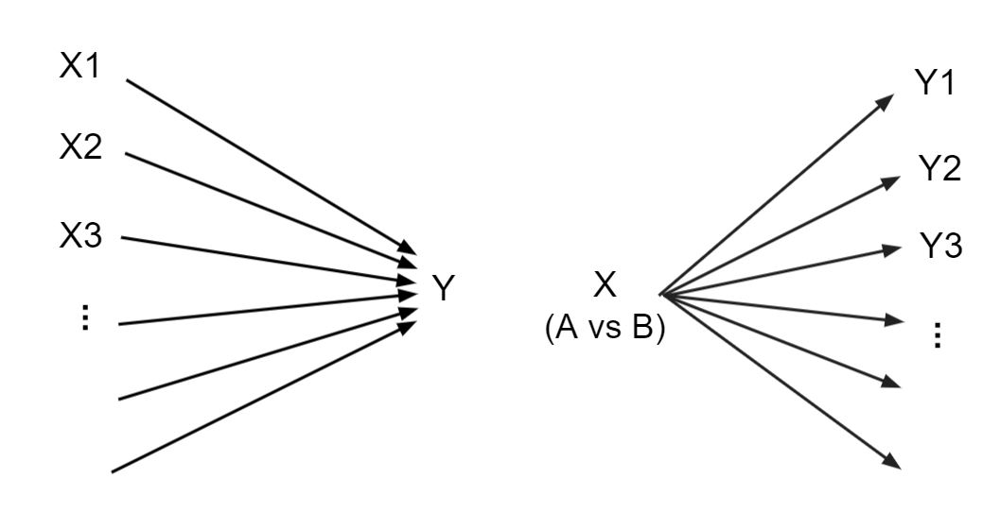

--- 
title: "Analysis of High-Dimensional Data: Prediction and Feature Assessment"
author: "Nicolas Städler"
date: "`r Sys.Date()`"
site: bookdown::bookdown_site
output: bookdown::gitbook
documentclass: book
bibliography: [book.bib, packages.bib]
biblio-style: apalike
link-citations: yes
github-repo: staedlern/highdim_stats
description: "Script for the course on Analysis of High-Dimensional Data of the CAS in Advanced Statistical Data Science (CAS ASDS)"
---

# Introduction

This script was written for the course on *Analysis of High-Dimensional Data* of the CAS in Advanced Statistical Data Science (CAS ASDS) held at the University of Bern.
Much of the content is based on the book from @elements. The course has a focus on applications using **R** [@R-base]. All data sets used throughout the script can be downloaded from [github](https://github.com/staedlern/highdim_stats/tree/main/data).

What are high-dimensional data and what is high-dimensional statistics? The Statistics Department of the University of California, Berkeley summarizes it as follows:

*High-dimensional statistics focuses on data sets in which the number of features is of comparable size, or larger than the number of observations.  Data sets of this type present a variety of new challenges, since classical theory and methodology can break down in surprising and unexpected ways.*

High-dimensional statistics is often paraphrased with the expression $p>>n$ which refers to a linear regression setting where the number of covariates $p$ is much larger than the number of samples $n$. Nevertheless, challenges with standard statistical approaches already appear when $p$ is comparable to $n$ and we will see that in more complex models issues due to high-dimensionality often manifest itself in a more subtle manners.

High-dimensional data are omnipresent and the approaches which we will discuss find applications in many disciplines. In this course we will explore examples from molecular biology, health care, speech recognition and finance. 

In this script we distinguish between two typical tasks of high-dimensional statistics. The first task considers many explanatory variables $X_1,\ldots,X_p$ and one response variable $Y$. The goal is to predict the response and to identify the most relevant covariates. We refer to this task as *Prediction and Feature Selection*. The second task considers one (or few) explanatory variable $X$ and many response variables $Y_1, \ldots, Y_p$. The aim is to identify those variables which differ with respect to $X$ (e.g. treatment groups A vs B). We refer to this task as *Feature Assessment*.

```{r twotasks,echo=FALSE,out.width="90%",fig.cap="Prediction and feature selection (left graph) and feature assessment (right graph)."}

```

The script starts with the *multiple linear regression* model and the *least squares* estimator. We discuss the limitations of least squares in the $p>>n$ scenario, explain the challenge of *overfitting*, introduce the *generalization error* and elaborate on the *bias-variance dilemma*. We then discuss methods designed to overcome challenges in high dimensions. We start with *subset-* and *stepwise regression* and then discuss in more detail regularization methods, including *Ridge regression*, *Lasso regression* and *Elasticnet regression*. Next, we turn our attention to binary endpoints. In particular we discuss regularization in the context of the *logistic regression* model. We then talk about *classification trees*, *Random Forest* and *AdaBoost*. We then move to *time-to-event endpoints* and show how to extend the previously introduced methods to *survival data*. We introduce the *Brier score* to assess the generalization error in the survival context. The last section is devoted to *high-dimensional feature assessment*. Based on a *differential gene expression* example we will discuss the issue of *multiple testing*, introduce methods for *p-value adjustment*, and finally we will touch upon *variance shrinkage*.


```{r include=FALSE}
# automatically create a bib database for R packages
knitr::write_bib(c(
  .packages(), 'bookdown', 'knitr', 'rmarkdown'
), 'packages.bib')
```

```{r include=FALSE}
knitr::opts_chunk$set(echo = TRUE,warnings=FALSE,fig.align='center')
```

```{r include=FALSE}
library(knitr)
library(tidyverse)
```

